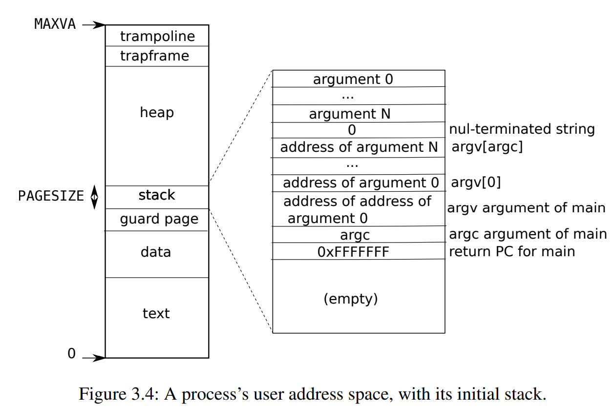
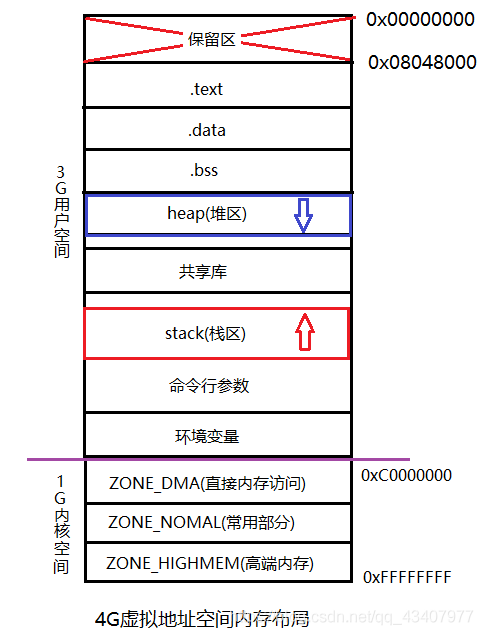
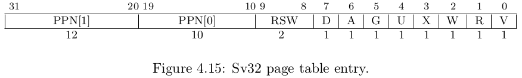

# Lab: Copy-on-Write Fork for xv6

虚拟内存提供一定程度的间接性：内核可以通过将 PTE 标记为无效或只读来拦截内存引用，使页失效发生，并且可以通过修改PTEs来改变地址的含义。有一种说法是，计算机系统中的很多问题都可以通过一个新的间接层来解决。lazy allocation lab提供了一个样例。这个lab探索了另一个案例：Copy-on-Write fork。

首先切换分支：

```
$ git fetch
$ git checkout cow
$ make clean
```

## The problem

在xv6中，`fork()`系统调用会复制所有父亲进程的用户态内存到子进程中。如果父进程很大，复制可能会花费很长的时间。更糟糕的时，这一工作通常非常浪费：例如，一个fork()后执行exec()调用的子进程，会丢失复制的所有父进程的内存，可能根本不会用到大部分的父进程中的内存复制。另一方面，如果父子进程都使用一个页面地址，并且一个或两个都写这一页地址，那么确实需要一个复制操作。

## The solution

Cow fork()的目的是推迟为子进程分配并复制物理内存页到这些复制真的被需要时（如果有的话）。

Cow fork()仅仅为子进程创建页表，将用户态的PTE指向父进程的物理页。COW fork()将父子进程的用户态PTE都设置为不可写。当任一进程尝试写COW页时，CPU会产生一个页错误。内核页错误处理程序会探测到它的出现，为出现页错误的进程分配物理页，复制原本的物理页到新的页中，并在失效的进程中修改对应的PTE指向这个新分配的物理页，将PTE设置为可写。当page fault handler返回时，用户程序能顺利写入这一复制出来的页。

COW fork() 使实现用户内存的物理页面的释放变得有点棘手。一个给出的物理页可能被多个进程的页表引用，并且只能在最后一个引用失效时释放。

## Implement copy-on write

### 任务说明

> 任务是在xv6内核中实现Copy-on-write fork。如果通过`cowtest`和`usertests`，则修改后的内核通过测试。

为了帮助测试实现的正确性，lab提供了一个xv6用户态测试程序`cowtest`。`cowtest`会运行多种测试，如果没有修改内核，第一个测试就会失败。输出如下：

```
$ cowtest
simple: fork() failed
$
```

这一"simple" test 分配大半的可用物理内存，接下来执行`fork()s`。这样会失败，因为没有可用的物理内存了。

当完整实现后，内核能够通过所有的`cowtest`和`usertests`测试，输出如下：

```
$ cowtest
simple: ok
simple: ok
three: zombie!
ok
three: zombie!
ok
three: zombie!
ok
file: ok
ALL COW TESTS PASSED
$ usertests
...
ALL TESTS PASSED
$
```

### 计划和提示

如下有一份合理的计划：

1. 修改`uvmcopy()`用于映射父进程的物理页到子进程，而不是分配一个新的页。在父子进程中都清空`PTE_W`。
2. 修改`usertrap()`用于识别page fault。当一个page-fault发生在COW的页时，由`kalloc()`分配一个新的页，复制旧的页到新的页中，并将新页的PTE设置`PTE_W`。
3. 确保每个物理页在最后一个PTE引用清空后被释放。一个好的实现方法是为每个物理页维护一个引用计数器。当第一次由`kalloc()`分配时将引用设置为1。当`fork()`时将引用计数器加1，在每次including释放页时将引用计数器减一。`kfree()`应该仅在页的引用计数为0时释放。可以维护一个固定大小的整型数组，但需要给出一种机制确定如何在数组中索引并确定这一个数组的大小。例如，需要根据物理内存除以4096的值来索引，并让这个数组的元素个数等于在`kinit(), kalloc.c`分配的free list中最大物理地址值（除以4096）。

一些提示：

* lazy page allocation lab可能让你熟悉大量xv6与cow相关的代码。但是，你不应该基于lazy allocation的解决方案，而是从全新的xv6副本开始这一lab。
* 为每个PTE记录是否是COW页会有帮助。你可以使用RISC-V的PTE中的RSW(reserved for software)位来实现这一功能
* `usertests`会探索`cowtest`没有测试的其他场景，不要忘记将两个测试都通过
* 一些与页表flag相关的宏在`kernel/riscv.h`。
* 如果COW页错误发生，但是仍然没有可用内存，这一进程应该被杀死。(不是在fork时kill，而是在page fault时)

### do lab

#### `uvmcopy`发生了什么
首先我们要确定在`fork()`时发生了什么。

```
// Create a new process, copying the parent.
// Sets up child kernel stack to return as if from fork() system call.
int
fork(void)
{
  int i, pid;
  struct proc *np;
  struct proc *p = myproc();

  // Allocate process.
  if((np = allocproc()) == 0){
    return -1;
  }

  // Copy user memory from parent to child.
  if(uvmcopy(p->pagetable, np->pagetable, p->sz) < 0){
    freeproc(np);
    release(&np->lock);
    return -1;
  }
  np->sz = p->sz;

  // copy saved user registers.
  *(np->trapframe) = *(p->trapframe);

  // Cause fork to return 0 in the child.
  np->trapframe->a0 = 0;

  // increment reference counts on open file descriptors.
  for(i = 0; i < NOFILE; i++)
    if(p->ofile[i])
      np->ofile[i] = filedup(p->ofile[i]);
  np->cwd = idup(p->cwd);

  safestrcpy(np->name, p->name, sizeof(p->name));

  pid = np->pid;

  release(&np->lock);

  acquire(&wait_lock);
  np->parent = p;
  release(&wait_lock);

  acquire(&np->lock);
  np->state = RUNNABLE;
  release(&np->lock);

  return pid;
}
```

可以看到，在fork中，有关父子进程页表复制的函数是`uvmcopy()`。`uvmcopy`只在这里调用，因此仅仅需要修改`uvmcopy()`，fork中的其他部分不需要修改。

```
$ find ./kernel | xargs grep uvmcopy
grep: ./kernel: Is a directory
./kernel/defs.h:int             uvmcopy(pagetable_t, pagetable_t, uint64);
./kernel/proc.c:  if(uvmcopy(p->pagetable, np->pagetable, p->sz) < 0){
./kernel/vm.c:uvmcopy(pagetable_t old, pagetable_t new, uint64 sz)
./kernel/vm.c:      panic("uvmcopy: pte should exist");
./kernel/vm.c:      panic("uvmcopy: page not present");
```

`uvmcopy()`函数的实现如下：

```c
// Given a parent process's page table, copy
// its memory into a child's page table.
// Copies both the page table and the
// physical memory.
// returns 0 on success, -1 on failure.
// frees any allocated pages on failure.
int
uvmcopy(pagetable_t old, pagetable_t new, uint64 sz)
{
  pte_t *pte;
  uint64 pa, i;
  uint flags;
  char *mem;

  for(i = 0; i < sz; i += PGSIZE){
    if((pte = walk(old, i, 0)) == 0)
      panic("uvmcopy: pte should exist");
    if((*pte & PTE_V) == 0)
      panic("uvmcopy: page not present");
    pa = PTE2PA(*pte);
    flags = PTE_FLAGS(*pte);
    if((mem = kalloc()) == 0)
      goto err;
    memmove(mem, (char*)pa, PGSIZE);
    if(mappages(new, i, PGSIZE, (uint64)mem, flags) != 0){
      kfree(mem);
      goto err;
    }
  }
  return 0;

 err:
  uvmunmap(new, 0, i / PGSIZE, 1);
  return -1;
}

```

其实这里蛮奇怪的点是，用户态进程的内存都是连续的：
```
for(i = 0; i < sz; i += PGSIZE){
    f((pte = walk(old, i, 0)) == 0)
    {
        ;
    }
}
```

`i`指向的是用户态的虚拟地址，但是虚拟地址空间刚好`p->sz`个。这是因为xv6的进程地址空间是连续分配，且从0开始的。

> 那么用户的trampoline和trapframe呢？




这个可以在`proc_pagetable()`和`growproc()`中找到答案，`TRAMPOLINE`和`TRAPFRAME`都是在这里映射的，但是`p->sz`并不改变。

同时`growproc()`用于用户进程内存的扩缩容，其都是以页表为连续，并且直接在最高地址加减进行操作的。

xv6的用户态地址是从0开始，以`p->sz`结束，和`linux`有些不同。



#### 修改`uvmcopy`

我们需要让所有的page在两个页表中的`PTE_W`都为0；设置`RSW, reserved for software`位为1，用于确保发生page fault时，只有COW page被复制。



RSW 的值为`3L << 8`，因此在`riscv.h`中添加这个宏

```
#define PTE_COW (1L << 8) // 1 -> is cow page
```

```c
// Given a parent process's page table, copy
// its memory into a child's page table.
// Copies both the page table and the
// physical memory.
// returns 0 on success, -1 on failure.
// frees any allocated pages on failure.
int
uvmcopy(pagetable_t old, pagetable_t new, uint64 sz)
{
  pte_t *pte;
  uint64 pa, i;
  uint flags;

  for(i = 0; i < sz; i += PGSIZE){
    if((pte = walk(old, i, 0)) == 0)
      panic("uvmcopy: pte should exist");
    if((*pte & PTE_V) == 0)
      panic("uvmcopy: page not present");
    pa = PTE2PA(*pte);

    if(0 == ((*pte) & PTE_COW)) // not a cow page before
        pagerefcnt[PA2IDX(pa)]++;

    *pte &= (-1L)^PTE_W; // set PTE_W to 0 in parent
    *pte |= PTE_COW; // set PTE_COW to 1 in parent

    flags = PTE_FLAGS(*pte);

    if(mappages(new, i, PGSIZE, (uint64)pa, flags) != 0){ //increase refcnt if cow page
      goto err;
    }
  }
  return 0;

 err:
  uvmunmap(new, 0, i / PGSIZE, 1); // decrease refcnt if cow page
  return -1;
}
```


我这里的实现做了一些选择：

* 在`uvmcopy`中进行父子进程页表的映射，仅在成功映射一个页时增加引用计数
* 增加引用计数的实现是在`mappages()`中，仅仅在页表复制时进行复制，也就是PTE_COW为1时复制。
* 注意我们对内核的物理页不进行引用计数，比如`walk`分配的页表。
* 当出现错误时，使用`uvmunmap`进行页释放，并且减去有`PTE_COW`的引用计数
* 引用计数器使用物理内存进行索引。计数器数组保存在全局变量中，定义在`vm.c`中，并且在`proc.h`中引用。注意到引用计数最大值为`NPROC = 64`，所以使用uint64是完全没有问题的。
* 数组的大小需要根据`kinit()`设计

    已知内核和用户态内存是从`KERNBASE`到`PHYSTOP`，所以我们可以设置的数组大小为`(PHYSTOP-KERNBASE)>>PGSHIFT`

    ```
    // in vm.c
    uint64 pagerefcnt[(PHYSTOP-KERNBASE)>>PGSHIFT];

    //in kalloc.c

    extern uint64 pagerefcnt[(PHYSTOP-KERNBASE)>>PGSHIFT];

    //in riscv.h
    #define PA2IDX(pa) ((((uint64)pa)-KERNBASE) >> PGSHIFT)
    ```

    由于是全局变量，因此值直接为全0。但是在每次`kalloc()`分配到的时候还需要设置为1。

    这里我们还定义了`PA2IDX`，用于将内存映射到数组下标。

* 我们这里没有在分配失败时，为父进程恢复PTE。这是父进程的PTE有可能本身就是一个COW页。这里我选择用`page fault`进行处理，当`page fault`发现一个引用计数为1的COW页时，会恢复`PTE_W`并清空`PTE_COW`。

#### 修改`uvmunmap()`和`mappages()`

`uvmunmap()`需要减少引用计数，并在引用计数为0时释放页。

注意到函数中有一个`do_free`。在COW之前，这个值确实表示是否释放，但是在COW之后，这个参数表示引用计数为0时是否释放该页。

```
// Remove npages of mappings starting from va. va must be
// page-aligned. The mappings must exist.
// Optionally free the physical memory.
void
uvmunmap(pagetable_t pagetable, uint64 va, uint64 npages, int do_free)
```


内核中有多处使用到了`uvunmap`：

```
$ find ./kernel | xargs grep uvmunmap
grep: ./kernel: Is a directory
./kernel/defs.h:void            uvmunmap(pagetable_t, uint64, uint64, int);
./kernel/proc.c:    uvmunmap(pagetable, TRAMPOLINE, 1, 0);
./kernel/proc.c:  uvmunmap(pagetable, TRAMPOLINE, 1, 0);
./kernel/proc.c:  uvmunmap(pagetable, TRAPFRAME, 1, 0);
./kernel/vm.c:uvmunmap(pagetable_t pagetable, uint64 va, uint64 npages, int do_free)
./kernel/vm.c:    panic("uvmunmap: not aligned");
./kernel/vm.c:      panic("uvmunmap: walk");
./kernel/vm.c:      panic("uvmunmap: not mapped");
./kernel/vm.c:      panic("uvmunmap: not a leaf");
./kernel/vm.c:    uvmunmap(pagetable, PGROUNDUP(newsz), npages, 1);
./kernel/vm.c:    uvmunmap(pagetable, 0, PGROUNDUP(sz)/PGSIZE, 1);
./kernel/vm.c:  uvmunmap(new, 0, i / PGSIZE, 1);
```

修改`uvmunmap()`如下：

```
// Remove npages of mappings starting from va. va must be
// page-aligned. The mappings must exist.
// Optionally free the physical memory.
void
uvmunmap(pagetable_t pagetable, uint64 va, uint64 npages, int do_free) {
  uint64 a;
  pte_t *pte;

  if((va % PGSIZE) != 0)
    panic("uvmunmap: not aligned");

  for(a = va; a < va + npages*PGSIZE; a += PGSIZE){
    if((pte = walk(pagetable, a, 0)) == 0)
      panic("uvmunmap: walk");
    if((*pte & PTE_V) == 0)
      panic("uvmunmap: not mapped");
    if(PTE_FLAGS(*pte) == PTE_V)
      panic("uvmunmap: not a leaf");

    uint64 pa = PTE2PA(*pte);

    if((*pte) & PTE_COW)
      pagerefcnt[PA2IDX(pa)]--;
    if(do_free && pagerefcnt[PA2IDX(pa)] == 0){
      kfree((void*)pa);
    }
    *pte = 0;
  }
}
```

`mappages()`需要增加引用计数，修改如下：

```
// Create PTEs for virtual addresses starting at va that refer to
// physical addresses starting at pa. va and size might not
// be page-aligned. Returns 0 on success, -1 if walk() couldn't
// allocate a needed page-table page.
int
mappages(pagetable_t pagetable, uint64 va, uint64 size, uint64 pa, int perm)
{
  uint64 a, last;
  pte_t *pte;

  if(size == 0)
    panic("mappages: size");
  
  a = PGROUNDDOWN(va);
  last = PGROUNDDOWN(va + size - 1);
  for(;;){
    if((pte = walk(pagetable, a, 1)) == 0)
      return -1;
    if(*pte & PTE_V)
      panic("mappages: remap");
    *pte = PA2PTE(pa) | perm | PTE_V;

    if(perm & PTE_COW)
        pagerefcnt[PA2IDX(pa)]++;

    if(a == last)
      break;
    a += PGSIZE;
    pa += PGSIZE;
  }
  return 0;
}
```

> 注意到有的设备的映射是小于`KERNBASE`的，因此需要跳过这样的物理地址。

#### 修改`kalloc()`和`kfree()`

需要确保分配和释放的内存都是没有引用的。

```
// kfree()

if(((uint64)pa % PGSIZE) != 0 || (char*)pa < end || (uint64)pa >= PHYSTOP)
    panic("kfree");

  if(pagerefcnt[PA2IDX(pa)] != 0)
      panic("kfree cow ref cnt not zero!");

// kalloc()

if(r){
    memset((char*)r, 5, PGSIZE); // fill with junk
    if(pagerefcnt[PA2IDX(r)] != 0)
        panic("alloc phy mem ref cnt not zero!");
  }
```

#### 修改`usertrap()`

这一修改是为了捕获page fault。RISC-V的cpu能分辨三种page fault：
1. load 指令导致的（load 时无法翻译对应的虚拟地址）
2. store 指令导致的
3. instruction（pc指向的代码无法翻译）

之后`scause`寄存器会指示发生了何种page fault，并由`stval`寄存器包含无法翻译的地址。我们需要处理的是`store`指令导致的page fault。

下面贴一份`RISC-V` 部分supervisor寄存器的功能的[文档](https://five-embeddev.com/riscv-isa-manual/latest/supervisor.html#sec:scause)：

* Supervisor Scratch Register (sscratch)
    
    sscratch是一个SXLEN-bit 读写寄存器，在supervisor下使用。通常，在hart执行user代码时，sscratch是用于保存一个指向本地 supervisor上下文的地址。在trap处理开始时，sscratch与user 寄存器交换，提供一个初始的working寄存器。

* Supervisor Exception Program Counter (sepc)

    管理者异常程序计数器
    sepc是一个SXLEN-bit 读写寄存器。格式如下：

    sepc[0]总是为0。在只支持IALIGN=32的实现中，两个低位(sepc[1:0])总是0。

    如果实现允许IALIGN为16或32(例如，通过更改CSR misa)，那么，每当IALIGN=32时，位sepc[1]在读取时被屏蔽，使其看起来为0。这种屏蔽也发生在SRET指令隐式读取时。尽管被屏蔽，当IALIGN=32时，sepc[1]仍然是可写的。

    sepc是一个WARL寄存器，必须能够保存所有有效的虚拟地址。它不需要能够保存所有可能的无效地址。在编写sepc之前，实现可能会将一个无效地址转换成其他一些sepc可以保存的无效地址。

    当一个trap陷入s模式时，sepc被写入被中断或遇到异常的指令的虚拟地址。否则，sepc永远不会写。

* Supervisor Cause Register (scause)

    scause是一个SXLEN-bit 读写寄存器，格式如下：

    当一个trap进入s模式时，cause会用一个代码来表示导致trap的事件。
    如果trap是由中断引起的，则在cause寄存器中设置Interrupt位。Exception Code字段包含了最后一次发生异常和中断的编码。

    

    ```
    Interrupt	Exception Code	Description	
    1	0	Reserved	
    1	1	Supervisor software interrupt	
    1	2–4	Reserved	
    1	5	Supervisor timer interrupt	
    1	6–8	Reserved	
    1	9	Supervisor external interrupt	
    1	10–15	Reserved	
    1	≥16	Designated for platform use	
    0	0	Instruction address misaligned	
    0	1	Instruction access fault	
    0	2	Illegal instruction	
    0	3	Breakpoint	
    0	4	Load address misaligned	
    0	5	Load access fault	
    0	6	Store/AMO address misaligned	
    0	7	Store/AMO access fault	
    0	8	Environment call from U-mode	
    0	9	Environment call from S-mode	
    0	10–11	Reserved	
    0	12	Instruction page fault	
    0	13	Load page fault	
    0	14	Reserved	
    0	15	Store/AMO page fault	
    0	16–23	Reserved	
    0	24–31	Designated for custom use	
    0	32–47	Reserved	
    0	48–63	Designated for custom use	
    0	≥64	Reserved
    ```
    
* Supervisor Trap Value (stval) Register

    stval是一个SXLEN-bit 读写寄存器，格式如下：

    

    当一个trap进入s-mode时，stval将保存异常特别的信息，以供软件处理。硬件平台将指令哪些异常信息设置到stval，哪些设置stval为0。在发生breakpoint（断点），address-misaligned(地址不对齐)，access-fault(访问错误)，page-fault(缺页异常)时，stval被写入包含错误的虚拟地址。


> 所以我们需要判定的类型是`scause == 15`, Store/AMO page fault
> 
> 以及获取`stval`寄存器的值

```
} else if(r_scause() == 15){
    // Store/AMO page fault
    uint64 accessaddr = r_stval();

    if(cowcopy(p->pagetable, accessaddr) < 0)
    {
        printf("alloc COW page fault pid=%d\n", p->pid);
        p->killed = 1;
    }
  }
```

这里我们需要实现`cowcopy()`函数：

```
// in vm.c

// alloc a page, and copy a cow page to it
int cowcopy(pagetable_t pagetable, uint64 va)
{
    pte_t * pte = walk(pagetable, va, 0);
    uint64 pa = PTE2PA(*pte);
    uint flags;


    if(0 == ((*pte) & PTE_COW))
    {
        panic("not a cow page!");
    }
    
    if(pagerefcnt[PA2IDX(pa)] == 1)
    {
        //修改PTE_W和PTE_COW
        *pte |= PTE_W;
        *pte ^= PTE_COW;
        pagerefcnt[PA2IDX(pa)] = 0;
    }
    else if(pagerefcnt[PA2IDX(pa)] > 1)
    {
        uint64 mem = (uint64) kalloc();
        if(!mem)
            return -1;

        flags = PTE_FLAGS(*pte);
        flags |= PTE_W;
        flags ^= PTE_COW;
        
        if(copyin(pagetable, (char*)mem, PGROUNDDOWN(va), PGSIZE) < 0)
            return -1;
        
        uvmunmap(pagetable, PGROUNDDOWN(va), 1, 1);

        mappages(pagetable, PGROUNDDOWN(va), PGSIZE, mem, flags);
    }
    else 
    {
        panic("wrong cow addr!");
    }
    return 0;
}

// in defs.h

int             cowcopy(pagetable_t, uint64);
```

#### 第一次测试


```
$ cowtest
simple: ok
simple: ok
three: ok
three: ok
three: ok
file: eererorrr:r orreroard::  rf eaaridela def daf
iailleded
```

其实第一本版实现bug非常多，建议使用`gdb`调试。


#### `copyout`

为什么最后这个测试没有通过，是因为`copyout`没有实现。因为最后一个测试会使用`pipe()`进行读写，会使用`copyout`进行复制内存。

这里如果不实现，会崩溃的原因是：如果进程使用`pipe()`通信，但是用户态的buffer是cow页，此时使用`copyout`会让父子进程的buffer都被写，然而实际上只能让一个进程的写入。所以我们需要在`copyout`时，如果遇到cow页，进行页错误一样的处理。

```
int
copyout(pagetable_t pagetable, uint64 dstva, char *src, uint64 len)
{
  uint64 n, va0, pa0;

  while(len > 0){
    va0 = PGROUNDDOWN(dstva);
    pa0 = walkaddr(pagetable, va0);
    pte_t * pte = walk(pagetable, va0, 0);
    if(pa0 == 0)
      return -1;
    n = PGSIZE - (dstva - va0);
    if(n > len)
      n = len;
    if(((*pte) & PTE_COW)&&(0 == ((*pte)&PTE_W)))
    {
      if(cowcopy(pagetable, va0) < 0)
          return -1;
    }

    pa0 = walkaddr(pagetable, va0);
    if(pa0 == 0)
        return -1;
    memmove((void *)(pa0 + (dstva - va0)), src, n);

    len -= n;
    src += n;
    dstva = va0 + PGSIZE;
  }
  return 0;
}
```


#### 测试2

```
$ cowtest
simple: ok
simple: ok
three: ok
three: ok
three: ok
file: ok
ALL COW TESTS PASSED

$ usertests
usertests starting
test MAXVAplus: panic: walk
QEMU: Terminated
```

但是`usertests`还不能通过。我们之前写程序，都只要保证在正常情况下的正确性，但是内核需要保证在正常以及异常情况下，都能正确处理。我处理的两个错误都是由于walk函数使用了大于`VMAX`的虚拟地址

1. 程序读写的内存不合法也会造成page fault。需要判断。
2. copyout中使用了`walk`函数，需要在`va`错误就退出，而不进入`walk`。


修改后：

```
// in uvmcopy
if(va >= MAXVA) //add va judge
    return -1;
pte_t * pte = walk(pagetable, va, 0);
if(pte == 0) //add pte judge, va may not belone to this process
    return -1;

// in copyout
va0 = PGROUNDDOWN(dstva);
pa0 = walkaddr(pagetable, va0);
 //pte_t * pte = walk(pagetable, va0, 0); //delete
if(pa0 == 0)
    return -1;
pte_t * pte = walk(pagetable, va0, 0); //add

```

#### 加锁

还有一个测试没有通过是`usertest`的`pgbug`，会在CPU数量为4时崩溃，但是在CPU为1的时候没有问题。

```
test pgbug: panic: alloc phy mem ref cnt not zero!
```

一个可能的问题是我们没有对`refcnt`进行临界区的保护。

```
//in vm.c
#include "spinlock.h"
struct spinlock pgreflock;

// in kvmmake()

initlock(&pgreflock, "pgf");

// 之后在所有pagerefcnt的地方进行锁`acquire`和`release`
```

之后所有`usertests`能通过，但是`cowtest`又过不了了。非常奇怪。这是因为我们的锁存在重复，就是在同一个cpu上锁后，再次在同一cpu请求锁。


加锁方法
```
// mappages()
if(perm & PTE_COW)
{
    acquire(&pgreflock);
    pagerefcnt[PA2IDX(pa)]++;
    release(&pgreflock);
}

//uvmunmap()
acquire(&pgreflock);
if((*pte) & PTE_COW)
{
    pagerefcnt[PA2IDX(pa)]--;
}
if(do_free && pagerefcnt[PA2IDX(pa)] == 0){
    uint64 pa = PTE2PA(*pte);
    kfree((void*)pa);
}
release(&pgreflock);

//uvmcopy
if(0 == ((*pte) & PTE_COW)) // not a cow page before$
{
    acquire(pgreflock);
    pagerefcnt[PA2IDX(pa)]++;
    release(&pgreflock);
}

//cowcopy()

acquire(&pgreflock);
if(pagerefcnt[PA2IDX(pa)] == 1)
{
    //修改PTE_W和PTE_COW
    *pte |= PTE_W;
    *pte ^= PTE_COW;
    pagerefcnt[PA2IDX(pa)] = 0; 
    release(&pgreflock);
}
else if(pagerefcnt[PA2IDX(pa)] > 1)
{
    release(&pgreflock);
    uint64 mem = (uint64) kalloc();
    if(!mem)
    {
        return -1;
    }
    flags = PTE_FLAGS(*pte);
    flags |= PTE_W;
    flags ^= PTE_COW;
    
    if(copyin(pagetable, (char*)mem, PGROUNDDOWN(va), PGSIZE) < 0)
    {
        return -1;
    }
    uvmunmap(pagetable, PGROUNDDOWN(va), 1, 1);

    mappages(pagetable, PGROUNDDOWN(va), PGSIZE, mem, flags);
}
else
{
    panic("wrong cow addr!");
}
```


之后能够通过所有两次测试，添加time.txt。使用`make grade`获得所有得分。


```
$ make qemu-gdb
(7.5s)
== Test   simple ==
  simple: OK
== Test   three ==
  three: OK
== Test   file ==
  file: OK
== Test usertests ==
$ make qemu-gdb

(110.9s)
== Test   usertests: copyin ==
  usertests: copyin: OK
== Test   usertests: copyout ==
  usertests: copyout: OK
== Test   usertests: all tests ==
  usertests: all tests: OK
== Test time ==
time: OK
Score: 110/110
```

## Chapter 5 Interrupts and device drivers

> 虽然在lab开始没有让看这个章节，但是这一章的概念对完成lab很有帮助。

一个驱动(driver)是操作系统管理一个特定设备的代码：它配置硬件设备，告知设备来执行操作，处理产生的中断，并与等待设备IO的进程进行交互。驱动代码坑你非常tricky，因为驱动代码与管理的设备会同时执行。此外，驱动必须理解设备的硬件接口，这一块可能非常复杂，并且缺乏文档。

设备需要操作系统注意时，通常可以生成一个中断。内核的trap处理代码会意识到设备产生了中断，并调用对应的驱动处理程序。在xv6中，判断发生设备中断类型发生在`devintr()， kernel/trap.c:177`中。

很多设备的驱动通过两个上下文进行代码执行：上半部分在进程的内核线程执行，下半部分在中断时间执行。上半部分通过系统调用，如`read`和`write`这种希望设备执行I/O的系统调用执行。这部分代码可能请求硬件启动一个操作（比如，请求磁盘读取一个块）；接下来代码等待操作完成。最终，设备完成操作，并上抛一个中断。驱动的中断处理程序，作为驱动程序的后半部分，首先确定是什么操作被完成了，如果合适则唤醒一个等待的进程，并告知硬件启动正在等待的接下来的操作。

### 5.1 Code: Console input

控制台驱动程序 (kernel/console.c) 是驱动程序结构的简单说明。控制台驱动程序通过连接到RISC-V的`UART`串口硬件，接收人类输入的字符。控制台驱动每次累积一行输入，处理退格和control-u等特殊输入字符。用户进程，如shell，使用`read`系统调用从`console`中获取一行的输入。当你在QEMU中向xv6进行输入，您的击键通过 QEMU 的模拟 UART 硬件传送到 xv6。

与驱动设备沟通的UART硬件是QEMU模拟的`16550`芯片。在真实的计算机中，一个`16550`能够管理一个连接到终端或其他电脑的`RS232`串行链路。当运行QEMU时，这个`RS232`连接到你的键盘和屏幕。

UART硬件在软件层面看来是一个`memory-mapped`控制寄存器集合。换句话说，有一些RISC-V硬件连接到UART设备的物理地址，因此loads和stores能够与设备硬件交互，而不仅仅是内存。`memory-mapped`地址中，用于UART的从`0x10000000`，或者`UART0(kernel/memlayout.h:21)`。有几个 UART 控制寄存器，每个寄存器都有一个字节的宽度。它们相对`UART0`的偏移量在`kernel/uart.c`中定义。例如，`LSR`寄存器保存，指示输入的字符是否正在等待软件读取的，bit。这些字符（如果有）可用于从 RHR 寄存器中读取。每读取一个字符时，UART硬件将其从等待字符的内部FIFO中删除，并当FIFO为空后，从`LSR`清空`ready`bit。UART发送硬件很大程度上独立于接收硬件；如果软件写入一个字节到`THR`寄存器，`UART`会传输这一字节。

xv6的main函数调用`concoleinit, kernel/concole.c`来初始化UART硬件。这些代码配置UART为在接收到每个字符时，生成接收中断，并在每次UART完成发送输出字节时，传输一个完成中断。

XV6的Shell通过`init.c (user/init.c)`打开的文件描述符从控制台读取字符。对read系统调用的调用通过内核到达`consoleread, kernel/console.c`。

```
  // in fileread(), 通过以下代码调用到`consoleread`
  
  if(f->type == FD_DEVICE){
    if(f->major < 0 || f->major >= NDEV || !devsw[f->major].read)
      return -1;
    r = devsw[f->major].read(1, addr, n);
  }

  // consoleread
  // user read()s from the console go here.$
  // copy (up to) a whole input line to dst.$
  // user_dist indicates whether dst is a user$
  // or kernel address.$
  //$
  int$
  consoleread(int user_dst, uint64 dst, int n)
```
`consoleread`等待输入到达（通过中断），并在cons.buf中缓冲，将输入复制到用户空间，并（在整行到达后）返回到用户进程。如果用户没有输入一个完整的行，任何进程都会等待在`sleep`系统调用中。（Chapter 7 解释了sleep的细节）

当用户输入一个字符后，UART硬件请求RISC-V产生一个中断，激活xv6的trap处理程序。trap处理程序调用`devintr(), kernel/trap.c`，它会查询`RISC-V`的scause寄存器，来发现中断来自外部设备。接下里它会请求硬件调用`PLIC, kernel/trap.c:186`来告诉中断发生在哪个硬件。如果是`UART`，`devintr`调用`uartintr`。

```
  //in devintr()

    // irq indicates which device interrupted.
    int irq = plic_claim();

    if(irq == UART0_IRQ){
      uartintr();
    }
```


`uartintr(), kernel/uart.c`从UART硬件中读取任何等待输入的字符，并将它们交给`consoleintr(), kernel/console.c`；它不会为字符等待，因为未来的输入能产生新的中断（由新的中断处理）。`consoleintr`的任务是累计输入字符到`cons.buf`中，直到一整行输入到达。`consoleintr`将退格键和一些其他字符进行特殊处理。当新的行到达，`consoleintr`唤醒等待的`consoleread`（如果有）。

一旦被唤醒，`consoleread`会在`cons.buf`中观察到完整的一行，并将这一行复制到用户空间，然后（通过系统调用的形式）返回到用户空间。

### data structure

要想理解输入输出的逻辑，一个快速的方法是看看它们的数据结构。

1. `struct cons`

  ```
  struct {
    struct spinlock lock;
    
    // input
  #define INPUT_BUF 128
    char buf[INPUT_BUF];
    uint r;  // Read index
    uint w;  // Write index
    uint e;  // Edit index
  } cons;
  ```

  `struct cons`是UART读写的数据结构，其中有锁、环形buffer、读写修改指针。

2. `uart`
   
    ```
    // the transmit output buffer.
    struct spinlock uart_tx_lock;
    #define UART_TX_BUF_SIZE 32
    char uart_tx_buf[UART_TX_BUF_SIZE];
    uint64 uart_tx_w; // write next to uart_tx_buf[uart_tx_w % UART_TX_BUF_SIZE]
    uint64 uart_tx_r; // read next from uart_tx_buf[uart_tx_r % UART_TX_BUF_SIZE]
    ```

    uart的tx数据结构。


### 5.2 Code: Console output

一个`write`系统调用对于连接到控制台的文件描述符的操作，最终会到达`uartputc, kernel/uart.c`。设备驱动程序会维护一个输出buffer(uart_tx_buf)，因此进程的写入不需要等待UART结束传输；相反，`uartputc`将每个字符添加到buffer的后方，调用`uartstart`来开始设备传输（如果还没有开始的话），并返回。`uartputc`唯一等待的情况是buffer已经满了。

每次UART完成传输一个字节，其会产生一个中断。`uartintr`调用`uartstart`函数，该函数检查设备是否确实完成了发送，并将设备移动到下一个缓冲的字符。于是，如果一个进程写入了多个字符到控制台，通常第一个字节将通过`uartputc`对`uartstart`的调用发送，而接下来的buffer中的字节，当传输完成中断到达时，会由`uartintr`中的`uartstart`发送。

需要注意的一个通用的模式是通过缓冲（buffer）和中断将设备活动与进程活动分离。控制台驱动能处理输入，即使没有任何进程等待这些输入；随后的读取能够看到这些输入。相似的，进程能够发送输出，而不需要等待设备。这样的解耦能够通过允许程序和设备I/O并发执行提升性能，当设备运行缓慢（如 UART）或需要立即注意（如回显键入的字符）时尤其重要。这一思想有时被称为I/O concurrency。

这里做一下说明：

当用户调用`write`之后，内核调用`uartstart()`进行字符发送，`uartstart()`函数一次只能传输一个字符，因此第一个字符传输后，write调用就结束了。

剩余的字符如何传输呢？答案是`UART`的产生的中断会持续读取：

```
// handle a uart interrupt, raised because input has
// arrived, or the uart is ready for more output, or
// both. called from trap.c.
void
uartintr(void)
{
  // read and process incoming characters.
  while(1){
    int c = uartgetc();
    if(c == -1)
      break;
    consoleintr(c);
  }

  // send buffered characters.
  acquire(&uart_tx_lock);
  uartstart();
  release(&uart_tx_lock);
}
```

就是说当`UART`能够进行输出时，会自动产生中断，从buffer中读取。

### echo to user

第一时间获取键盘输入的是设备，然后是内核，那么内核是如何将输入实时显示到用户态的shell的呢？

```
// send one character to the uart.
// called by printf, and to echo input characters,
// but not from write().
//
void consputc(int c){
  if(c == BACKSPACE){
    // if the user typed backspace, overwrite with a space.
    uartputc_sync('\b'); uartputc_sync(' '); uartputc_sync('\b');
  } else {
    uartputc_sync(c);
  }
}
```

答案在上面这个函数中。`conputc`接收来自`uartgetc`的字符后，将字符使用`uartputc_sync`传输到`UART`中，最终发送到屏幕。整个过程`console`就像一个回音装置，因此这一个过程称为`echo`。

### 5.3 Concurrency in drivers

你可能已经注意到`acquire`在`consoleread`和`consoleintr`中被调用到了。这些调用会申请锁，在并发访问中保护控制台的驱动程序数据结构。其中有三个并发的危险：
1. 两个不同的进程在不同的CPU上可能同时调用`consoleread`
2. 当CPU已经在`consoleread`中执行时，硬件可能会要求CPU提供控制台（实际上是`UART`）中断；
3. 硬件可能提交一个控制台中断到一个另外的CPU，但是此时`consoleread`已经在执行了。

这些危险可能导致竞争条件（race conditions）或死锁（deadlocks）。第六章会探索这些问题，以及如何通过锁解决它们。

在驱动中另一个需要关注到并发的点是，一个进程可能会等待设备的输入，但是当中断信号到达时，可能是不同的进程在执行。这使得中断处理程序不被允许考虑被中断的进程或代码。例如，一个中断处理程序不能使用当前进程的页表安全地调用`copyout`。中断处理程序通常做的工作相对较少（例如，只需将输入数据复制到缓冲区），然后唤醒上半部分代码来完成其余工作。

### 5.4 Timer interrupts

Xv6 使用timer 中断来维护其时钟，并允许内核从计算型程序间切换。在`usertrap`和`kerneltrap`中的`yield`调用会造成进程切换。Timer中断来自和RISC-V CPU连接的时钟硬件。Xv6会对这个时钟硬件进行编程，以定期唤醒各个CPU。

RISC-V请求timer中断在machine mode处理，而不是supervisor mode。RISC-V 的machine mode执行时不启用页表，并且带有一组单独的控制寄存器。因此在machine mode 直接运行普通的xv6内核代码是不切实际的。因此，xv6处理定时器中断与上述trap机制完全分开。

在machine mode执行的代码是`start.c`，在`main()`之前，设置以接收时钟中断（kernel/start.c）。其工作的一部分就是对CLINT（core-local interruptor）硬件进行编程，以产生定期延迟的中断。另一部分的工作是设置一个暂存（scratch）区域，类似于trapframe，帮助timer中断处理程序保存寄存器和`CLINT`寄存器的地址。最后，`start`设置`mtvec`到`timervec`，并启用timer中断。

一个时钟中断能够在任何时刻（无论是用户还是内核）代码执行时发生。内核无法在关键操作期间禁用定时器中断。因此timer中断处理程序必须完成工作的同时，保证不打扰中断的内核代码。中断处理程序基本的策略是让RISC-V产生一个"software interrupt"，并立即返回。RISC-V发送软件中断到内核时通过基础的trap机制，并且允许内核禁止它们。处理timer interrupt产生的software interrupt的代码保存在`devintr, kernel/trap.c:204`中。

> 这一部分的代码实现在`timervec, kernel/kernelvec.S`
> 
> 在每次发生timer中断时，必将进入这一代码，以machine mode执行。但是进入后，会产生一个supervisor mode的软件中断，这一中断能在`kerneltrap`或`usertrap`中处理，或者被屏蔽。

machime-mode 的timer中断处理程序是`timervec`。其保存少量的寄存器到由`start()`预备的`scratch`区域中，告知`CLINT`何时生成下一个timer interrupt，告知RISC-V产生一个software中断，恢复寄存器，然后返回。timer 中断处理程序中没有C代码。

### Real world

Xv6允许设备和timer中断在内核和用户态发生。Timer中断会强制一个线程通过timer中断处理程序进行切换(`yield`)，甚至在内核执行时也会切换。如果内核线程进行大量的计算，而不返回用户态的话，这样对内核线程进行公平的CPU时间切片是有用的。然而，内核代码需要注意，进程可能被挂起（由于定时器中断），然后在不同的CPU上恢复。这是xv6中一些复杂性的来源（参见第 6.6 节）。如果设备和时钟中断仅在用户态发生，内核可以变得更加简单。

完全支持典型计算机上的所有设备是一项艰巨的工作，因为设备很多，设备有很多功能，而且设备和驱动程序之间的协议可能很复杂，文档也很差。在许多操作系统中，驱动程序比核心内核占用更多的代码。

UART驱动通过读取UART控制寄存器，每次接收一个字节的数据；这样的模式被称为`programmed I/O`，因为是使用软件驱使数据移动。programmed I/O是简单的，但在高速率情况下非常慢。需要高速移动大量数据的设备通常使用直接内存访问 (DMA)。DMA硬件设备直接将到达的数据写入RAM中，并且从RAM读出数据。现代磁盘和网络设备都会使用DMA。一个用于DMA的驱动会在RAM中准备数据，然后使用单个写寄存器来告知设备处理准备好的数据。

设备在无法预测什么时候需要注意，且并不频繁时，中断机制是有意义的。但是中断的CPU开销很高。因此，告诉设备，比如磁盘和网络控制器，使用了减少中断需求的技巧。

1. 为一批次到达和发出的数据需求仅仅产生一个中断。
2. 另一个技巧是驱动程序完全禁用中断，并定期检查设备以查看是否需要注意。这一技术被称为`polling`，轮询。
   
   Polling在设备操作非常快时有意义，但是如果设备大量时间是空闲的话则浪费了CPU时间。

   一些驱动在polling和中断处理两种模式之间切换，取决于当前的设备负载。

UART 驱动程序首先将传入的数据复制到内核中的缓冲区，然后再复制到用户空间。这在低数据速率下是有意义的，但这样的双重复制（double copy）会显着降低生成或消耗数据非常快的设备的性能。一些操作系统能够直接在用户空间缓冲区和设备硬件之间移动数据，通常使用DMA。

如第1章所述，控制台对应用程序显示为常规文件描述符，应用程序使用read和write系统调用读取输入和写入输出。应用程序可能想要控制无法通过标准文件系统调用表达的设备能力（例如，在控制台驱动程序中启用/禁用行缓冲）。对于这种情况，Unix操作系统使用ioctl系统调用。

计算机的某些用途要求系统必须在有限时间内做出响应。例如，在安全关键系统中，错过最后期限可能会导致灾难。 xv6 不适合硬实时设置。硬实时操作系统（hard real-time Operating system）往往是与应用程序链接的库，其方式允许进行分析以确定最坏情况的响应时间。xv6 也不适合【软实时程序（soft real-time application）】——偶尔错过截止日期是可以接受的。因为xv6的调度程序过于简单，并且xv6具有长时间禁用中断的内核代码路径。