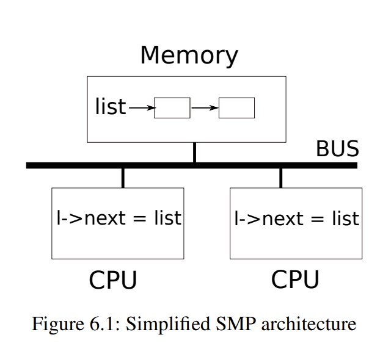
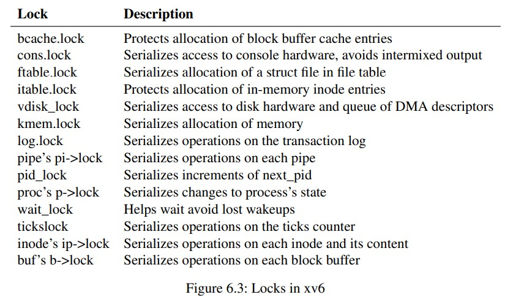
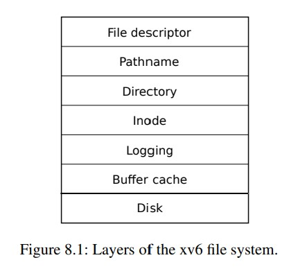
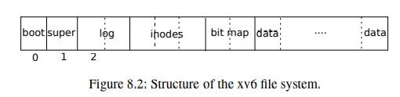

# Locks_lab

在本实验中，您将获得重新设计代码以提高并行性的经验。多核机器上并行性差的一个常见原因是高锁争用。提高并行性通常涉及更改数据结构和锁定策略以减少争用。您将为`xv6`内存分配器和块缓存执行此操作。

在编写代码之前，请务必阅读`xv6`书籍中的以下部分：
* Chapter 6: "Locking" and the corresponding code.
* Section 3.5: "Code: Physical memory allocator"
* Section 8.1 through 8.3: "Overview", "Buffer cache layer", and "Code: Buffer cache"

```shell
$ git fetch
$ git checkout lock
$ make clean
```

## Read Book Chapter 6 Locking

大多数内核，包括`xv6`，交错执行多个活动。交错的一个来源是多处理器的硬件：具有多个独立执行的`CPU`的计算机，例如`xv6`的`RISC-V`。这些多个`CPU`共享物理`RAM`，`xv6`使用这样的共享来维护所有`CPU`都读写的数据结构。这种共享增加了一个CPU正在读数据结构时，另一个CPU也在更新它的可能，甚至更多CPU同时更新同一个数据结构。如果没有仔细设计，这种并行可能造成错误的结果，或者损坏数据结构。即使在单CPU上，内核也会在多个线程之间切换，导致线程交错执行。最后，如果中断发生在错误的时间，某个可中断的代码的数据可能被设备的中断处理程序修改，这可能会损坏数据。并发（concurrency）一词是指由于多处理器并行、线程切换或中断而导致多个指令流交错的情况。

内核充满了并发访问的数据。例如，两个CPU可以同时调用`kalloc`，导致同时从`free list`的头部获取数据。内核设计者喜欢允许大量并发，因为它可以通过并行性提高性能，并提高响应能力。然而，这使得内核设计者花了大量的精力来实现（来说服自己相信）在并发下确保正确性。有很多实现正确代码的方式，一些比其他更加容易说理。在并发下以正确性为目标的策略，以及支持它们的抽象，被称为并发控制（`concurrency control`）技术。

XV6使用大量的并发控制技术，基于不同的场景，很多技术都是可行的。本章重点关注广泛使用的锁机制。锁提供交错执行，保证只有一个CPU能持有锁。如果程序将锁和共享的数据关联，并且程序只在持有锁的情况下能够使用数据，这样的数据就只能同时被一个CPU访问。在这种情况下，我么你说该锁保护了数据。尽管锁容易理解，但是锁不好的一面是其损失了性能，因为这样的操作序列化了并发的操作。

本章的接下俩介绍为什么xv6需要锁，如何实现锁，以及如果使用锁。

### 6.1 Race Conditions

考虑一个需要锁的例子，两个进程调用`wait`在两个不同的CPU上，`wait`会释放子进程的内存。于是每个CPU上，内核都会调用`kfree`来释放这些子进程的页。内核内存分配器维护一个链表结构：`kalloc()`弹出一个页用于分配，而`kfree()`将一个回收的页放到链表里。为了性能，我们可能希望两个进程的`kfree`能并行的执行，并不需要等待对方。但是在xv6的内核`kfree()`上，这样会产生错误。

图6.1说明了更多的细节。该链表在内存中由两个CPU功能项，两个CPU使用`load`和`store`指令来操作链表。（真实的情况下，处理器有缓存，但从概念上讲，多处理器系统的行为就像有一个单一的共享内存。）如果这里有没有并发的请求，可能`push`的实现是如下的：
```c
struct element {
    int data;
    struct element *next;
};

struct element *list = 0;

void
push(int data)
{
    struct element *l;

    l = malloc(sizeof *l);
    l->data = data;
    l->next = list;
    list = l;
}
```



如此实现在独立执行时是正确的。然而，这样的代码在更多并行的执行下，是不正确的。如果两个CPU同时执行`push`，但是可能同时执行了`l->next = list`，但都没有执行`list = l;`。这样或有两个元素的后继`next`都是`list`，当两个执行都将执行到`list = l`后，后执行的会覆盖先执行的。第一个执行流中的元素会丢失。

这样丢失的例子称为`race condition`。一个`race dondition`是指内存被并发访问，并且至少有一个是写入的场景。race可能是一个bug，或者丢失更新，或者读取到没有完全更新的数据。race的出现取决于CPU的真实执行时间，以及内存的访问顺序（由内存系统决定），这导致race导致的bug非常难以重现和解决。例如，在debugging时中添加一个`print`，可能导致执行时间改变，因此race就消失了。

通常避免race的方法是使用lock。锁保证交错执行的正确性，因此只有一个CPU能访问在`push`中关键的部分代码行。这使得在上述的并发执行变得不可能。正确的带锁的代码如下：
```c
struct element {
    int data;
    struct element *next;
};

struct element *list = 0;
struct lock listlock;

void
push(int data)
{
    struct element *l;

    l = malloc(sizeof *l);
    l->data = data;
    acquire(&listlock);
    l->next = list;
    list = l;
    release(&listlock);
}
```

在`acquire`和`release`之间的代码通常被称为`critial section`。通常我们说锁保护了`list`。

当我么说锁保护数据，我们真正的意思是锁保护了一些数据上的不变量。不变量是跨操作维护的数据结构的属性。典型的，一个操作的正确性需要基于操作开始时的不变量是否为真。操作可能短暂的违背不变量，但是必须在结束前恢复。例如，对于链表，不变量是`list`指向链表中的第一个元素，同时所有元素的`next`字段执行其后继。`push`的实现违背了这样的不变量，比如`l->next = list`和`list = l`之间，这样的不变量被打破了。于是race condition会在第二个CPU执行同样的代码时打破这样的不变量。正确的使用锁能够保证仅有一个CPU会操作数据结构的`critial section`，这样当数据结构的不变量不成立时，没有`CPU`会执行数据结构操作。

我们可以认为锁序列化了并发的执行，因此每次只能有一个执行，因此保持了不变量。我们也可以认为由同一个锁保护的`critial section`成为了原子的（相对于其他执行流），因此每个CPU只能在其他的`critial section`之后执行整个操作，并永远不会看到部分完成的更新。

尽管正确使用锁能使得不正确的代码变正确，锁也限制了性能。例如，如果两个进程同时调用`kfree`，锁会序列化这两次调用，于是我们不能从并行中获得任何收益。如果每个进程都想获得同一个锁，这被称之为多进程冲突（conflict），或者锁被争用（contention）。对于内核设计者来说，必备锁争用是一个主要挑战。Xv6在这方面没有做太多工作，但是复杂的内核会专门组织数据结构和算法以避免锁争用。在链表的例子中，内核可能为每个CPU维护一个`free list`，并且仅在自己的链表为空因此必须从其他CPU窃取内存时干涉到其他CPU。其他例子中可能会涉及到更复杂的设计。

锁的放置对性能也非常关键。例如，将`acquire`放到`push`更前方也是正确的。但是这样可能会降低性能，因为调用`malloc`也被序列化了。下方的`Using locks`提供一些对如何插入`acquire`和`release`的指南。

### 6.2 Code: Locks

Xv6中有两种锁`spinlock`和`sleep-locks`。我们会从`spinlock`开始。Xv6将自旋锁实现为数据结构`strict spinlock`。重要的字段为`lockd`，当为0时锁可获取，不为0则锁被持有。逻辑上，xv6实现锁的代码如下：

```c
void 
acquire(strict splilock *lk)
{
    for(;;){
        if(lk->locked == 0){
            lk->locked = 1;
            break;
        }
    }
}
```

然而，这样的实现不能保证在多核处理器上的交错执行。其可能有两个CPU同时执行到`if`，导致同时获取锁。在这种情形下，不同的CPU获取了同一个锁，违背了交错执行的性质。我们需要让检查锁和获取锁的代码原子的执行。

由于锁机制被广泛使用，多核处理器通常提供指令实现了原子执行方法。在RISC-V上，这样的指令是`amoswap r, a`。`amoswap`读取内存地址为`a`的值，并将寄存器`r`中的值写入`a`，然后将`a`读取到的值写入`r`。即在内存和寄存器之间交换了数据。这样的执行是原子的，使用特殊的硬件保证任何其他CPU在执行之间读写内存。

Xv6的`acquire`使用可移植的C库`__sync_lock_test_and_set`调用来实现，其是基于`amoswap`指令，其返回值是`lk->locked`的旧的（被交换的）内容。函数`acquire`在循环中包裹了swap的过程，不断尝试(spinning)直到成功获取锁。每次循环，都会将`1`交换到`lk->locked`中，并检查之前的值：如果之前的值是0，则我们获取和锁，并且交换会设置`lk->locked = 1`。如果之前的值是1，则说明其他CPU持有锁，而我们将`1`原子的交换进去，并不会改变这一现状。

一旦获取了锁，`acquire`会记录获取的CPU，可能用于debug。`lk->cpu`字段被锁保护，并仅能在持有锁下被修改。

函数`release`是`acquire`的相反：其修改`lk->cpu`，然后释放锁。概念上，释放仅需要将0写入`lk->locked`。`C`标准允许编译器实现具有多个存储指令的赋值，因此`C`赋值对于并发代码可能是非原子的。相反，`release`使用C库函数`__sync_lock_release`来实现原子的赋值。这个函数也是基于`RISC-V`的`amoswap`指令。


### 6.3 Code: Using locks

Xv6在大量的race condition下使用锁。比如`kalloc`和`kfree`。尝试练习1和2来看如果没有锁这些函数会怎么样。大概率会发现触发错误的行为是困难的，这表明很难可靠地测试代码是否没有锁相关的错误和竞争。然而`xv6`有一些races并不是不可能的。

使用锁一些困难是决定需要多少锁，以及保护哪些不变量。以下有一些基本的原则：
1. 任何时刻如果一个变量可能被一个CPU写，而其他CPU可能读写这个变量，则需要使用锁保证这些操作不能覆盖彼此；
2. 记住锁保证的是不变量：如果一个不变量会涉及多个内存地址，典型的是这些所有地址都需要被单个锁保证整体的不变量。

以上的规则告诉了何时锁是必要的，但是没有说明何时锁是不必要的。但是对于效率和性能来说，减少锁是重要的，因为锁降低了并行性。如果并行是不重要的，那么可以使用单个线程，并需要使用锁。一个简单的内核可以在多核处理器上仅使用一个锁，并且每次进入内核必须获取锁，退出内核时释放（尽管系统调用，比如`pipe`读取，或`wait`会造成问题）。

> 比如`wait`调用需要等待子进程`exit`，而`exit`被全局锁阻止了？这可能造成一些性能问题。

许多单处理器操作系统已使用这种方法转换为在多处理器上运行，有时被称为`big kernel lock`，但是这样的尝试牺牲了并行性：仅有一个CPU能执行在内核态。如果内核没有任何重的计算任务，使用更多的细粒度的锁会更加高效，使得内核能在多个CPU上同时执行。

作为粗粒度锁定示例，xv6的`kalloc.c`分配器有一个由单个锁保护的单个空闲列表。如果不同`CPU`上的多个进程尝试同时分配页面，则每个进程都必须通过自旋获取来等待轮到它。自旋会降低性能，因为它不是有用的工作。如果对锁的争用浪费了大量的`CPU`时间，也许可以通过将分配器设计更改为具有多个空闲列表（每个都有自己的锁）来提高性能，从而实现真正的并行分配。

一个细粒度锁的例子在xv6中是每个文件的独立的锁，因此操作不同文件的进程通常可以在不等待彼此的锁的情况下继续进行。文件的锁能更加细粒度，用于支持多进程同时写文件的不同部分。最终，锁定粒度决策需要由性能测量以及复杂性考虑来驱动。



随着后续章节解释`xv6`的每个部分中的锁，他们将提到`xv6`使用锁来处理并发的示例。作为预览，图6.3列出了xv6中的所有锁。

### Deadlock and lock ordering

如果内核的代码路径中必须持同时持有多个锁，重要的是所有代码路径都以相同的顺序获取这些锁。如果不是这样做的，则有死锁（deadlock）的风险。比如，在两个代码路径上同时需要A、B两个锁，但是代码路径1请求锁A先于B，在路径2上是B先于A。假设线程T1执行path1,获取了锁A，而线程B在path2获取了锁B，则两个线程都无法继续进行。为了避免这种死锁，所有代码路径必须以相同的顺序获取锁。对全局锁获取顺序的需求意味着锁实际上是每个函数规范的一部分：调用者必须以某种方式调用函数，使锁以约定的顺序获取。

由于`sleep`的工作方式（参见第7章），XV6中有许多长度为2，并且涉及到进程锁（在`struct proc中`）的锁顺序链。例如，`consoleintr`是处理字符输入的中断程序。当新的一行到达，任何等待控制台说如的进程都被唤醒。为了实现这个功能，`consoleintr`持有`cons.lock`再执行`wakeup`，在`wakeup`中获取等待进程的锁用于唤醒它。因此，避免全局死锁的锁顺序应该包括：必须在任何进程锁之前获取`cons.lock`的规则。文件系统代码中有xv6最长的锁链。例如，创建文件需要同时持有目录的锁，新文件的`inode`锁，disk block buffer的锁，磁盘驱动的`vdisk_lock`锁，以及调用进程的`p->lock`。为了避免死锁，文件系统永远按照上述顺序获取锁。

遵守全局避免死锁的顺序可能非常困难。有时锁的顺序会与逻辑程序结构冲突，比如，代码模块M1调用M2，但是锁顺序要求M2在M1之前被调用。有时锁的身份事先并不知道，可能是因为必须持有一个锁才能发现下一个要获取的锁的身份。这种情况会出现在文件系统中，因为文件系统会在路径名中查找连续的组件，并在`exit`和`wait`的代码中搜索进程表以查找子进程。最后，死锁的危险通常会限制锁方案的细粒度程度，因为更多的锁（细粒度下锁数量增加）通常意味着更多的死锁机会。

### 6.5 Re-entrant-locks

似乎可以通过使用可重入锁（reentrant locks，也称为递归锁（recursive locks））来避免一些死锁和锁排序挑战。这个想法是，如果锁被一个进程持有并且如果该进程尝试再次获取锁，那么内核可以允许这样做（因为进程已经拥有锁），而不是像`xv6`内核那样调用`panic`。

然而，事实证明，重入锁使得并发性的推理变得更加困难：重入锁打破了锁导致临界区相对于其他临界区是原子的直觉。考虑如下的函数`f()`和`g()`：

```c
struct spinlock lock;
int data = 0; // protected by lock
f() {
    acquire(&lock);
    if(data == 0){
        call_once();
        h();
        data = 1;
    }
    release(&lock);
}

g() {
    aquire(&lock);
    if(data == 0){
        call_once();
        data = 1;
    }
    release(&lock);
}
```

对于含有锁的代码段，直觉上`call_once()`只会被调用一次，要么被`f()`，要么被`g()`，而不是被两者都调用。

但是如果允许可重入锁，而函数`h`碰巧调用了`g`，则`call_once`会被调用两次。

如果重入锁不被允许，则`h`调用`g`会导致死锁，也是不好的。但是如果调用两次`call_once()`是一个严重错误，则死锁也是可取的。内核开发人员将观察到死锁（kernel panic）并可以修复代码以避免它，而调用`call_once`两次可能会静默运行，导致难以追踪的错误。

由于这种原因，xv6使用易于理解的不可重入锁。然而，只要程序员牢记锁定规则，任何一种锁方法都可以工作。如果xv6使用可重入锁，必须修改`acquire`才能注意到锁当前由调用线程持有。还必须向`struct spinlock`s添加嵌套获取的计数，其风格与`push_off`类似，这将在接下来讨论。

### 6.6 Locks and interrupt handlers

某些xv6的自旋锁保护线程和中断处理程序都使用的数据。例如，时钟中断的`clockintr`处理程序可能增加`ticks`（kernel/trap.c），同时一个内核线程在`sys_sleep`中读取`ticks`（kernel/sysproc.c）。`tockslock`序列化这两次访问。

自旋锁和中断的交互导致了潜在的风险。假设`sys_sleep`持有`tickslock`，然后其CPU被时钟中断打断，`clockintr`会尝试获取`tickslock`，发现它被持有，然后等待它被释放。在这种情况下，`tickslock`永远不会被释放：只有持有的`sys_sleep`能释放它，但直到`clockintr`返回，`sys_sleep`不会继续执行。于是这个CPU被死锁，而任何需要这个锁的代码都会被冻结。

为了避免这样的情况，如果自旋锁被使用在一个中断处理程序中，CPU必须关闭中断才能持有锁。Xv6更加保守：当CPU获得任何锁时，xv6总是禁用该CPU上的中断。中断在其他CPU上仍然能发生，因此一个中断的`acquire`可以等待线程释放自旋锁；只是不在同一个CPU上。

xv6仅在CPU不持有自旋锁时，开启中断。它必须做一点记录来处理嵌套的临界区。`acquire`调用`push_off`，而`release`调用`pop_off`来记录在当前CPU上的嵌套等级。一旦计数器达到0，`pop_off`恢复存在于最外层临界区开始前的中断使能状态。`intr_off`和`intr_on`函数分别执行RISC-V指令来禁止和启用中断。

重要的是在设置`lk->locked(kernel/spin lock.c:28)`之前严格获取调用`push_off`。如果将两者颠倒过来，会有一个短暂的窗口启用中断同时获取锁，于是此时发生时钟中断会使系统死锁。同样重要的是`release`仅在释放锁后调用`pop_off (kernel/spinlock.c:66)`。

### 6.7 Instruction and memory ordering

很自然地想到程序按照源代码语句出现的顺序执行。然而，许多编译器和`CPU`会乱序执行代码以实现更高的性能。如果一个进程需要多个cycle来完成，CPU可能会提前发出指令，以便它可以与其他指令重叠并避免`CPU`停顿。例如，CPU可能会注意到在指令的串行序列中`A`和`B`不相互依赖。 CPU可能首先启动指令`B`，因为它的输入在`A`的输入之前准备好，或者是为了重叠执行`A`和`B`。编译器启用类似的指令重排序来修改执行顺序。

编译器和CPU在重新排序时遵循规则，以确保它们不会更改正确编写的串行代码的结果。但是，规则确实允许重新排序，这会改变并发代码的结果，并且很容易导致多处理器上的错误行为。 CPU的排序规则称为内存模型（memory model）。

例如，在这个`push`的代码中，如果编译器或`CPU`将第`4`行对应的`store`移动到第`6`行`release`之后的某个点，那将是一场灾难：

```c
l = malloc(sizeof *l);
l->data = data;
acquire(&listlock);
l->next = list;
list = l;
release(&listlock);
```

如果发生了这样的重排序，会有一个窗口，在此期间另一个`CPU`可以获取锁并观察更新的`list`，但是`list->next`还没有被初始化。

为了告诉硬件和编译器不要执行这种重新排序，xv6在`acquire`和`release`中使用`__sync_synchronize()` 。`__sync_synchronize()`是一个`memory barrier`：它告诉编译器和CPU不要在屏障前后重排序`load`和`store`命令。xv6的`acquire`和`release`的障碍几乎在所有重要的情况下都会强制执行顺序，因为`xv6`在访问共享数据时使用了锁。第9章讨论了一些例外情况。

### 6.8 Sleep locks

有时xv6需要长时间持有锁。例如，文件系统（第8章）在磁盘上读取和写入文件内容时保持文件锁定，这些磁盘操作可能需要几十毫秒。如果另一个进程想要获取它，那么长时间持有一个自旋锁会导致浪费，因为获取过程会在旋转时很长时间浪费CPU资源。自旋锁的一个缺点是进程在保留自旋锁的同时不能让出CPU。我们希望能在进程等待磁盘时，其他进程能使用CPU。
让持有自旋锁的进程`yield`是非法的，因为如果第二个线程随后尝试获取自旋锁，则可能导致死锁；由于获取过程开始后不会释放CPU。第二个线程的自旋可能会阻止第一个线程运行恢复并释放锁。在持有锁的同时`yield`也违反了在持有自旋锁时必须关闭中断的要求。因此，我们想要一种在等待获取时能让出`CPU`，并在持有锁时允许`yield`（和中断）的锁。

Xv6以`sleep-lock`的形式提供这种锁。`acquiresleep,(kernel/sleeplock.c)`会在等待的时候释放CPU。在高层次上，睡眠锁有一个受自旋锁保护的锁定字段，并且`acquiresleep`在调用`sleep`时，会自动的释放CPU，并释放自旋锁。这样其他进程能在`acquiresleep`等待时执行。

因为sleep-lock使中断处于启用状态，所以它们不能在中断处理程序中使用。因为`acquiresleep`可能会释放`CPU`，所以不能在自旋锁临界区中使用睡眠锁（尽管自旋锁可以在睡眠锁临界区中使用）。

自旋锁最适合较短的临界区，因为等待它们会浪费CPU时间；睡眠锁适用于长时间的操作。


```c
// Long-term locks for processes
struct sleeplock {
  uint locked;       // Is the lock held?
  struct spinlock lk; // spinlock protecting this sleep lock
  
  // For debugging:
  char *name;        // Name of lock.
  int pid;           // Process holding lock
}

void
acquiresleep(struct sleeplock *lk)
{
  acquire(&lk->lk);
  while (lk->locked) {
    sleep(lk, &lk->lk);
  }
  lk->locked = 1;
  lk->pid = myproc()->pid;
  release(&lk->lk);
}
```

`sleeplock`的实现如上，注意一个进程获取自旋锁是被`lk->lk`保护的，这是一个自旋锁。然而如果锁已经被其他进程获取，则进入`sleep`。`sleep`中释放`lk->lk`，并且将进程设置为睡眠状态，并让这个进程在`lk`这个`channel`上等待。一旦睡眠锁`lk`被释放，会调用`wakeup`来唤醒在这里睡眠的其他等待线程。

如果顺利不进入睡眠状态，或则从睡眠中被唤醒，则这个进程持有了自旋锁`lk->lk`，可以操作数据结构设置锁被自己这个线程持有。

### 6.9 Real world

尽管对并发原语和并行性进行了多年研究，但使用锁进行编程仍然具有挑战性。通常最好在同步队列（synchronized queues）等高层次数据结构中隐藏锁，尽管xv6不这样做。如果您使用锁进行编程，明智的做法是使用尝试识别race condition的工具，因为很容易遗漏需要锁的不变量。

大多数操作系统都支持`POSIX`线程 (`Pthreads`)，它允许用户进程在不同的`CPU`上同时运行多个线程。`Pthreads`支持用户级锁、屏障等。`Pthread`还允许程序员有选择地指定锁是否是可重入的。

在用户级别支持`Pthreads`需要操作系统的支持。例如，如果一个`pthread`在系统调用中阻塞，则同一进程的另一个`pthread`应该能够在阻塞的`CPU`上运行。再举一个例子，如果一个`pthread`改变了它的进程的地址空间（例如，映射或取消映射内存），内核必须安排运行同一进程的运行在其他CPU上的线程更新其硬件页表以反映地址空间的变化。

没有原子指令也可以实现锁[9]，但成本很高，而且大多数操作系统都使用原子指令。

如果许多`CPU`尝试同时获取相同的锁，锁可能会变得很昂贵。如果一个`CPU`在其本地缓存中缓存了一个锁，并且另一个`CPU`必须获取该锁，那么更新持有该锁的缓存行的原子指令必须将该行从一个`CPU`的缓存移动到另一个`CPU`的缓存，并且可能使该缓存行的任何其他副本无效。从另一个`CPU`的缓存中获取一条缓存行的成本，可能比从本地缓存中获取缓存行高出几个数量级。

为了避免与锁相关的开销，许多操作系统使用无锁数据结构和算法[5, 11]。例如，可以实现一个像本章开头那样的链表，在列表搜索过程中不需要锁，并且可以实现仅使用一个原子指令来在列表中插入一个项目。然而，无锁编程比有锁编程更复杂；例如，必须担心指令和内存重新排序。有锁已经很困难了，所以`xv6`避免了无锁编程的额外复杂性。

> [9] L Lamport. A new solution of dijkstra’s concurrent programming problem. Communications of the ACM, 1974.
> 
> [5] Maurice Herlihy and Nir Shavit. The Art of Multiprocessor Programming, Revised Reprint. 2012.
> 
> [11] Paul E. Mckenney, Silas Boyd-wickizer, and Jonathan Walpole. RCU usage in the linux kernel: One decade later, 2013.

## Read Book Section 3.5

pass

## Section 8.1 through 8.3



xv6的文件系统被组织为7层，展示在图8.1中。`disk layer`在`virtio`硬盘上读写块。`buffer cache layer`缓存磁盘块并同步对它们的访问，确保一次只有一个内核进程可以修改存储在任何特定块中的数据。`logging layer`允许更高层将针对多个块的更新包装成一个事务（transaction），并保证数据块被原子的更新（崩溃时，这些数据要么被更新，要么不更新）。`inode layer`提供单独的文件，每个被表示为一个`inode`，具有唯一的`i-number`和一些数据块保存文件数据。`directory layer`将每个目录实现为一种特殊的`inode`，其内容时一系列的目录条目，每个条目都包含一个文件名和一个`i-number`。`pathname layer`提供像`/usr/rtm/xv6/fs.c`这样的分层路径名，并通过递归查找来解析它们。`file descriptor layer`使用文件系统接口抽象了许多Unix资源（例如，管道、设备、文件等），从而简化了应用程序程序员的生活。

磁盘硬件传统上将磁盘上的数据显示为`512`字节大小的块（也称为扇区，sectors）的编号序列：sector 0是第一个512字节。操作系统用于其文件系统的块大小可能与磁盘使用的扇区大小不同，但通常块大小是扇区大小的倍数。Xv6在`struct buf (kernel/buf.h:1)`类型的对象中保存已读入内存的块副本。存储在此结构中的数据块有时与磁盘不同步：它可能尚未从磁盘读取（磁盘正在处理它但尚未返回扇区的内容），或者它可能已被软件更新但尚未写入磁盘。



文件系统必须对它在磁盘上存储`inode`和内容块的位置有一个计划。为此，xv6将磁盘分为几个部分，如图8.2所示。文件系统并不使用`block0`，其存储`boot sector`。Block 1被称为`superblock`：其保存文件系统的元数据（文件系统大小（以块为单位）、数据块数、inode 数和日志中的块数）。从block 2开始保存日志。日志之后是`inode`，每个block中有多个。再之后是`bitmap`，记录哪些数据块已经使用。剩下的块是数据块：每个数据块要么在`bitmap`中被标记为free，要么保存有文件或者目录的内容.超级块由一个名为`mkfs`的单独程序填充，由该程序构建一个初始文件系统。

接下来本章将会介绍每个层，从`buffer cache`开始。观察在较低层精心选择的抽象，可以简化较高层设计的情况。

### Buffer cache layer

`buffer cache`有两个工作：（1）同步访问磁盘块，以确保内存中只有一个块的副本，并且每次只有一个内核线程使用该副本； (2) 缓存流行的块，这样它们就不需要从慢盘中重新读取。相关代码在`bio.c`。

`buffer cache`暴露的主接口由`bread`和`bwrite`组成；前者获得一个包含块副本的*buf*，使得该块可以在内存中读取或修改，后者将修改后的*buf*写入磁盘上的相应块。内核线程在使用完缓冲区后必须通过调用`brelse`来释放缓冲区。`buffer cache`使用每个缓冲区的睡眠锁来确保一次只有一个线程使用每个缓冲区（以及每个磁盘块）；`bread`返回一个锁定的缓冲区，`brelse`释放锁。

让我们回到`buffer cache`。`buffer cache`有固定数量的buffer来保存磁盘块，这意味着如果文件系统请求一个尚未在cache中的块，则`buffer cache`必须回收当前持有其他块的buffer。`buffer cache`为新块回收最近最少使用的buffer。这里的假设是最近最少使用的buffer是最不可能很快再次使用的buffer。

### 8.3 Code: Buffer cache

`Buffer cache`是buffer的双向链表。函数`binit`，会被`kernel/main.c`中的`main`函数调用，使用在静态数组`buf (kernel/bio.c:43-52)`中的`NBUF`个buffer，初始化这一链表。所有其他对`buffer cache`的访问都通过`bcache.head`来引用，而不是`buf`数组。

一个buffer中有两个状态字段与之相关(kernel/buf.h)。字段`valid`表示缓冲区是否包含块的副本。`disk`字段表示缓冲区内容已经交给磁盘，这可能会改变缓冲区（例如，将数据从磁盘写入`data`字段）。

```c
struct buf {
  int valid;   // has data been read from disk?
  int disk;    // does disk "own" buf?
  uint dev;
  uint blockno;
  struct sleeplock lock;
  uint refcnt;
  struct buf *prev; // LRU cache list
  struct buf *next;
  uchar data[BSIZE];
};
```

`Bread,(kernel/bio.c)`调用`bget`来为给定的sector分配一个buffer。如果该buffer需要从磁盘读取，`bread`使用`virtio_disk_rw`在返回buffer之前执行这一操作。

`Bget,(kernel/bio.c)`扫描缓冲区列表以查找具有给定设备和扇区号的buffer(kernel/bio.c:65-73)。如果有符合设备号和扇区号的buffer，`bget`会获取buffer的睡眠锁。然后,`Bget`返回锁定的buffer。

如果这里没有已经缓存的buffer用于给定的扇区，`bget`必须分配一个，导致可能重用保存不同扇区的buffer。`bget`会第二次扫描整个buffer list，查询buffer中没有使用的(`b->refcnt = 0`)：任何这样的buffer都能被使用。`Bget`编辑buffer元数据以记录新设备和扇区号并获取其睡眠锁。请注意，赋值`b->valid = 0`确保`bread`将从磁盘读取块数据，而不是错误地使用缓冲区之前的数据。

一个重要的保证是每个磁盘扇区最多有一个被缓存的buffer，以确保读取器看到写入，并且因为文件系统使用缓冲区锁进行同步。`Bget`通过从第一个检查数据块是否被缓存，直到第二个循环声明该数据块被缓存（通过设置`dev`，`blockno`和`refcnt`）之间，都持有`bcache.lock`，来保持这样的不变量。这会使得检查块的存在和（如果不存在）指定一个缓冲区来保存块是原子的。

`bget`在`bcache.lock`这自旋锁之外申请buffer的睡眠锁是安全的，因为不为0的`b->refcnt`会保护该buffer不被用于另外的数据块。该睡眠所保护读写该数据块被buffer的内容，而`bcache.lock`保护哪些数据块被缓存的信息。

如果所有的buffer都在忙碌状态，接下来大量进程都同时执行文件系统调用，`bget`可能崩溃。更加优雅的反馈应该是睡眠直到一个buffer被释放，尽管这样可能导致死锁。

一旦`bread`读取了磁盘（如果需要）并返回其buffer到调用者，调用者独占使用buffer并且可以读取或写入数据字节。如果caller修改buffer，其必须调用`bwrite`在释放buffer之前，向磁盘写入修改的数据。`Bwrite`调用了`virto_disk_rw`来与磁盘硬件进行交互。

当调用者使用完一个buffer，其必须`brelse`这个buffer。（名称`brelse`是b-release的缩写，虽然神秘但值得学习：它起源于Unix，也用于BSD、Linux和Solaris。）`Brelse`会释放睡眠锁，并将该buffer移动到链表的头部。移动buffer会导致列表按buffer的最近使用时间（意思是释放）排序：列表中的第一个buffer是最近使用的，最后一个是最近最少使用的。`bget`中的两个循环利用了这一点：在最坏的情况下，对现有buffer的扫描必须处理整个列表，但首先检查最近使用的buffer（从`bcache.head`开始并跟随`next`指针）将减少扫描时间，因为这样的顺序有很好的局部性用于访问。第二个扫描选择要重用的buffer是通过向后扫描（跟随`prev`指针），选择最近最少使用的buffer。

## Do lab

### Memory allocator

程序`user/kalloctest`会压测xv6的内存分配器：三个进程增大或缩小它们的地址空间，产生大量对`kalloc`和`kfree`的调用。这两个调用会需要`kmem.lock`。`kalloctest`会打印`"#fetch-and-add"`这种在`acquire`阶段尝试获取锁的循环的次数，打印的锁包括`kmem`和一些其他锁。获取中的循环迭代次数是锁定争用的粗略度量。在完成实验之前，`kalloctest`的输出与此类似：

```shell
$ kalloctest
start test1
test1 results:
--- lock kmem/bcache stats
lock: kmem: #test-and-set 36284 #acquire() 433016
lock: bcache: #test-and-set 0 #acquire() 1248
--- top 5 contended locks:
lock: proc: #test-and-set 70103 #acquire() 1192304
lock: proc: #test-and-set 48724 #acquire() 1192311
lock: proc: #test-and-set 46007 #acquire() 1192249
lock: proc: #test-and-set 43336 #acquire() 1192249
lock: proc: #test-and-set 43231 #acquire() 1192136
tot= 36284
test1 FAIL
start test2
total free number of pages: 32499 (out of 32768)
.....
test2 OK
$
```

> 打印的两个数分别是`nts`——尝试获取锁的循环次数，和`acquire`调用的次数。可以看到`kmem`是争用最严重的锁，发生了39945次重试。以上是我自己的笔记本跑出来的结果。


对于每个锁，`acquire`维护对该锁的调用计数，以及获取中的循环尝试但未能设置锁的次数。`kalloctest`调用一个系统调用，使内核打印`kmem`和`bcache`锁（这是本实验的重点）和5个争用最严重锁的计数。如果存在锁争用，获取的循环次数将会很大。`statslock`系统调用返回`kmem`和`bcache`中，锁的循环次数的总和。

对于本实验，您必须使用具有多核的专用卸载机器。如果您使用一台正在做其他事情的机器，那么`kalloctest`打印的计数将是无稽之谈。您可以使用专用的`Athena`工作站或您自己的笔记本电脑，但不要使用拨号机。

> 意思是进行测试的时候不能被别的进程打扰

`kalloctest`中锁争用的根本原因是`kalloc()`只有一个空闲列表，仅由一个锁保护。要消除锁争用，您必须重新设计内存分配器以避免单个锁和列表。基本思想是为每个`CPU`维护一个空闲列表，每个列表都有自己的锁。不同`CPU`上的分配和释放可以并行运行，因为每个`CPU`将在不同的列表上运行。主要挑战将是处理一个`CPU`的空闲列表为空，但另一个`CPU`的列表有空闲内存的情况；在这种情况下，一个`CPU`必须“窃取”另一个`CPU`的空闲列表的一部分。窃取可能会引入锁争用，但希望这种情况很少见。

#### Job

你的工作是实现每个`CPU`的空闲列表，并在`CPU`的空闲列表为空时进行窃取。必须为所有新的锁以"kmem"开头命名。也就是说，您应该为每个锁调用`initlock`，并传递一个以"kmem"开头的名称。运行`kalloctest`以查看您的实现是否减少了锁争用。要检查它是否仍然可以分配所有内存，请运行`usertests sbrkmuch`。您的输出将类似于下图所示，`kmem`锁的争用总量大大减少，尽管具体数字会有所不同。确保`usertests`中的所有测试都通过。此时`make Grade`表明通过了`kalloctest`。

```sh
$ kalloctest
start test1
test1 results:
--- lock kmem/bcache stats
lock: kmem: #fetch-and-add 0 #acquire() 42843
lock: kmem: #fetch-and-add 0 #acquire() 198674
lock: kmem: #fetch-and-add 0 #acquire() 191534
lock: bcache: #fetch-and-add 0 #acquire() 1242
--- top 5 contended locks:
lock: proc: #fetch-and-add 43861 #acquire() 117281
lock: virtio_disk: #fetch-and-add 5347 #acquire() 114
lock: proc: #fetch-and-add 4856 #acquire() 117312
lock: proc: #fetch-and-add 4168 #acquire() 117316
lock: proc: #fetch-and-add 2797 #acquire() 117266
tot= 0
test1 OK
start test2
total free number of pages: 32499 (out of 32768)
.....
test2 OK
$ usertests sbrkmuch
usertests starting
test sbrkmuch: OK
ALL TESTS PASSED
$ usertests
...
ALL TESTS PASSED
$
```

一些提示：

* 您可以使用`kernel/param.h`中的常量`NCPU`
* 让`freerange`将所有空闲内存分配给运行`freerange`的CPU。
* 函数`cpuid`返回当前核心编号，但只有在中断关闭时调用它并使用它的结果才是安全的。您应该使用`push_off()`和`pop_off()`来关闭和打开中断。
* 查看`kernel/sprintf.c`中的`snprintf`函数，了解字符串格式化的思路。不过，将所有锁命名为"kmem"也是可以的。

#### 实现

内核初始化时，`kinit`仅在第0个CPU调用，且使用`freerange`将所有的内存分配给`kmem`。如果在系统初始化时就给多个CPU分配内存，可以减少争用。但是提示2说还是保持`freerange`不变，所以我们不修改这个函数，而是使用窃取的方法在之后的分配中增加没有内存的CPU的资源量。

```c
struct run {
  struct run *next;
};

struct {
  struct spinlock lock;
  struct run *freelist;
  uint64 pgcnt;
} kmems[NCPU];
```

我的设计是，在多核下，每个CPU维护一个`kmem`数据结构。CPU页窃取的策略是，在该次分配后，尽可能平衡多个CPU之间的剩余内存量（假设各个CPU的负载相同）。我使用了原子读来加速获取每个CPU剩余的内存量，以及减少锁请求。选择内存量最多的CPU，假设剩余量为`most_free_pgcnt`，如果这个值也是0，则不分配返回`0`；否则将`(most_free_pgcnt+1)/2`迁移到缺内存的CPU链表上。为什么向上取整是避免内存碎片留在某一个核心上。

这里有一个难点是如何确认系统已经没有内存可以使用了。我们会遍历CPU两遍，两遍中找到的内存最多的核的内存量仍为0，则认为没有内存可以分配了。


```c
// Physical memory allocator, for user processes,
// kernel stacks, page-table pages,
// and pipe buffers. Allocates whole 4096-byte pages.

#include "types.h"
#include "param.h"
#include "memlayout.h"
#include "spinlock.h"
#include "riscv.h"
#include "defs.h"

void freerange(void *pa_start, void *pa_end);

extern char end[]; // first address after kernel.
                   // defined by kernel.ld.

struct run {
  struct run *next;
};

struct {
  struct spinlock lock;
  struct run *freelist;
  uint64 pgcnt;
} kmems[NCPU];


void
kinit()
{
  char namebuf[10] = "kmem0";
  for(int i = 0; i < NCPU; i++)
  {
    kmems[i].pgcnt = 0;
    initlock(&(kmems[i].lock), "kmem");
    namebuf[4] += 1;
  }
  freerange(end, (void*)PHYSTOP);
}

void
freerange(void *pa_start, void *pa_end)
{
  char *p;
  p = (char*)PGROUNDUP((uint64)pa_start);
  for(; p + PGSIZE <= (char*)pa_end; p += PGSIZE)
    kfree(p);
}

// Free the page of physical memory pointed at by v,
// which normally should have been returned by a
// call to kalloc().  (The exception is when
// initializing the allocator; see kinit above.)
void
kfree(void *pa)
{
  struct run *r;
  int cid;

  if(((uint64)pa % PGSIZE) != 0 || (char*)pa < end || (uint64)pa >= PHYSTOP)
    panic("kfree");

  // Fill with junk to catch dangling refs.
  memset(pa, 1, PGSIZE);
  
  r = (struct run*)pa;

  push_off();
  cid = cpuid();
  //cid = 0;

  acquire(&(kmems[cid].lock));
  r->next = kmems[cid].freelist;
  kmems[cid].freelist = r;
  kmems[cid].pgcnt += 1;
  release(&(kmems[cid].lock));
  pop_off();
}

// Allocate one 4096-byte page of physical memory.
// Returns a pointer that the kernel can use.
// Returns 0 if the memory cannot be allocated.
void *
kalloc(void)
{
  struct run *r;
  int cid;
  int most_free_cid;
  uint64 most_free_pgcnt;
  uint64 now_free_pgcnt;

  push_off();
  cid = cpuid();
  //cid = 0;

  acquire(&(kmems[cid].lock));
  r = kmems[cid].freelist;
  if(r)
  {
    kmems[cid].freelist = r->next;
    kmems[cid].pgcnt -= 1;
  }
  else
  {
    most_free_cid = cid;
    most_free_pgcnt = 0;
    for(int i = 1; i < NCPU*2; i++)
    {
      now_free_pgcnt = lockfree_read8(&(kmems[(i+cid)%NCPU].pgcnt));
      if(now_free_pgcnt > most_free_pgcnt)
      {
        most_free_pgcnt = now_free_pgcnt;
        most_free_cid = (i+cid)%NCPU;
      }
    }
    if(most_free_cid == cid)
    {
        r = 0;
    }
    else
    {
        acquire(&kmems[most_free_cid].lock);
        most_free_pgcnt = kmems[most_free_cid].pgcnt;
        if(most_free_pgcnt)
        {
            kmems[cid].freelist = kmems[most_free_cid].freelist;
            for(int i = 0; i < (1+most_free_pgcnt)/2; i++)
            {
                r = kmems[most_free_cid].freelist;
                kmems[most_free_cid].freelist = kmems[most_free_cid].freelist->next;
            }
            r->next = 0;
            kmems[most_free_cid].pgcnt -= (1+most_free_pgcnt)/2;
            kmems[cid].pgcnt += (1+most_free_pgcnt)/2;

            release(&kmems[most_free_cid].lock);
            kmems[cid].pgcnt -= 1;
            r = kmems[cid].freelist;
            kmems[cid].freelist = r->next;
        }
        else
        {
            r = 0;
        }
    }
  }
  release(&(kmems[cid].lock));
  pop_off();

  if(r)
    memset((char*)r, 5, PGSIZE); // fill with junk
  return (void*)r;
}

```

写完代码直接通过测试：

```shell
$ kalloctest
start test1
test1 results:
--- lock kmem/bcache stats
lock: kmem: #test-and-set 0 #acquire() 51703
lock: kmem: #test-and-set 0 #acquire() 191776
lock: kmem: #test-and-set 0 #acquire() 189539
lock: bcache: #test-and-set 0 #acquire() 340
--- top 5 contended locks:
lock: proc: #test-and-set 44360 #acquire() 740508
lock: proc: #test-and-set 34774 #acquire() 740508
lock: proc: #test-and-set 18179 #acquire() 740450
lock: virtio_disk: #test-and-set 18164 #acquire() 57
lock: proc: #test-and-set 16897 #acquire() 740448
tot= 0
test1 OK
start test2
total free number of pages: 32499 (out of 32768)
.....
test2 OK
```

这里的`bcache`锁的调用次数与文件系统有关。并且以上的代码也可以通过`usertests`

### Buffer cache

这部分的实验与上半部分是独立的。可以并行完成。

如果多个进程密集使用文件系统，它们可能会争用`bcache.lock`，它保护`kernel/bio.c`中的磁盘块缓存。`bcachetest`创建了多个重复读取不同文件的进程，以便在`bcache.lock`上产生争用；在我的笔记本上，输出如下所示（在完成本实验之前）：

```shell
$ bcachetest
start test0
test0 results:
--- lock kmem/bcache stats
lock: kmem: #test-and-set 0 #acquire() 32892
lock: kmem: #test-and-set 0 #acquire() 75
lock: kmem: #test-and-set 0 #acquire() 71
lock: bcache: #test-and-set 57527 #acquire() 65936
--- top 5 contended locks:
lock: virtio_disk: #test-and-set 406286 #acquire() 1188
lock: bcache: #test-and-set 57527 #acquire() 65936
lock: proc: #test-and-set 44314 #acquire() 556621
lock: proc: #test-and-set 37896 #acquire() 556632
lock: proc: #test-and-set 36666 #acquire() 556637
tot= 57527
test0: FAIL
start test1
test1 OK
```

可以看到，`bcache`锁中`#test-and-set`的次数为`57527`，竞争非常严重。

您可能会看到不同的输出，但`bcache`锁的获取循环迭代次数会很高。如果你查看`kernel/bio.c`中的代码，你会看到`bcache.lock`保护缓存块缓冲区链表、每个块缓冲区中的引用计数`(b->refcnt)`以及缓存块的标识（`b->dev`和`b->blockno`）。

#### Job

修改块缓存，使运行`bcachetest`时`bcache`中所有锁的获取循环迭代次数接近于零。理想情况下，块缓存中涉及的所有锁的计数总和应该为零，但如果总和小于`500`也可以。

修改`bget`和`brelse`以便`bcache`中不同块的并发查找和释放不太可能在锁上发生冲突（例如，不必都等待`bcache.lock`）。您必须保持每个块最多缓存一个副本的不变量。当你完成后，您的输出应该与下面显示的类似（尽管不相同）。确保`usertests`仍然通过。完成后，`make grade`应该通过所有测试。


```
$ bcachetest
start test0
test0 results:
--- lock kmem/bcache stats
lock: kmem: #fetch-and-add 0 #acquire() 32954
lock: kmem: #fetch-and-add 0 #acquire() 75
lock: kmem: #fetch-and-add 0 #acquire() 73
lock: bcache: #fetch-and-add 0 #acquire() 85
lock: bcache.bucket: #fetch-and-add 0 #acquire() 4159
lock: bcache.bucket: #fetch-and-add 0 #acquire() 2118
lock: bcache.bucket: #fetch-and-add 0 #acquire() 4274
lock: bcache.bucket: #fetch-and-add 0 #acquire() 4326
lock: bcache.bucket: #fetch-and-add 0 #acquire() 6334
lock: bcache.bucket: #fetch-and-add 0 #acquire() 6321
lock: bcache.bucket: #fetch-and-add 0 #acquire() 6704
lock: bcache.bucket: #fetch-and-add 0 #acquire() 6696
lock: bcache.bucket: #fetch-and-add 0 #acquire() 7757
lock: bcache.bucket: #fetch-and-add 0 #acquire() 6199
lock: bcache.bucket: #fetch-and-add 0 #acquire() 4136
lock: bcache.bucket: #fetch-and-add 0 #acquire() 4136
lock: bcache.bucket: #fetch-and-add 0 #acquire() 2123
--- top 5 contended locks:
lock: virtio_disk: #fetch-and-add 158235 #acquire() 1193
lock: proc: #fetch-and-add 117563 #acquire() 3708493
lock: proc: #fetch-and-add 65921 #acquire() 3710254
lock: proc: #fetch-and-add 44090 #acquire() 3708607
lock: proc: #fetch-and-add 43252 #acquire() 3708521
tot= 128
test0: OK
start test1
test1 OK
$ usertests
  ...
ALL TESTS PASSED
$
```

请所有相关锁以`bcache`开头命名。也就是说，应该为每个锁调用`initlock`，并传递一个以"bcache"开头的名称。减少块缓存中的争用比`kalloc`更棘手，因为`bcache`缓冲区在进程（以及`CPU`）之间真正共享。对于`kalloc`，可以通过让每个`CPU`持有自己的分配器来消除大多数争用；这不适用于块缓存。我们建议使用哈希表查找缓存中的块号，该哈希表每个哈希桶都有一个锁。在某些情况下，新的解决方案是可以存在锁冲突的：

* 当两个进程同时使用相同的块号时。
* 当两个进程同时缓存缺失，需要找到一个未使用的块来替换时。`bcachetest test0`不会这样做。
* 当两个进程同时使用在您用于划分块和锁的任何方案中冲突的块时；例如，如果两个进程使用块编号hash到hash表中的相同槽的块。`bcachetest test0`可能发生这样的现象，具体取决于您的设计，但您应该尝试调整方案的细节以避免冲突（例如，更改哈希表的大小）。

`bcachetest`的`test1`使用比缓冲区容量更多的独立数据块，并使用大量文件系统代码路径。

以下有一些提示：

* 阅读xv6书（第 8.1-8.3 节）中对块缓存的描述。
* 可以使用固定数量的桶而不是动态调整哈希表的大小。使用质数的桶（例如，13）来减少散列冲突的可能性。
* 在哈希表中搜索buffer并在未找到buffer时为该buffer分配条目，这一事务必须是原子的。
* 删除所有缓冲区的链表（`bcache.head`等），取而代之的是使用上次buffer使用的时间戳（即，使用`kernel/trap.c`中的`ticks`）。通过此更改，`brelse`不需要获取`bcache`锁，`bget`可以根据时间戳选择最近最少使用的块。（*有点像clock算法*）
* 可以在`bget`中序列化eviction过程（即，当缓存中的查找未命中时，选择要重用的缓冲区的`bget`代码段）。
* 在某些情况下，您的解决方案可能需要持有两个锁；例如，在eviction期间，您可能需要持有`bcache`锁和桶粒度的锁。确保避免死锁。
* 替换块时，您可能会将结构`buf`从一个hash桶移动到另一个hash桶，因为新块hash到不同的hash桶。您可能会遇到一个棘手的情况：新块可能会hash到与旧块相同的hash桶中。确保在这种情况下避免死锁。
* 一些调试技巧：实现桶锁，但仍然将全局`bcache.lock`获取/释放留在`bget`的开头/结尾，以序列化代码。一旦你确定它在没有竞争条件的情况下是正确的（说明代码逻辑正确），就删除全局锁并处理并发问题。您还可以运行`make CPUS=1 qemu`以使用一个内核进行测试。

#### 实现

我们首先查看下有哪些获取`bcache.lock`的代码：

```s
$ grep -rn "bcache.lock" ./
./kernel/bio.c:41:  initlock(&bcache.lock, "bcache");
./kernel/bio.c:63:  acquire(&bcache.lock);
./kernel/bio.c:69:      release(&bcache.lock);
./kernel/bio.c:83:      release(&bcache.lock);
./kernel/bio.c:124:  acquire(&bcache.lock);
./kernel/bio.c:136:  release(&bcache.lock);
./kernel/bio.c:141:  acquire(&bcache.lock);
./kernel/bio.c:143:  release(&bcache.lock);
./kernel/bio.c:148:  acquire(&bcache.lock);
./kernel/bio.c:150:  release(&bcache.lock);
```

所以我们需要修改的所有东西都在文件`bio.c`中。

首先我们获取最近最少使用的方法是在`struct bcache`中轮询`buf[NBUF]`寻早最远使用的块。`NBUF = (MAXOPBLOCKS*3) = 30`，所以轮询的开销不是很高。在`struct bcache`中还需要删除`head`。

我们在`bcache`中定义一个长度为`NSLOT = 13`的hash表，使用bdev和块id进行hash。

在`binit`中初始化每个slot的锁，以及hash表的链表，删除初始化链表的代码。

我们的hash算法实现如下：
```c
static uint my_hash(uint dev, uint blockno)
{
  uint hash = (uint)2166136261L;
  hash = (hash * 16777619) ^ blockno;
  hash += dev;
  return hash%NBUF;
}
```

* `binit`


初始化时应该也要将所有的buffer放到链表中，否则后面没有锁能管理buffer。
```c
void
binit(void)
{
  struct buf *b;
  char namebuffer[10] = "bcache0";

  initlock(&bcache.lock, "bcache");

  for(int i = 0; i < NSLOT; i++)
  {
      initlock(&bcache.slot_locks[i], namebuffer);
      namebuffer[6] += 1;
      bcache.slots[i] = 0;
  }

  for(b = bcache.buf; b < bcache.buf+NBUF; b++){
    initsleeplock(&b->lock, "buffer");
    uint idx = my_hash(b->dev, b->blockno);
    if(bcache.slots[idx])
     bcache.slots[idx]->prev = b;
    b->next = bcache.slots[idx];
    b->prev = 0;
    bcache.slots[idx] = b;
  }
}
```

* 处理`bpin`和`bunpin`函数。


```c
//未修改的实现
void
bpin(struct buf *b)
{
    acquire(&bcache.lock);
    b->refcnt++;
    release(&bcache.lock);
}
```
我们要尽量减少对`bcache.lock`的争用，因此我们先计算hash，然后根据hash获取锁，再修改引用计数。两个函数的修改是类似的。

```c
void
bpin(struct buf *b)
{
  uint idx = my_hash(b->dev, b->blockno);
  acquire(&bcache.slot_locks[idx]);
  b->refcnt++;
  release(&bcache.slot_locks[idx]);
}

void
bunpin(struct buf *b) {
  uint idx = my_hash(b->dev, b->blockno);
  acquire(&(bcache.slot_locks[idx]));
  b->refcnt--;
  release(&bcache.slot_locks[idx]);
}
```

接下来需要修改的是`bget`和`brelse`。

* `brelse`

当`b->refcnt == 0`时，需要释放这个buffer。我们首先在`slot`的链表中找到这个buffer，但是并不释放掉（仍然存在于链表中）。我们使用的是双向不循环链表，由`slots[idx]`指向链表头。

另外在`brelse`函数中我们还需要记录释放的时间。我们使用原子32位读获取`ticks`，存储在`struct buf`的`uint t_release`字段。

> `ticks`类型是`uint`，我打印出来是4B。
> 
> `sizeof(uint) 4`

```c
// Release a locked buffer.
// Move to the head of the most-recently-used list.
void
brelse(struct buf *b)
{
  if(!holdingsleep(&b->lock))
    panic("brelse");

  releasesleep(&b->lock);

  uint idx = my_hash(b->dev, b->blockno);
  acquire(&(bcache.slot_locks[idx]));

  b->refcnt--;
  if (b->refcnt == 0) {
    // no one is waiting for it.
    b->t_release = lockfree_read4((int*)(&ticks));
  }

  release(&bcache.slot_locks[idx]);
}
```

* `bget`

获取一个buffer。注意我们需要比较每个buffer的释放时间。进行替换的时候我们使用全局锁保证替换的原子性。

```c
// Look through buffer cache for block on device dev.
// If not found, allocate a buffer.
// In either case, return locked buffer.
static struct buf*
bget(uint dev, uint blockno)
{
  struct buf *b;


  uint idx = my_hash(dev, blockno);
  acquire(&(bcache.slot_locks[idx]));

  // Is the block already cached?
  for(b = bcache.slots[idx]; b != 0; b = b->next){
    if(b->dev == dev && b->blockno == blockno){
      b->refcnt++;
      release(&bcache.slot_locks[idx]);
      acquiresleep(&b->lock);
      return b;
    }
  }

  // Not cached.
  // Recycle the least recently used (LRU) unused buffer.
  

  acquire(&bcache.lock);
  uint least_use_t = lockfree_read4((int*)(&ticks));
  int least_use_idx = NBUF;
  for(b = bcache.buf; b < bcache.buf+NBUF; b++)
  {
    if(b->refcnt == 0)
    {
      if(b->t_release <= least_use_t)
      {
        least_use_t = b->t_release;
        least_use_idx = b - bcache.buf;
      }
    }
  }

  if(least_use_idx == NBUF)
    panic("bget: no buffers");

  uint target_idx = my_hash(bcache.buf[least_use_idx].dev, bcache.buf[least_use_idx].blockno);
  b = bcache.buf+least_use_idx;
  if(target_idx != idx)
  {
    acquire(&(bcache.slot_locks[target_idx]));
    if(b == bcache.slots[target_idx])
    {
      //b is head
      bcache.slots[target_idx] = b->next;
      if(b->next) b->next->prev = 0;
    }
    else
    {
      b->prev->next = b->next;
      if(b->next) b->next->prev = b->prev;
    }

    b->next = bcache.slots[idx];
    b->prev = 0;
    if(b->next) b->next->prev = b;
    bcache.slots[idx] = b;
    
    b->dev = dev;
    b->blockno = blockno;
    b->valid = 0;
    b->refcnt = 1;

    release(&bcache.slot_locks[target_idx]);
    release(&bcache.lock);
    release(&bcache.slot_locks[idx]);
    
    acquiresleep(&b->lock);
    return b;
  }
  else
  {
    b->dev = dev;
    b->blockno = blockno;
    b->valid = 0;
    b->refcnt = 1;
        

    release(&bcache.lock);
    release(&bcache.slot_locks[idx]);
    acquiresleep(&b->lock);
    return b;
  }
}
```

上述的代码能够正确执行，并且通过`bcachetest`测试。但是在`usertests`会失败，猜测是产生了死锁。

### debugging

我们在usertests时会出现如下错误：

```
test manywrites: panic: freeing free block
```

我们尝试为所有操作加上大锁进行序列化，看看是不是序列化的问题，但是仍然崩溃。我们恢复到第一个实验commit的代码，发现还是崩溃。初步判断是`kalloc`有隐含的bug。

* 现象1：直接运行`usertests`成功
* 现象2：直接运行`kalloctest`成功
* 现象3：直接运行`bcachetest`成功
* 现象4：运行`bcachetest`成功后，运行`usertests`出现`double free`

感觉这里的`double free`有可能是数据落盘导致的？

我这里直接回退到没有任何修改的代码开始测试。虽然也能通过单独的各项测试，但是连续测试还是会崩溃（通过了manywrites）。

```
test manywrites: OK
.
.
.
test writebig: panic: balloc: out of blocks
```

所以其实系统有一个问题是，`buffer`的数量有限，但是我们的分配器需要能够处理。

另外如果我们直接使用练习1的代码，跑`bcachetest`，也会出现`panic: balloc: out of blocks`。

#### 修复`double free`

通过查网上的一些资料发现，我们`double free`的一个原因是，两个进程同时`bget`同一个块导致数据块同时存在2份。注意我们修复这个问题后，需要`make clean`清空文件系统。

我们会出现`double free`的问题在于我们没有处理死锁和维持确定的一些不变量。下面定义一些设计不变量：

* 对于一个给定的`struct buf * b`结构，我们只在`bget`函数中修改它的`b->dev`和`b->blockno`
* 我们使用`bcache.slot_locks[idx]`来维护`buf * b`的`refcnt`原子性，因此在任何时候检查`refcnt`应该持有锁
* 在`bget`的查询循环中，也只修改了`refcnt`，所以只需要`bcache.slot_locks[idx]`
* 不能并发`eviction`，所有涉及到修改`b->dev`和`b->blockno`的操作需要序列化
* `bcache.slots`的更新需要是原子的。

所以我们使用全局锁`acquire(&bcache.lock);`来维护`eviction`过程的原子性。但是`eviction`中有以下的死锁可能：

* 申请在`slot[0]`上查询不到->获取全局锁->尝试获取`slot[1]`锁，同时`slot[1]`锁被另一个进程持有->尝试获取全局锁。因此发生死锁。

这个问题的原因是循环等待。我们修改代码为在第一次查询循环后，释放自己`idx`的锁。

* 以上的修改产生了第二个问题：两个进程同时读取同一个数据块->进程1发现数据块都查不到->释放锁->进程2获取锁查询不到->进程1、2同时尝试获取全局锁进入申请流程。

这样会导致两个进程都申请一遍数据块，造成`double free`。修改的方法是，在获取全局锁后，再查询一次。此时如果数据块存在，则持有进程锁可以获取到这个数据块。

* `eviction block`的`refcnt`不为0。这个问题是，因为我们在检查refcnt的时候，其实是没有获取数据块对应slot的锁的，`refcnt`是有可能更新的。

我的解决方法是，获取需要`eviction`的buf后，再获取它的锁，再检查`refcnt`是否真的为0，如果真的不为0，则释放锁同时重新查找`eviction block`。这样只在检查的时候持有锁，减少锁争用。

* 性能问题：我们在`bget`中长时间获取锁，导致争用增加。

我们需要遵循定下的不变量。比如修改`refcnt`需要持有锁、修改`bcache.slots`需要持有两者的锁等等。但是我们可以减小锁的粒度，让锁尽快释放。注意到修改权限需要获取全局锁，因此在全局锁内部的`bcache.slots`都是不可修改的，二次查询时我们只用保证`refcnt`原子就行了。

* 虚拟环境问题：我们在测试的时候，尽量保证不干扰运行，否则其他用户（本机）进程会强占用CPU导致争用严重。


#### 修复`out of blocks`

参考20fall版本，修改`kernel/param.h`中的`FSSZIE 1000`为`FSSZIE 10000`

不改的话会导致`panic: balloc: out of blocks`

因为我们的测试会写入数据，我们数据量超过文件系统的承载能力了。


最终的`bget`代码：

```c
static struct buf*
bget(uint dev, uint blockno)
{
  struct buf *b;

  uint idx = my_hash(dev, blockno);
  acquire(&(bcache.slot_locks[idx]));

  // Is the block already cached?
  for(b = bcache.slots[idx]; b != 0; b = b->next){
    if(b->dev == dev && b->blockno == blockno){

      b->refcnt++;
      release(&bcache.slot_locks[idx]);
      acquiresleep(&b->lock);
      return b;
    }
  }

  // Not cached.
  // Recycle the least recently used (LRU) unused buffer.
  
  release(&bcache.slot_locks[idx]);
  acquire(&bcache.lock);
  for(b = bcache.slots[idx]; b != 0; b = b->next){
    if(b->dev == dev && b->blockno == blockno){

      acquire(&(bcache.slot_locks[idx]));
      b->refcnt++;
      release(&bcache.slot_locks[idx]);
      release(&bcache.lock);
      acquiresleep(&b->lock);
      return b;
    }
  }

  
  uint least_use_t;
  int least_use_idx;

RETRY:
  least_use_t = lockfree_read4((int*)(&ticks));
  least_use_idx = NBUF;
  for(b = bcache.buf; b < bcache.buf+NBUF; b++)
  {
    if(b->refcnt == 0)
    {
      if(b->t_release <= least_use_t)
      {
        least_use_t = b->t_release;
        least_use_idx = b - bcache.buf;
      }
    }
  }

  if(least_use_idx == NBUF)
    panic("bget: no buffers");

  b = bcache.buf+least_use_idx;
  uint target_idx = my_hash(b->dev, b->blockno);
  {
    acquire(&(bcache.slot_locks[target_idx]));
    
    if(b->refcnt != 0)
    {
        release(&(bcache.slot_locks[target_idx]));
        goto RETRY;
    }
  }

  if(target_idx != idx)
  {

    if(b == bcache.slots[target_idx])
    {
      //b is head
      bcache.slots[target_idx] = b->next;
      if(b->next) b->next->prev = 0;
    }
    else
    {
      b->prev->next = b->next;
      if(b->next) b->next->prev = b->prev;
    }

    b->next = bcache.slots[idx];
    b->prev = 0;
    b->dev = dev;
    b->blockno = blockno;
    b->valid = 0;
    b->refcnt = 1;
    acquire(&(bcache.slot_locks[idx]));
    if(b->next) b->next->prev = b;
    bcache.slots[idx] = b;

    release(&bcache.slot_locks[idx]);
    release(&bcache.slot_locks[target_idx]);
    release(&bcache.lock);

    acquiresleep(&b->lock);
    return b;
  }
  else
  {
    b->dev = dev;
    b->blockno = blockno;
    b->valid = 0;
    b->refcnt = 1;

    release(&bcache.slot_locks[idx]);
    release(&bcache.lock);
    acquiresleep(&b->lock);
    return b;
  }
}
```

```
$ make qemu-gdb
(83.5s)
== Test   kalloctest: test1 ==
  kalloctest: test1: OK
== Test   kalloctest: test2 ==
  kalloctest: test2: OK
== Test kalloctest: sbrkmuch ==
$ make qemu-gdb
kalloctest: sbrkmuch: OK (8.3s)
== Test running bcachetest ==
$ make qemu-gdb
(6.0s)
== Test   bcachetest: test0 ==
  bcachetest: test0: OK
== Test   bcachetest: test1 ==
  bcachetest: test1: OK
== Test usertests ==
$ make qemu-gdb
usertests: OK (110.0s)
== Test time ==
time: OK
Score: 70/70
```