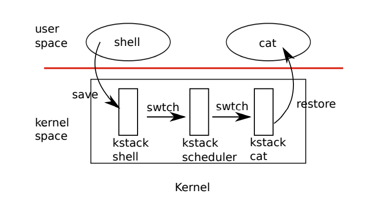

# Multithreading_lab

这个lab会加强对多线程的概念。你会实现用户级线程您将在用户级线程包中实现线程之间的切换，使用多个线程来加速程序，并实现屏障（barrier）。

```
$ git fetch
$ git checkout thread
$ make clean
```

## Chapter 7: Scheduling

任何操作系统都会运行比CPU数量多的进程，因此对进程时分复用CPU是很重要的。理想的共享应该对用户进程透明。一个常见的方法是通过复用多个进程在硬件CPU上，为每个进程提供虚拟的CPU的幻觉。本章叙述xv6如何实现这样的复用。

### 7.1 Multiplexing

Xv6通过切换CPU上的进程到另一个进程实现复用。这样的切换有两种情形：

1. xv6的`sleep`和`wakeup`机制在进程等待设备或者pipe I/O完成、子进程退出、在`sleep`调用中等待，发生切换。
2. xv6周期性地强制发生切换，以应对长时间的计算进程而不sleep。

这样的复用创造了一种幻觉——每个进程都有其自身独立的CPU，就像xv6使用内存分配器和硬件页表创造每个进程都有其独立的内存的幻觉一样。

实现复用带来一些挑战。
* 首先，如何从一个进程切换到另一个？尽管上下文切换的想法时简单的，其实现却是xv6中几乎最令人迷惑的部分。
* 其次，如何使得切换在进程看来是透明的？xv6使用标准的技术，即硬件timer中断驱动上下文切换。
* 第三：所有的CPU都在共享的进程集合中切换，为避免冲突，加锁是必要的。
* 第四：进程的内存和其他资源必须要在进程退出后释放，但是释放不能由进程自己完全完成。比如进程无法在使用自己的内核栈的同时中释放自己这个栈。
* 第五：每个多核机器必须记住那个进程正在执行，因此系统调用能正确使用正确的进程的内核状态。
* 最后：`sleep`和`wakeup`允许进程放弃其自身的CPU并等待被另一个进程或中断唤醒。需要注意中途导致丢失唤醒提醒。

xv6尝试尽量简单的解决这些问题，但是无论如何最终的代码都很有技巧。


### 7.2 Code: Context switching



图中展示了涉及到从一个用户进程切换到另一个用户进程的步骤：
* 用用户到内核的转换（通过系统调用或中断）到老的进程的内核线程（kstack shell）
* 上下文切换，由进程的内核线程切换到CPU的调度线程
* 上下文切换，由调度线程切换到新进程的内核线程
* 一个trap返回到用户的进程

xv6调度程序在每个CPU都有一个专用线程（保存的寄存器和堆栈），因为调度程序在旧进程的内核堆栈上执行是不安全的：其他核心可能唤醒该进程并运行这一进程，并且使用同一个栈在不同的两个核心上可能造成灾难。在这一章中，我们会叙述由内核线程切换到调度线程的机制。

从一个线程切换到另一个线程需要保存旧线程的CPU寄存器，并恢复之前保存的新线程的寄存器。事实上，栈指针和PC指针是也被保存和恢复，这意味着CPU会在栈和执行代码上切换。

函数`swtch`执行保存和恢复内核线程切换的工作。`swtch`并不直接直到线程的信息：它只会保存和恢复32个RISC-V的寄存器，这些寄存器称为`contexts`。当进程需要放弃CPU，进程的内核线程调用`swtch`用于保存其自身的上下文，并返回到调度器的context。每个context都保存在结构`struct context, kernel/proc.h`，这一结构被保存在进程的结构`struct proc`或者CPU的数据结构`struct cpu`。`swtch`有两个参数：`struct context *old`和`struct context *new`。其保存当前的寄存器到`old`中，从`new`中读取寄存器，然后返回。

```
// in sched(void), switch from current process to CPU scheduler thread
swtch(&p->context, &mycpu()->context);

// in scheduler(void), switch from CPU scheduler thread to p's kernel thread
swtch(&c->context, &p->context);
```

让我跟着一个进程从`swtch`进入到调度器。我们说在一个中断的末端的一种可能是`usertrap`调用`yield`。`Yield`调用`sched`，用于保存当前的上下文到`p->context`并切换到之前保存在`cpu->scheduler`中的调度器的上下文。

> 新的xv6的调度器上下文保存在`cpu->context`

`Swtch, kernel/Swtch.S`仅保存当前的调用者的寄存器：C编译器在调用者中生成代码，以将调用者需要保存的寄存器保存在堆栈中。`Swtch`直到每个寄存器的在`struct context`中的偏移量。它并不保存PC寄存器。相反，`swtch`保存`ra`寄存器，其保存调用`swtch`的函数的地址用于返回。然后`swtch`恢复新的context中的寄存器，这些context保存由之前的`swtch`中保存的值。当`swtch`最后一行调用`ret`时，其返回到由`ra`寄存器保存的指令地址。这一地址是新线程之前调用`swtch`时保存的返回值。另外，其返回到新线程的栈，因为恢复了新线程的`sp`寄存器。

```
.globl swtch
swtch:
        sd ra, 0(a0)
        sd sp, 8(a0)
        sd s0, 16(a0)
        sd s1, 24(a0)
        sd s2, 32(a0)
        sd s3, 40(a0)
        sd s4, 48(a0)
        sd s5, 56(a0)
        sd s6, 64(a0)
        sd s7, 72(a0)
        sd s8, 80(a0)
        sd s9, 88(a0)
        sd s10, 96(a0)
        sd s11, 104(a0)

        ld ra, 0(a1)
        ld sp, 8(a1)
        ld s0, 16(a1)
        ld s1, 24(a1)
        ld s2, 32(a1)
        ld s3, 40(a1)
        ld s4, 48(a1)
        ld s5, 56(a1)
        ld s6, 64(a1)
        ld s7, 72(a1)
        ld s8, 80(a1)
        ld s9, 88(a1)
        ld s10, 96(a1)
        ld s11, 104(a1)
        
        ret
```

在我们的样例中，`sched`调用`swtch`切换到`cpu->context`，是每个CPU的调度器上下文。这一上下文指针指向上次`scheduler`线程调用`swtch`时保存的`scheduler`的上下文。当`swtch`返回时，它返回的地方不是`sched`而是`scheduler`，而且将栈指针`sp`切换到当前的CPU的调度器栈。

### 7.3 Code: Scheduling

上一节查看了`swtch`的底层实现，现在让我们将`swtch`看作是给定的用于将一个内核线程切换为另一个内核线程的功能。调度器的实现在每个CPU上，是一个特殊线程的形式，完全运行`scheduler`函数的死循环。这一函数负责选择接下来运行那个线程。

一个进程希望放弃CPU必须获取其自己的进程锁`p->lock`，释放任何其他进程获取的锁，更新其自己的状态（p->state），然后调用`sched`。这样的过程在`yield`，`sleep`和`exit`中。`Sched`双重检查了这些要求，并检查一种含义：由于持有锁，因此需要释放锁。最后，`sched`调用`swtch`用于保存当前的线程上下文到`p->context`中，然后切换到调度器的上下文。`Swtch`在返回时到达调度器的栈。

调度器的任务就是持续的`for`循环，寻找一个线程运行，切换到这一线程运行，然后循环。

我们看到xv6在运行`swtch`前都会获取进程的锁`p->lock`：调用`swtch`时必须持有锁，并且将持有的锁转移到切换去的代码。这种约定对于锁来说是不寻常的。通常，获得锁的线程也负责释放锁，这样更容易推理正确性。对于上下文切换，打破这一传统是必要的额，因为`p->lock`保护了`swtch`中执行时不为真的进程状态和上下文字段的不变量（传统的线程获取，线程释放仅在不变量为真时有用）。一个可能的问题是，如果不在`swtch`时获取`p->lock`，则可能由另一个CPU在`yield`将线程状态由`RUNNING`修改为`RUNNABLE`后，决定运行这一线程，但却还在`swtch`决定停止使用这一线程的自己的内核栈之前。这导致两个CPU运行在同一个栈，造成错误。

内核线程放弃CPU的唯一区域是`sched`，并且它永远会切换到同样的位置`scheduler`中，并且永远切换到一个之前调用`sched`的内核线程中。于是，如果在xv6切换线程时打印行号，我们可以看到如下的模式：
* `kernel/proc.c: 456`
* `kernel/proc.c: 490`
* `kernel/proc.c: 456`
* `kernel/proc.c: 490`

这样的循环。有意地主动通过线程切换将控制权*相互*转移的过程有时称为协程（co-routines）。在这一例子中，`sched`和`scheduler`是一对协程。

这里有一种可能当调度器调度`swtch`，但最后不在`sched`结束。`allocproc`将上下文中的新的进程的`ra`寄存器设置为`forkret`，因此其第一个`swtch`返回到这一函数的起始位置。`Forkret`退出时释放`p->lock`。在其他情况下，由于新进程使用`fork`返回到用户态，其使用`usertrapret`返回。

`Scheduler（kernel/proc.c）`在循环中运行：寻找一个进程运行，运行直到进程`yield`，重复。调度器在线程列表中轮询，直到找到一个`p->state == RUNNABLE`的进程。一旦找到一个进程，它就会将之设置每个CPU的当前进程变量`c->proc`，将该进程标记为`RUNNING`，然后调用`swtch`开始运行它。

思考调度器代码结构的一种方法是，它对每个进程强制实现一组不变量，并且在这些不变量被打破时持有锁`p->lock`。一个不变量是如果进程是`RUNNING`状态，一个时间中断的`yield`必须能安全地切换走这个进程。这意味着CPU的寄存器爆出有该进程的寄存器值（就是说，`swtch`没有将他们移动到`context`中），而且`c->proc`必须指向该进程。另一个不变量是如果进程状态是`RUNNABLE`，对于一个空闲地CPU必须能安全地调度运行它。这意味着`p->context`中持有这一进程地寄存器（就是说，它们不是真实的寄存器，而是内存），而且没有CPU在这一进程的内核栈上运行，并且没有CPU的`c->proc`指向这一进程。很明显，这些特性通常在`p->lock`持有的时候通常不为真。

维护以上的不变量是为什么xv6经常请求`p->lock`在一个线程请求锁，而在另一个线程释放的原因。例如，在`yield`中请求，而在`scheduler`中释放。一旦`yield`开始修改一个运行的进程状态让它`RUNNABLE`，锁必须保持到不变量恢复为真：最早的释放时间点是`scheduler`（在线程自己的栈上运行）释放`c->proc`之后。相似的，一旦`scheduler`开始从`RUNNABLE`转移到`RUNNING`，锁必须保持到内核线程完全运行（在`swtch`之后，在`yield`中有例子）。


> 这里的问题是，既然timer中断无法关闭，那么timer中断会产生软件中断，导致的进程`yield`，是否也没有办法关闭呢？
> 
> 也就是说：即使CPU获取了进程的锁，但是此时该cpu发生了timer中断，然后必将发生软件中断。
> 
> 这一软件中断是否被`sstatus`的bit屏蔽了呢？
> 
> 答案是的：在中断使能方面，MIE、SIE、UIE分别提供了 machine mode 、supervisor mode 、user mode 的全局中断使能位，能够屏蔽除了Timer以外的中断。

我们添加一个实验：

```
void usertrap()
{
    int xx = 1/2;
    int bug = 1/xx;
    printf("%d\n",bug);
    printf("after bug\n");
}

void kerneltrap()
{
   printf("in kerneltrap\n");
}
```
此时如果进入`usertrap`，输出值是：
```
-1
after bug
```
中间除以0时不会进入`kerneltrap`

但是如果是在`intr_on()`之后添加输出：

```
void usertrap()
{
    int xx = 1/2;
    int bug = 1/xx;
    intr_on();
    printf("%d\n",bug);
    printf("after bug\n");
}

void kerneltrap()
{
   printf("in kerneltrap\n");
}
```

则输出为：

```
-1
in kerneltrap
after bug
```

所以在`yield`中`acquire`获取锁之时，同时也使用`intr_off()`关闭了中断，此时即使发生timer中断，引发软件中断，也不会引发进一步的`yield`。

### 7.4 Code: mycpu and myproc

Xv6通常需要一个指针指向当前的进程`struct proc`的指针。在单核CPU上，可能有一个全局变量的指针指向当前的`proc`。这在多核的机器上，每个核心执行不同的进程时，是不奏效的。一个解决这一问题的方法是每个核心都有其自己的寄存器集合。我们能够使用其中的一个寄存器帮助找到单个核心的信息。

Xv6为每个核心维护`struct cpu`，它保存了当前CPU运行的进程（如果有的话），保存的CPU上的调度线程的寄存器，以及管理中断禁用所需的嵌套自旋锁的计数。函数`mycpu()`返回指向当前CPU地址的`struct cpu`。RISC-V 会对其CPU进行编号，给定每个CPU一个`hartid`。Xv6 保证在内核中时，当前CPU的hartid保存在CPU的`tp`寄存器中。这使得`mpcpu`能使用`tp`从一个CPU数据结构中索引正确的一个。

保证当前CPU的`tp`保持CPU的hartid是按照如下实现的：在CPU启动的过程中，`mstart()`设置`tp`寄存器，并仍然在machine mode（kernel/start.c）。

> 注：当前的版本的函数名已经改成了`start()`。

`usertrapret`保存`tp`在trampoline页中，因为用户进程可能修改`tp`寄存器。最终`uservec`在从用户态进入内核时恢复保存的`tp`(kernel/trampoline.S)。编译器保证永远不会使用`tp`寄存器。如果xv6能请求RISC-V硬件获取当前的hartid，会更加方便，但是RISC-V仅允许在machine mode执行这样的操作。

`cpuid`和`mycpu`的返回值是脆弱的：如果timer发生中断并导致线程让步，然后移动到不同的 CPU，则先前返回的值将不再正确。为避免这样的问题，xv6要求调用者关闭中断，并且在使用完成`struct cpu`之后允许打开。

函数`myproc`返回`struct proc`指向正在当前CPU运行的进程。`myproc`关闭中断，并调用`mpcpu`，获取当前的进程指针`c->proc`，然后使能中断。`myproc`的返回值能够在中断使能情况下安全使用，因为如果一个timer中断使得进程到一个不同的CPU，其`struct proc`指针的值不会变。

### 7.5 Sleep and wakeup

调度和锁有助于隐藏一个线程的操作，但是我们仍然需要抽象帮助线程显示的交互。例如，一个管道的渲染在xv6中可能需要等待一个写进来处理数据；一个父线程调用`wait`可能需要等待子线程的退出；一个进程读取磁盘需要等待磁盘硬件完成读取。xv6内核使用`sleep`和`wakeup`机制处理这些需求。Sleep允许内核线程等待特定的事件，另一个线程能调用`wakeup`来指示等待事件的线程需要恢复。Sleep和wakeup通常被称为`sequence coordination`或者`conditional synchronization`机制。

`sleep`和`wakeup`提供相对底层的同步接口。为了激发它们在`xv6`中的工作方式，我们将使用它们来构建一个更高级别的同步机制，称为信号量(`semaphore`)[4]，用于协调生产者和消费者（xv6 不使用信号量）。一个信号量维护一个计数器，并且提供两种操作。`V`操作（用于生产者）增长变量。`P`操作（用于消费者）等待直到变量为非0，然后减少变量并返回。如果仅有一个生产者线程和一个消费者进程，并且它们在不同的CPU上运行，然后编译器没有过度的优化，如下有一个正确的实现方法：

> [4] Edsger Dijkstra. Cooperating sequential processes. https://www.cs.utexas.edu/users/EWD/transcriptions/EWD01xx/EWD123.html, 1965.

```
struct semaphore{
    struct spinlock lock;
    int count;
};

void 
V(struct semaphore *s)
{
    acquire(&s->lock);
    s->count += 1;
    release(&s->lock);
}

void
P(struct semaphore *s)
{
    while(s->count == 0)
        ;
    acquire(&s->lock);
    s->count -= 1;
    release(&s->lock);
}
```

以上的实现是非常昂贵的。如果生产者行动非常少，消费者会花费大量时间在`while`循环中。通过反复轮询`s->count`，消费者的CPU可能会找到比忙于等待(busy waiting)更高效的工作（切换进程）。避免`busy waiting`需要一种让消费者释放CPU并仅在`V`增加计数器后恢复执行的方法。

这是朝着这个方向迈出的一步，尽管我们将看到这还不够。让我们想象一对函数，`sleep`和`wakeup`，按照如下工作：`Sleep(chan)`在任意值`chan`上等待，称为`wait channel`，等待通道。`Sleep`将运行的进程去睡眠等待，释放CPU用于其他工作。`Wakeup(chan)`唤醒所有(如果有)在通道`chan`上等待的进程，导致它们的`sleep`返回。如果没有进程等待在`chan`，`wakeup`什么也不做。我们能使用这样的函数修改信号量的实现：

```
void 
V(struct semaphore *s)
{
    acquire(&s->lock);
    s->count += 1;
    wakeup(s);
    release(&s->lock);
}

void
P(struct semaphore *s)
{
    while(s->count == 0)
        sleep(s);
    acquire(&s->lock);
    s->count -= 1;
    release(&s->lock);
}
```

现在`P`释放CPU而不是轮询，这样更好。然而，事实证明，使用这个接口设计`sleep`和`wakeup`机制，在不遭受丢失唤醒（*lost-wake-up*）问题前提下，并不简单。假设`P`找到`s->count == 0`，`P`还在`sleep(s)`之前，`V`在另一个CPU上执行：其修改`s->count`使之为非0，并调用`wakeup`，其并不能找到一个正在`sleep`的进程，然后什么也不会发生。现在`P`继续在`sleep(s)`上执行：其调用`sleep`然后继续休眠。这导致了问题：`P`睡眠等待的`V`调用早已发生。除非我们走运并且生产者再次调用 V，否则即使计数不为零，消费者也会**永远等待**。

该问题的根源是，`P`只会在`s->count == 0`情况下休眠的不变量被`V`在错误的时刻运行的行为违反了。一个错误的保护这样的不变量的方法是，将请求锁的操作在`P`中提前，因此其检测计数器的操作并调用`sleep`是原子的：

```
void 
V(struct semaphore *s)
{
    acquire(&s->lock);
    s->count += 1;
    wakeup(s);
    release(&s->lock);
}

void
P(struct semaphore *s)
{
    acquire(&s->lock);
    while(s->count == 0)
        sleep(s);
    s->count -= 1;
    release(&s->lock);
}
```

人们可能希望这个版本的`P`能避免丢失唤醒，因为锁阻止`V`在`while(s->count == 0)`和`sleep(s)`之间执行。但是这样会导致死锁问题：`P`持有锁并休眠，因此`V`操作会永远等待锁。

我们将通过更改`sleep`的接口来修复上述方案：调用者必须传入*condition lock*到`sleep`，因此它能够在调用进程被标记为休眠状态时释放锁，并在channel上等待。该锁会强制并发的`V`等待，直到`P`完成将自己置于休眠状态，因此`wakeup`能够找大豆休眠的消费者并唤醒它。一旦消费者再次恢复，`sleep`在返回之前再次获得锁。新的正确的`sleep/wakeup`机制可按如下方式使用：

```
void 
V(struct semaphore *s)
{
    acquire(&s->lock);
    s->count += 1;
    wakeup(s);
    release(&s->lock);
}

void
P(struct semaphore *s)
{
    acquire(&s->lock);
    while(s->count == 0)
        sleep(s, &s->lock);
    s->count -= 1;
    release(&s->lock);
}
```

实时上，`P`通过持有`s->lock`，阻止了`V`尝试在`P`检查`s->count`和调用`sleep`之间唤醒`P`。注意到，无论如何，我们需要让`sleep`自动的释放`s->lock`并且将消费者进程设置为休眠状态，以避免丢失唤醒。

### 7.6 Code: Sleep and wakeup

xv6的`sleep`和`wakeup`的使用样例如上一小节，其实现方式（加上使用的规则）保证了不会有丢失唤醒。基础的思想是`sleep`标记当前的进程为`SLEEPING`并调用`sched`来释放CPU；`wakeup`查找在对应channel上等待的进程，并将它标记为`RUNNABLE`。`sleep`和`wakeup`的调用者可以使用任何相互方便的号码作为channel。Xv6通常使用内核数据结构的地址来参与等待。

```
// Atomically release lock and sleep on chan.
// Reacquires lock when awakened.
void
sleep(void *chan, struct spinlock *lk)
{
  struct proc *p = myproc();
  
  // Must acquire p->lock in order to
  // change p->state and then call sched.
  // Once we hold p->lock, we can be
  // guaranteed that we won't miss any wakeup
  // (wakeup locks p->lock),
  // so it's okay to release lk.

  acquire(&p->lock);  //DOC: sleeplock1
  release(lk);

  // Go to sleep.
  p->chan = chan;
  p->state = SLEEPING;

  sched();

  // Tidy up.
  p->chan = 0;

  // Reacquire original lock.
  release(&p->lock);
  acquire(lk);
}

// Wake up all processes sleeping on chan.
// Must be called without any p->lock.
void
wakeup(void *chan)
{
  struct proc *p;

  for(p = proc; p < &proc[NPROC]; p++) {
    if(p != myproc()){
      acquire(&p->lock);
      if(p->state == SLEEPING && p->chan == chan) {
        p->state = RUNNABLE;
      }
      release(&p->lock);
    }
  }
}
```

`Sleep`获取`p->lock`。现在进程调用`sleep`会持有`p->lock`和`lk`。让调用者持有`lk`是必要的（比如，`P`）：其保证没有其他进程（比如：`V`）能够调用`wakeup(chan)`。现在`sleep`持有`p->lock`，因此可以释放`lk`：其他进程可能开始调用`wakeup(chan)`，但是`wakeup`会等待获取`p->lock`，这样的等待会在`sleep`完成将进程设置为休眠之后结束，防止`wakeup`错过`sleep`。

现在`sleep`仅持有`p->lock`，它可以通过记录睡眠通道、将进程状态更改为`SLEEPING`并调用`sched`来使进程进入睡眠状态。马上就会清楚为什么在进程标记为`SLEEPING`之前不释放`p->lock`是至关重要的（释放是由`scheduler`完成的，由`sched`进入）。

在一些情况下，一个进程会请求获取条件锁，设置休眠者的等待条件，然后调用`wakeup(chan)`。`wakeup`调用时持有该条件锁是重要的。

> 严格来说，`wakeup`仅仅跟在`acquire`之后就足够了（也就是说，可以在`release`之后调用`wakeup`）

`wakeup`在进程表中循环。其请求每个进程的`p->lock`，因为这样`wakeup`能操作进程的状态并且`p->lock`保证`sleep`和`wakeup`不会相互错过。当`wakeup`查找在`SLEEPINIG`状态中，满足`chan`的进程，其改变当前的进程状态为`RUNNABLE`。下一次`scheduler`运行时，能发现该进程已经准备好运行。

为什么锁的规则保证了`sleep`和`wakeup`不会丢失唤醒？休眠的进程持有该条件锁或其自己的`p->lock`，或者两者都有。这一不不变量在其检查自己的条件之前，直到其标记自身为`SLEEPING`之后，都为真。

唤醒者调用`wakeup`后，会在`wakeup`的循环中同时持有两个锁，因此和上面的`sleep`进程区间不会交替执行。于是唤醒者要么在消费者进程检查条件之前，将条件标记为真；要么唤醒者调用`wakeup`的行为，严格限制在进程被标记为`SLEEPING`之后。然后`wakeup`会看到休眠进程并唤醒它（除非别的事件先唤醒了它）。

> 就算是，sleep进程会持有两个锁中的至少一个，而wakeup必须持有两个锁，因此不会交替执行。sleep中的sched会在执行流切换到scheduler之后，释放`p->lock`，此时wakeup能够唤醒该休眠的进程。

有时会出现多个进程在同一个通道上休眠的情况；例如，从管道中读取的多个进程。一个唤醒调用会把他们全部唤醒。其中一个将首先运行并获取调用`sleep`的锁，并且（在这个管道样例中）读取任何等待读取的管道数据。其他进程会发现，除了被唤醒以外，没有其他数据能读取。从他们的角度来看，唤醒是"虚假的"，他们必须再次休眠。出于这个原因，休眠总是在检查条件的循环内调用（while()->count == 0）。

> 个人理解这里被第一个唤醒的进程会获取`lk`，然后将生产消费掉。其他后续被唤醒的进程不能获取这个锁，只有在被消费完成后才能再次获取。

如果两组`sleep/wakeup`使用意外选择了相同的通道，不会造成任何伤害：它们会看到虚假的唤醒，但如上所述的循环将容忍这个问题。`sleep/wakeup`的大部分魅力在于它既轻量级（无需创建特殊的数据结构来充当睡眠通道），又提供了间接层（调用者不需要知道他们正在与哪个特定进程交互）。

### 7.7 Code: Pipes

一个更复杂的使用`sleep`和`wakeup`来同步生产者和消费者在xv6中的例子是管道。我们看到在第一章的管道接口：写入管道一端的字节被复制到内核缓冲区，然后可以从管道的另一端读取。未来的章节将检查文件描述符对管道周围的支持，但现在让我们看看`pipewrite`和`piperead`的实现。

每个管道由一个结构管道表示，其中包含一个锁和一个数据缓冲区。字段`nread`和`nwrite`计算从缓冲区读取和写入到缓冲区的字节总数。缓冲区是环状的：在`buf[PIPESIZE-1]`之后写入的下一个字节是`buf[0]`。计数器不会回环。
这个约定方便了区分一个完整的缓冲区`(nwrite == nread+PIPESIZE)`和一个空的缓冲区`(nwrite == nread)`，但这意味着索引到缓冲区必须使用`buf[nread % PIPESIZE]`而不仅仅是`buf[nread]`（同样适用于`nwrite`）。

假设对`piperead`和`pipewrite`的调用同时发生在两个不同的`CPU`上。`Pipewrite (kernel/pipe.c:77)`首先获取管道的锁，它保护计数器、数据及其相关的不变量。`Piperead (kernel/pipe.c:106)`然后也尝试获取锁，但不能。它在获取（内核/自旋锁）中旋转等待锁。当`piperead`等待时，`pipewrite`循环遍历正在写入的字节`(addr[0..n-1])`，依次将每个字节添加到管道`(kernel/pipe.c:95)`。在此循环期间，缓冲区可能会填满`(kernel/pipe.c:88)`。在这种情况下，`pipewrite`调用`wakeup`来提醒任何正在休眠的读取进程，读取缓冲区上的数据，然后`pipewrite`在`&pi->nwrite` channel上休眠以等待读取器从缓冲区中取出一些字节。`Sleep`释放`pi->lock`，作为使`pipewrite`的进程进入睡眠状态的一部分。

现在`pi->lock`可用，`piperead`设法获取它并进入其临界区：它发现`pi->nread != pi->nwrite (kernel/pipe.c:113)`（`pipewrite`会在`pi->nwrite == pi->nread+PIPESIZE (kernel/pipe.c:88)`时进入睡眠），所以`piperead`进入`for`循环，将数据复制出管道`(kernel/pipe.c:120)`，
并将`nread`增加复制的字节数。完成后有更多字节可用于写入，因此`piperead`在返回之前调用`wakeup (ker nel/pipe.c:127)`唤醒睡眠的writer。`Wakeup`发现一个进程在`&pi->nwrite`上休眠，所以该进程是因为正在运行`pipewrite`，但在缓冲区填满导致停止。`Wakeup`将该进程标记为`RUNNABLE`。

管道代码为读取器和写入器使用单独的睡眠通道（pi->nread 和 pi->nwrite）；这使得在有很多读取器和写入器在等待同一个管道时，系统能更高效。管道代码在一个循环中休眠，检查休眠状态；如果有多个读取器或写入器，
除了第一个被唤醒的进程之外，所有进程都会看到条件仍然为假并再次休眠。

### 7.8 Code: Wait, exit, and kill

`sleep`和`wakeup`能用于多种等待。一个有趣的用例就是第一章中的子进程的`exit`和父进程的`wait`。在子进程消亡时，父进程可能已经在`wait`中休眠，或者可能在做别的事情。在后者做其他事情的情况下，随后的`wait`调用必须观察到子进程的死亡，而这一调用可能在子进程调用`exit`之后很久才发生。xv6 记录子进程的死亡是将其调用`exit`后将状态设置为`ZOMBIE`，直到父进程的`wait`观察到它。直到父进程`wait`观察到这个`ZOMBIE`，其将子进程的状态设置为`UNUSED`，复制子进程的退出状态，并将子进程ID返回给父进程。如果父进程在子进程退出之前退出，父进程将子进程传给`init`进程，永远调用`wait`，使得所有子进程都有父进程进行回收。一个挑战是避免同时父进程和子进程`wait`和`exit`之间的竞争和僵局，以及同时`exit`和`exit`。

```
// in init.c
    for(;;){
      // this call to wait() returns if the shell exits,
      // or if a parentless process exits.
      wpid = wait((int *) 0);
      if(wpid == pid){
        // the shell exited; restart it.
        break;
      } else if(wpid < 0){
        printf("init: wait returned an error\n");
        exit(1);
      } else {
        // it was a parentless process; do nothing.
      }
    }
```

`Wait`首先申请`wait_lock`。`wait_lock`像一个条件锁一样保证父进程不会错过来自一个存在的子进程的`wakeup`。然后`wait`扫描进程列表，如果它找到子进程在`ZOMBIE`状态，将释放这个子进程的资源，以及其`proc`数据结构，将子进程的退出状态复制到提供给等待的地址（如果它不为 0），并返回子进程ID。如果`wait`找到子进程，但是没有子进程退出，其调用`sleep`来等待任何子进程退出，然后再次扫描所有的子进程。`wait`通常持有两个锁，`wait_lock`和某个进程的`np->lock`。避免死锁的顺序是先`wait_lock`，然后是`np->lock`。

`Exit`记录退出状态，释放一些资源，调用`reparent`来将其子进程给到`init`进程，唤醒`wait`中的父进程，将`exit`的调用者标记为`ZOMBIE`，然后永久释放CPU。`exit`在这一过程中同时持有`wait_lock`和`p->lock`。持有`wait_lock`因为它是`wakeup(p->parent)`的条件锁，防止父进程已经在`wait`中丢失唤醒信息。`Exit`必须持有`p->lock`，防止等待中的父进程在子进程最终调用`swtch`之前看到子进程处于`ZOMBIE`状态，导致父进程执行`wait`中的一些操作（比如释放子进程的资源，但是这个时候子进程还不能释放）。避免死锁的获取锁的顺序和`wait`一致。

> 到这里理解一下sleep的作用，是将进程设置为不可能被调度器调度到的装态，因此不会自动运行，所以sleep的进程持有的关键的锁一定要释放。
> 
> 但是释放锁又可能由于丢失原子性导致丢失唤醒，所以释放锁的语义必须由sleep函数本身完成，然后在被唤醒时恢复锁。

在将状态设置为`ZOMBIE`之前，`exit`唤醒父进程可能看起来不正确，但是实际上这是安全的：尽管`wakeup`可能造成父进程开始运行，但是在`wait`中的循环不能检查子进程，直到子进程的`p->lock`被调度器释放，因此`wait`不能查看退出的进程，直到`exit`将退出进程的状态设置为`ZOMBIE`。

```
  acquire(&wait_lock);

  // Give any children to init.
  reparent(p);

  // Parent might be sleeping in wait().
  wakeup(p->parent);                                                                                                                                 
  acquire(&p->lock);

  p->xstate = status;
  p->state = ZOMBIE;

  release(&wait_lock);

  // Jump into the scheduler, never to return.
  sched();
  panic("zombie exit");
```

`exit`允许进程自我退出，`kill`使得一个进程让另一个进程结束。由`kill`直接摧毁受害者进程太复杂了，因为受害者进程可能正在另一个`CPU`上执行，可能正处在对内核数据结构进行敏感的序列更新中。因此`kill`做很少的事情：仅设置受检者进程的`p->killed`，然后如果进程在`sleeping`，将其唤醒。最终受害者进程会进入或退出内核，于是在`usertrap`中的代码会为`p->killed`的进程调用`exit()`。如果受害者运行在用户态，会很快因为时间中断或者系统调用，或者外部中断进入内核。

```
if(p->killed)
    exit(-1);
```

如果受害进程在sleep，`kill`如果调用`wakeup`进程是非常危险的，因为睡眠等待的条件可能不为真（甚至根本不知道`sleep`等待的条件是什么）。然而，xv6调用`sleep`永远被包裹在一个`while`循环中，并在`sleep`结束后重新测试等待条件。一些调用`sleep`也会在循环中检查`p->killed`，并在为真情况下放弃当前的行为。只有在这种放弃是正确的情况下才会这样做。例如，如果设置了`killed`标志，则管道读写代码返回；最终代码将返回到trap，它会再次检查`p->killed`并退出。

> 这里看出，xv6对kill的执行是不做保证的，不能保证kill发出后，进程立马结束

一些xv6的`sleep`循环没有检查`p->killed`，因为在多步骤的系统调用中，这些代码需要是原子的。`virtio`驱动程序`(kernel/virtio_disk.c:273)`就是一个例子：它不检查`p->killed`，因为磁盘操作可能是一组写入中的一个，这些写入都是为了将​​文件系统留在其中一个正确的状态。在等待磁盘 I/O 时被杀死的进程，在完成当前系统调用并且`usertrap`看到被杀死标志之前，不会退出。

### 7.9 Process Locking

和每个进程关联的锁`p->lock`是在xv6中最复杂的锁。一个方便思考的方法是，当读写任何以下的`struct proc`字段时必须持有锁：`p->state`，`p->chan`，`p->killed`，`p->xstate`和`p->ipd`。这些字段能够被其他进程使用，后者由调度线程在其他核使用，因此被锁保护是自然的。

然而，`p->lock`的大多数用途都是保护`xv6`的过程数据结构和算法的更高级别的方面。这是`p->lock`所做的全部事情：

* 与`p->state`一起，防止为新进程分配`proc[]`插槽时的竞争。
* 一个进程被创建或销毁时，隐藏这个过程
* 它可以防止父进程等待收集已将其状态设置为`ZOMBIE`但尚未让出`CPU`的子进程
* 它可以防止进程状态设置为`RUNNABLE`之后，但在完成`swtch`之前，另一个核心的调度器决定运行该释放CPU的进程
* 它确保只有一个核心决定运行一个`RUNNABLE`的进程
* 它可以防止定时器中断导致进程在处于`swtch`状态时释放CPU
* 它防止`kill`的受害者在kill检查`p->pid`和`p->killed`之间时，退出并可能的被重新分配
* 它保证`kill`的检查和写入`p->state`是原子的

`p->parent`字段由全局锁`wait_lock`而不是`p->lock`保护。仅有一个进程的父亲修改`p->parent`，尽管该字段被进程和其他搜索子进程的进程都读取。`wait_lock`的目的是如同一个 等待任何子进程退出的睡眠中的条件锁。一个正在退出的进程会持有`wait_lock`或`p->lock`，直到其状态设置为`ZOMBIE`，唤醒其父进程，并释放自己的CPU。`wait_lock`也能够序列化父子进程从并发的退出，以便保证`init`进程（继承子进程）从等待中被唤醒（没有唤醒丢失）。`wait_lock`是全局锁而不是每个父进程中的进程锁，因为在进程获取它之前，它无法知道它的父进程是谁。

### Real world

xv6调度器实现了一个简单的调度策略，依次运行每个进程。此策略称为*round robin*。真实的操作系统会使用更复杂的策略，比如允许进程有优先级。这个想法是调度程序将优先选择可运行的高优先级进程而不是可运行的低优先级进程。这些策略可能很快变得复杂，因为经常存在相互竞争的目标：例如，操作希望同时保证公平性和高吞吐量。此外，复杂的策略可能会导致诸如优先级倒置（priority inversion）和车队（convoys）等意外的交互。当低优先级和高优先级进程都使用特定的锁时，可能会发生优先级反转，当低优先级进程获取该锁时，可能会阻止高优先级进程继续进行；当许多高优先级进程正在等待获取共享锁的低优先级进程时，会形成一个等待进程的长车队；一旦车队形成，它可以持续很长时间。为了避免这些类型的问题，复杂的调度器中需要额外的机制。

睡眠和唤醒是一种简单有效的同步方法，但还有很多其他方法。所有这些中的第一个挑战是避免我们在本章开头看到的“丢失唤醒”问题。最初的 Unix 内核的睡眠只是简单地禁用了中断，这就足够了，因为 Unix 在单 CPU 系统上运行。

因为 xv6 在多处理器上运行，所以它添加了一个显式锁来休眠。`FreeBSD`的`msleep`采用相同的方法。`Plan 9`的`sleep`使用了一个回调函数，该函数在进入睡眠前持有调度锁的情况下运行；该功能作为最后一分钟的睡眠状况检查，以避免失去唤醒。Linux内核的睡眠使用显式进程队列，称为等待队列，而不是等待通道(channel)；队列有自己的内部锁。

在唤醒时扫描整个进程集是低效的。一个更好的解决方案是将睡眠和唤醒中的`chan`替换为一个数据结构，该数据结构包含一个在该结构上睡眠的进程列表，例如`Linux`的等待队列。`Plan 9`的睡眠和唤醒将该结构称为集合点(rendezvous point)或`Rendez`。许多线程库将相同的结构称为条件变量；在这种情况下，`sleep`和`wajeup`操作称为`wait`和`signal`。所有这些机制都具有相同的特点：保护睡眠状态的锁会在睡眠期间原子的丢失。

`wakeup`的实现唤醒正在等待特定通道的所有进程，并且情况可能是很多进程在等待同一个`channel`。操作系统将调度所有这些进程，它们将竞争检查睡眠条件。进程们的这种行为有时被称为*thundering herd*(惊群)，并且最好避免。大多数条件变量都有两个原语用于唤醒（`wakeup`）：`signal`，唤醒一个进程，`broadcast`，唤醒所有等待的进程。

信号量通常用于同步，其计数通常对应于管道缓冲区中可用的字节数或进程拥有的僵尸子进程的数量。作为抽象的一部分，使用显式计数可以避免“丢失唤醒”问题：对已发生的唤醒次数保存有显式计数。计数还避免了虚假唤醒和惊群问题。

终止进程并清理它们在 xv6 中引入了很多复杂性。在大多数操作系统中，它甚至更加复杂，因为例如，受害进程可能在内核深处处于休眠状态，并且展开其堆栈需要小心，因为调用堆栈上的每个函数都可能需要进行一些清理。一些语言通过提供异常机制来提供帮助，但 C 语言没有。此外，还有其他事件可以导致睡眠进程被唤醒，即使它正在等待的事件尚未发生。例如，当一个`Unix`进程正在休眠时，另一个进程可能会向它发送`signal`。在这种情况下，进程将从中断的系统调用中返回`-1`并且错误代码设置为`EINTR`。应用程序可以检查这些值并决定要做什么。`Xv6`不支持信号，因此不会出现这种复杂性。

Xv6 对`kill`的支持并不完全令人满意：有一些睡眠循环可能应该检查`p->killed`（在sleep的wihle中检查）。一个相关的问题是，即使对于检查`p->killed`的`sleep`循环，`sleep`和`kill`之间也存在竞争；后者可能会设置`p->killed`并尝试在受害者的循环检查`p->killed`之后但在它调用`sleep`之前唤醒受害者（在检查`p->killed`之后被`kill`，导致无法唤醒）。如果发生此问题，受害者将不会注意到`p->killed`，直到它等待的条件发生。这可能会晚一些，甚至永远不会（例如，如果受害者正在等待来自控制台的输入，但用户没有输入任何输入）。

真正的操作系统会在常数时间内找到具有显式空闲列表（free list）的空闲`proc`结构，而不是在`allocproc`中进行线性时间搜索；为简单起见，xv6 使用线性扫描。

## do lab

### Uthread: switching between threads 

这个来袭需要设计一致用户态的线程切换机制，并实现。为方便开始，xv6有两个文件`user/uthread.c`和`user/uthread_switch.S`， 添加规则到Makefile中以编译`uthread`程序。`uthread.c`包含了大量用户层的线程库，以及三个简单的测试线程的代码。线程库空缺了创建线程并在它们之间切换的代码。

> 我们的工作是制定一个计划来创建线程并 保存/恢复寄存器，以在线程之间切换，并实现。完成了`make grade`应该表明通过了`uthread`测试。


我们需要添加代码到`thread_create()`和`thread_schedule()`在`user/uthread.c`中，添加`thread_switch`到`user/ythread_switch.S`中。一个目标是，确保当`thread_schedule()`第一次运行给定线程时，该线程运行在自己的堆栈上，并执行传递给`thread_create()`的函数（因为线程一般是一个函数）。另一个目标是确保`thread_switch`保存被切换到的线程的寄存器，恢复被切换到的线程的寄存器，并返回到后一个线程中上次指令停止的点。实现时，必须决定在哪里保存/恢复寄存器；修改`struct thread`以保存寄存器是一个不错的计划。需要在`thread_schedule`中添加对`thread_switch`的调用；可以将所需的任何参数传递给`thread_switch`，但目的是从线程`t`切换到`next_thread`。

一些提示：

1. `thread_switch`需要保存/恢复 `callee-save`寄存器，为什么？
2. 您可以在 user/uthread.asm 中看到 uthread 的汇编代码，这对于调试可能很方便。
3. 要测试您的代码，使用`riscv64-linux-gnu-gdb`单步执行`thread_switch`可能会有所帮助。您可以通过以下方式开始：

```
(gdb) file user/_uthread
Reading symbols from user/_uthread...
(gdb) b uthread.c:60
```

这会在`uthread.c`的第60行设置一个断点。在您运行`uthread`之前，断点可能（也可能不会）被触发。怎么会这样？

一旦你的xv6 shell运行，输入"uthread"，gdb 将在第60行中断。现在你可以输入如下命令来检查`uthread`的状态：

```
(gdb) p/x *next_thread
```

使用"x"，您可以检查内存位置的内容：

```
(gdb) x/x next_thread->stack
```

您可以跳到`thread_switch`的开头：

```
(gdb) b thread_switch
(gdb) c
```

可以单步执行汇编指令：

```
(gdb) si
```

在线的gdb文档在[这里](https://sourceware.org/gdb/current/onlinedocs/gdb/)。

#### 实现

1. 数据结构

我们首先思考两个线程切换的上下文有哪些内容？

其实一个更简单的思考方式是，将所有进程的内核态运行系统调用时思考为一个内核线程，与`scheduler()`线程并列。这些线程具有相同的页表，但是栈不同，和用户态进程拥有相同的页表，但运行在不同的栈上一样。

> 从一个线程切换到另一个线程需要保存旧线程的CPU寄存器，并恢复之前保存的新线程的寄存器。事实上，栈指针和PC指针是也被保存和恢复，这意味着CPU会在栈和执行代码上切换。

内核线程的数据结构是`struct context`，因此我们可以复用这个结构：

```
/* user thread context*/
struct ut_context {
  uint64 ra;
  uint64 sp;

  // callee-saved
  uint64 s0;
  uint64 s1;
  uint64 s2;
  uint64 s3;
  uint64 s4;
  uint64 s5;
  uint64 s6;
  uint64 s7;
  uint64 s8;
  uint64 s9;
  uint64 s10;
  uint64 s11;
};

struct thread {
  char       stack[STACK_SIZE]; /* the thread's stack */
  int        state;             /* FREE, RUNNING, RUNNABLE */
  struct ut_context context; /* user mode thread context */
};
```

注意，理论上用户态的寄存器有32个，用户态进入内核时，都被保存。但是这里保存的寄存器只有14个，这是因为我们的调度器会使用栈来进入调度函数，调度函数会破坏一些寄存器，因此编译器会设置保护寄存器的指令。而调度到的线程，也是从调度部分的代码开始执行，因此不需要保护寄存器。（换句话说，保护这些寄存器其实是为了保护调度代码的现场。）

这里涉及到两个名词，其实我以前以为是打错了，其实不是：

* Caller Saved寄存器在函数调用的时候不会保存
* Callee Saved寄存器在函数调用的时候会保存

> 学生提问：除了Stack Pointer和Frame Pointer，我不认为我们需要更多的Callee Saved寄存器。
> 
> TA：s0 - s11都是Callee寄存器，我认为它们是提供给编译器而不是程序员使用。在一些特定的场景下，你会想要确保一些数据在函数调用之后仍然能够保存，这个时候编译器可以选择使用s寄存器。

也就是说，只有`callee`寄存器需要保证在函数调用之间还能正确还原，而其他寄存器可以任意的被调用函数修改。我们调用进程切换，实际上是进行了函数调用，只不过修改了返回地址`ra`。


1. 修改`thread_create`

修改的目的是，让该线程被调度到的时候能开始运行。那么线程是如何开始运行的呢？

我这里的理解是，使用`thread_create`之后创建了线程B，由线程B的`thread_schedule`调度选择到这个线程之后，将正在执行的线程切换为B，之后能正确运行。所以`thread_create`中，应该在`ut_context`中保存函数指针指向线程函数，然后与当前线程的context切换。

这里的`MAX_THREAD = 4`，在`thread_init`中，将主线程设为0号线程，因此`thread_create`应该还有编号的责任，并且负责将线程可执行状态写入到`context`字段。

> 程序就是一个状态机，将程序的初始状态写入后便能执行。我们这里决定保存什么，对应的也决定在schedule中恢复什么

首先pc寄存器值应该是接下来要运行的地址，而`ret`指令将pc赋值为`ra`寄存器的值，因此context中的`ra`值应该是`func_p`

```c
void 
thread_create(void (*func)())
{
  struct thread *t;

  for (t = all_thread; t < all_thread + MAX_THREAD; t++) {
    if (t->state == FREE) break;
  }
  t->state = RUNNABLE;


  // YOUR CODE HERE
  t->context.ra = (uint64)func;
  t->context.sp = (uint64)(t->stack);
}
```

3. 修改`thread_schedule`

```c
  if (current_thread != next_thread) {         /* switch threads?  */
    next_thread->state = RUNNING;
    t = current_thread;
    current_thread = next_thread;
    /* YOUR CODE HERE
     * Invoke thread_switch to switch from t to next_thread:
     * thread_switch(??, ??);                                         */

     // save thread context to t->context and restore curr
     thread_switch((uint64)(&(t->context)), (uint64)(&(current_thread->context)));
  } else
    next_thread = 0;
```

4. 修改`thread_schedule`

```
.globl thread_switch
thread_switch:
/* YOUR CODE HERE */

sd ra, 0(a0)
sd sp, 8(a0)
sd s0, 16(a0)
sd s1, 24(a0)
sd s2, 32(a0)
sd s3, 40(a0)
sd s4, 48(a0)
sd s5, 56(a0)
sd s6, 64(a0)
sd s7, 72(a0)
sd s8, 80(a0)
sd s9, 88(a0)
sd s10, 96(a0)
sd s11, 104(a0)

ld ra, 0(a1)
ld sp, 8(a1)
ld s0, 16(a1)
ld s1, 24(a1)
ld s2, 32(a1)
ld s3, 40(a1)
ld s4, 48(a1)
ld s5, 56(a1)
ld s6, 64(a1)
ld s7, 72(a1)
ld s8, 80(a1)
ld s9, 88(a1)
ld s10, 96(a1)
ld s11, 104(a1)

ret    /* return to ra */
```


这里直接做实验发现不能在线程间切换，原因是栈地址设置错误，导致线程状态变成`FREE`

栈地址是从高到低生长的，因此我们需要设置栈地址为`(uint64)(t->stack)+STACK_SIZE`

> 这里到底是`STACK_SIZE - 1`还是不`-1`，其实值得思考
> 
> 答案是`STACK_SIZE`，比如我们向栈存一个`uint32`，`sp = 0x84`，则应该先`sp = sp - 4`，然后将数据存入`0x80-0x83`，不会涉及到`0x84`。

```c
void 
thread_create(void (*func)())
{
  struct thread *t;

  for (t = all_thread; t < all_thread + MAX_THREAD; t++) {
    if (t->state == FREE) break;
  }
  t->state = RUNNABLE;


  // YOUR CODE HERE
  // memset(&(t->context), 0, sizeof(struct ut_context));
  // thread_switch((uint64)(&(current_thread->context)), (uint64)(&(current_thread->context)));
  t->context.ra = (uint64)func;
  t->context.sp = (uint64)(t->stack)+STACK_SIZE;;
}
```

注意`make grade`的时候删除debug的输出，得分是依据全文匹配来给的

### Using threads

在本作业中，您将使用哈希表探索线程和锁的并行编程。您应该在具有多个内核的真实`Linux`或`MacOS`计算机（不是`xv6`，不是`qemu`）上执行此任务。大多数最新的笔记本电脑都有多核处理器。

本作业使用的是UNIX的`pthread`线程库，可以使用`man pthreads`查询信息。或者查询在线信息：[here](https://pubs.opengroup.org/onlinepubs/007908799/xsh/pthread_mutex_lock.html)、[here](https://pubs.opengroup.org/onlinepubs/007908799/xsh/pthread_mutex_init.html)、[here](https://pubs.opengroup.org/onlinepubs/007908799/xsh/pthread_create.html)

文件`notxv6/ph.c`包括简单在单线程正确的哈希表，但是多线程时不正确。运行编译方法如下，在主目录`~/xv6-labs-2021`输入：

```sh
$ make ph
$ ./ph 1
```

注意`ph`的编译使用的是操作系统的gcc，而不是6.S801的工具。参数表明在hash table中执行put和get操作的线程数量。经过一定时间执行后，回返回性能：

```
$ ./ph 1
100000 puts, 6.111 seconds, 16365 puts/second
0: 0 keys missing
100000 gets, 6.432 seconds, 15548 gets/second
```

以上是我笔记本上的结果。`ph`会测试`put()`和`get()`操作。`get()`测试还会打印出，本应该能获取的key但是缺失的量（比如这里是0）。

使用大于1的参数进行多线程测试：

```
$ ./ph 2
100000 puts, 3.079 seconds, 32475 puts/second
0: 16475 keys missing
1: 16475 keys missing
200000 gets, 7.194 seconds, 27800 gets/second
```

此`ph 2`输出的第一行表明，当两个线程同时向哈希表添加条目时，它们达到每秒`32475`次插入的总速率。这大约是运行`ph 1`的单线程速率的两倍。这是大约 2 倍的出色“并行加速”，这是人们可能希望的（加速比和核心数线性）。

但是，接下来两行说`16475`个键缺失，表明本应在哈希表中的大量键不存在。也就是说，`puts`应该将这些键添加到哈希表中，但是出了点问题。看看`notxv6/ph.c`，尤其是`put()`和`insert()`的实现。

#### 要求

* 为什么2个线程会缺少key，但1个线程没有 ？找出使用2个线程识别可能导致key丢失的一系列事件。在`answers-thread.txt`中提交说明。

* 为了避免这样的事件，在`put`和`get`中插入`lock`和`unlock`语句，以便在两个线程中丢失的key数始终为 0。相关的`pthread`调用是：

```c
pthread_mutex_t lock;            // declare a lock
pthread_mutex_init(&lock, NULL); // initialize the lock
pthread_mutex_lock(&lock);       // acquire lock
pthread_mutex_unlock(&lock);     // release lock
```

当`make Grade`表示您的代码通过了`ph_safe`测试时，您就完成了，这需要两个线程的都0 missing key。这个阶段测试`ph_fast`失败是可以的。

不要忘记调用`pthread_mutex_init()`。首先用`1`个线程测试您的代码，然后用`2`个线程测试它。相对于单线程版本，双线程版本是否实现了并行加速（即每单位时间的总工作量更多）？

在某些情况下，并发`put()`在它们在哈希表中读取或写入的内存中没有重叠，因此不需要锁来相互保护。你能改变`ph.c`以利用这种情况来获得一些`put()`的并行加速吗？提示：每个哈希桶有一个锁怎么样？

修改您的代码，使一些`put`操作在保持正确性的同时并行运行。当`make grade`表示您的代码通过了`ph_safe`和`ph_fast`测试时，您就完成了。`ph_fast`测试要求两个线程产生的`put/second`至少是一个线程的`1.25`倍。

#### 实现

注意这个实验的读写是分开的，因此读的时候不需要修改hash table，因此不需要锁。我们只需要在`put`阶段加锁就行了。


put线程如下：

```c
static void *
put_thread(void *xa)
{
  int n = (int) (long) xa; // thread number
  int b = NKEYS/nthread;

  for (int i = 0; i < b; i++) {
    put(keys[b*n + i], n);
  }

  return NULL;
}

static 
void put(int key, int value)
{
  int i = key % NBUCKET;

  // is the key already present?
  struct entry *e = 0;
  for (e = table[i]; e != 0; e = e->next) {
    if (e->key == key)
      break;
  }
  if(e){
    // update the existing key.
    e->value = value;
  } else {
    // the new is new.
    insert(key, value, &table[i], table[i]);
  }

}
```

这些key按照`bucket`存入hash table中。那么什么时候会导致key写入失败呢？注意到`bucket`是按照取模分的，但是每个线程的写区间是连续的，因此各个线程都会写入每个`bucket`。而各个`entry`是按照链表的形式组织的，因此可能操作同一个链表头，只有后更新的链表头留在内存里能被查询到。

为了使锁粒度不那么大，我们可以使用每个`bucket`的细粒度锁。

互斥锁的属性在创建锁的时候指定，在LinuxThreads实现中仅有一个锁类型属性，不同的锁类型在试图对一个已经被锁定的互斥锁加锁时表现不同。当前（glibc2.2.3,linuxthreads0.9）有四个值可供选择：

* PTHREAD_MUTEX_TIMED_NP，这是缺省值，也就是普通锁。当一个线程加锁以后，其余请求锁的线程将形成一个等待队列，并在解锁后按优先级获得锁。这种锁策略保证了资源分配的公平性。
* PTHREAD_MUTEX_RECURSIVE_NP，嵌套锁，允许同一个线程对同一个锁成功获得多次，并通过多次unlock解锁。如果是不同线程请求，则在加锁线程解锁时重新竞争。
* PTHREAD_MUTEX_ERRORCHECK_NP，检错锁，如果同一个线程请求同一个锁，则返回EDEADLK，否则与PTHREAD_MUTEX_TIMED_NP类型动作相同。这样保证当不允许多次加锁时不出现最简单情况下的死锁。
* PTHREAD_MUTEX_ADAPTIVE_NP，适应锁，动作最简单的锁类型，仅等待解锁后重新竞争。

获取和解锁的API有三个：

* int pthread_mutex_lock(pthread_mutex_t *mutex)
* int pthread_mutex_unlock(pthread_mutex_t *mutex)
* int pthread_mutex_trylock(pthread_mutex_t *mutex)

pthread_mutex_trylock()语义与pthread_mutex_lock()类似，不同的是在锁已经被占据时返回EBUSY而不是挂起等待。

```c
pthread_mutex_t locks[NBUCKET];

int main(){

  for(int i = 0; i < NBUCLET; i++)
    pthread_mutex_init(&lock, NULL);

}

static 
void put(int key, int value)
{
  int i = key % NBUCKET;

  // is the key already present?
  struct entry *e = 0;
  for (e = table[i]; e != 0; e = e->next) {
    if (e->key == key)
      break;
  }
  if(e){
    // update the existing key.
    e->value = value;
  } else {
    // the new is new.
    pthread_mutex_lock(locks+i);
    insert(key, value, &table[i], table[i]);
    pthread_mutex_unlock(locks+i);
  }

}
```

测试：

```
$ ./ph 2
100000 puts, 2.760 seconds, 36232 puts/second
1: 0 keys missing
0: 0 keys missing
200000 gets, 6.593 seconds, 30335 gets/second
```

此时能同时通过`ph_safe`和`ph_fast`测试


```
answers-thread.txt


这些key按照`bucket`存入hash table中。那么什么时候会导致key写入失败呢？注意到`bucket`是按照取模分的，但是每个线程的写区间是连续的，因此各个线程都会写入每个`bucket`。而各个`entry`是按照链表的形式组织的，因此多个线程可>能操作同一个链表头，但只有后更新的链表头留在内存里能被查询到。因此出现了missing key
```

### Barrier

在这个任务中，您将实现一个Barrier：应用程序中的一个点，所有参与的线程都必须等待，直到所有其他参与的线程也到达该点。您将使用`pthread`条件变量，这是一种类似于`xv6`的睡眠和唤醒的序列协调技术。

这个实现是在`xv6`之外的。文件`notxv6/barrier.c`包含一个损坏的屏障。

```
$ make barrier
$ ./barrier 2
barrier: notxv6/barrier.c:42: thread: Assertion `i == t' failed.
```

参数2指定在屏障上同步的线程数（barrier.c 中的 nthread）。每个线程执行一个循环。在每次循环迭代中，线程调用`barrier()`，然后休眠随机数微秒。这里的`assert`触发，是因为一个线程在另一个线程到达barrier之前，离开了barrier。期望的行为是每个线程都阻塞在`barrier()`中，直到它们的所有`nthread`都调用了`barrier()`。

* 您的目标是实现所需的屏障行为。除了您在`ph`赋值中看到的锁原语之外，您还需要以下新的`pthread`原语；在[这里](https://pubs.opengroup.org/onlinepubs/007908799/xsh/pthread_cond_wait.html)和[这里](https://pubs.opengroup.org/onlinepubs/007908799/xsh/pthread_cond_broadcast.html)查看详细信息。

```c
pthread_cond_wait(&cond, &mutex);  // go to sleep on cond, releasing lock mutex, acquiring upon wake up
pthread_cond_broadcast(&cond);     // wake up every thread sleeping on cond
```

注意需要通过`make grade`的`barrier`测试

`pthread_cond_wait`在调用时释放互斥锁，并在返回前重新获取互斥锁（中间线程处于休眠）。

已经实现了`barrier_init()`。你的工作是实现`barrier()`，这样就不会发生panic。我们为您定义了`struct barrier`；它的字段供您使用。有两个问题使您的任务复杂化：

* 你必须处理一连串的barrier调用，每个调用被称为一个round。`bstate.round`记录当前回合。每次所有线程都达到障碍时，您应该增加`bstate.round`。
* 您必须处理一个线程在其他线程退出障碍之前围绕循环竞争的情况。特别是在从一轮到下一轮重复使用`bstate.nthread`变量。确保离开屏障并在循环周围竞争的线程不会增加`bstate.nthread`，而前一轮仍在使用它。

在一个、两个和多个线程上进行测试。

#### 实现

实现需要使用到两个另外的语义：

* pthread_cond_wait(&cond, &mutex);  // go to sleep on cond, releasing lock mutex, acquiring upon wake up
* pthread_cond_broadcast(&cond);     // wake up every thread sleeping on cond

那么这里的`&cond`指的是一个`pthread_cond_t *cond`。`barrier()`调用时，其实没有指定需要等待多少个线程，因此我们这里只能用全局变量`nthread`。

```c
static void 
barrier()
{
  // YOUR CODE HERE
  //
  // Block until all threads have called barrier() and
  // then increment bstate.round.
  //

  pthread_mutex_lock(&(bstate.barrier_mutex));
  bstate.nthread ++;
  if(bstate.nthread == nthread)
  {
    bstate.round ++;
    bstate.nthread = 0;
    pthread_mutex_unlock(&(bstate.barrier_mutex));
    pthread_cond_broadcast(&(bstate.barrier_cond));
  }
  else
  {
    pthread_cond_wait(&(bstate.barrier_cond), &(bstate.barrier_mutex));
    pthread_mutex_unlock(&(bstate.barrier_mutex));
  }
}
```
注意到每个线程在`pthread_cond_wait`之后都要释放锁，因为它们唤醒会获取锁。

这里有一个可以思考的点是，达到要求的线程应该先释放锁还是先广播？实践证明都可以通过测试，但是我们要从性能的角度思考下何种更好：

```shell
# 先解锁后广播
~/xv6-labs-2021 on  thread! ⌚ 16:59:43
$ time ./barrier 4
OK; passed
./barrier 4  0.13s user 1.82s system 55% cpu 3.495 total

~/xv6-labs-2021 on  thread! ⌚ 16:59:48
$ time ./barrier 4
OK; passed
./barrier 4  0.27s user 1.66s system 55% cpu 3.489 total

# 先广播后解锁
~/xv6-labs-2021 on  thread! ⌚ 16:59:04
$ time ./barrier 4
OK; passed
./barrier 4  0.19s user 2.42s system 70% cpu 3.714 total

~/xv6-labs-2021 on  thread! ⌚ 16:59:10
$ time ./barrier 4
OK; passed
./barrier 4  0.23s user 2.39s system 70% cpu 3.721 total
```

注意到两者占用内核的比例是不同的，先解锁因为减少了需要内核线程调度再解锁的比例，因此性能更好。

### 提交

最后添加`time.txt`，通过所有测试：

```
echo 240 > time.txt
```

> 看book看了太久。理解书本后，实际做下来需要一个白天的时间