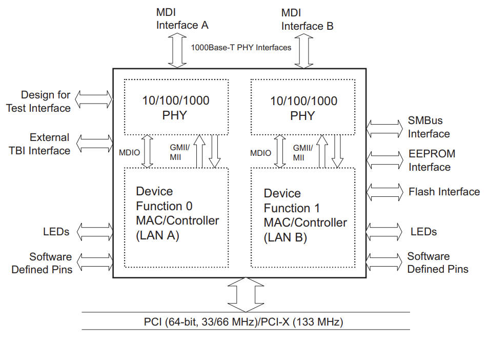
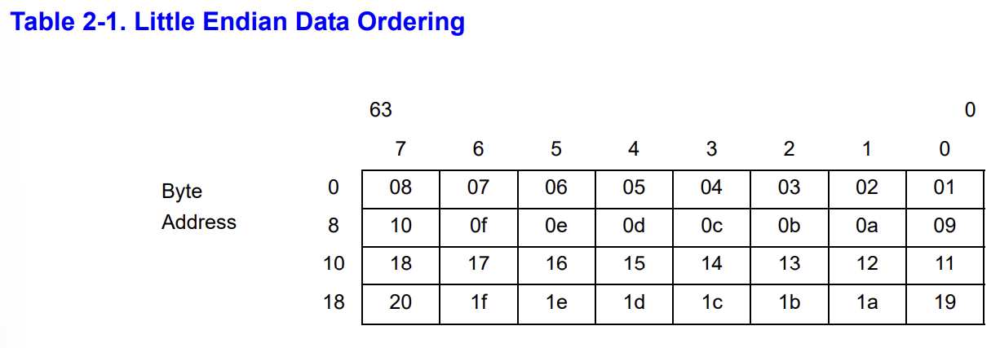
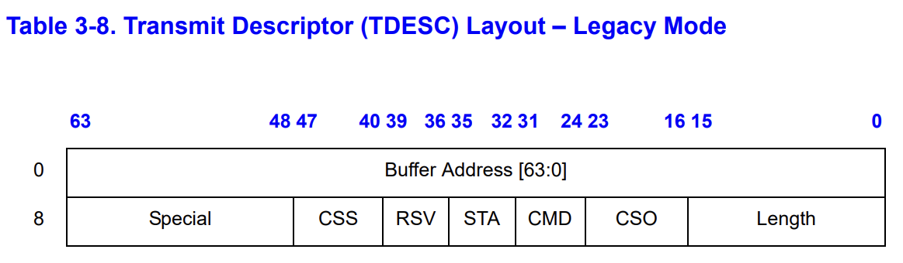
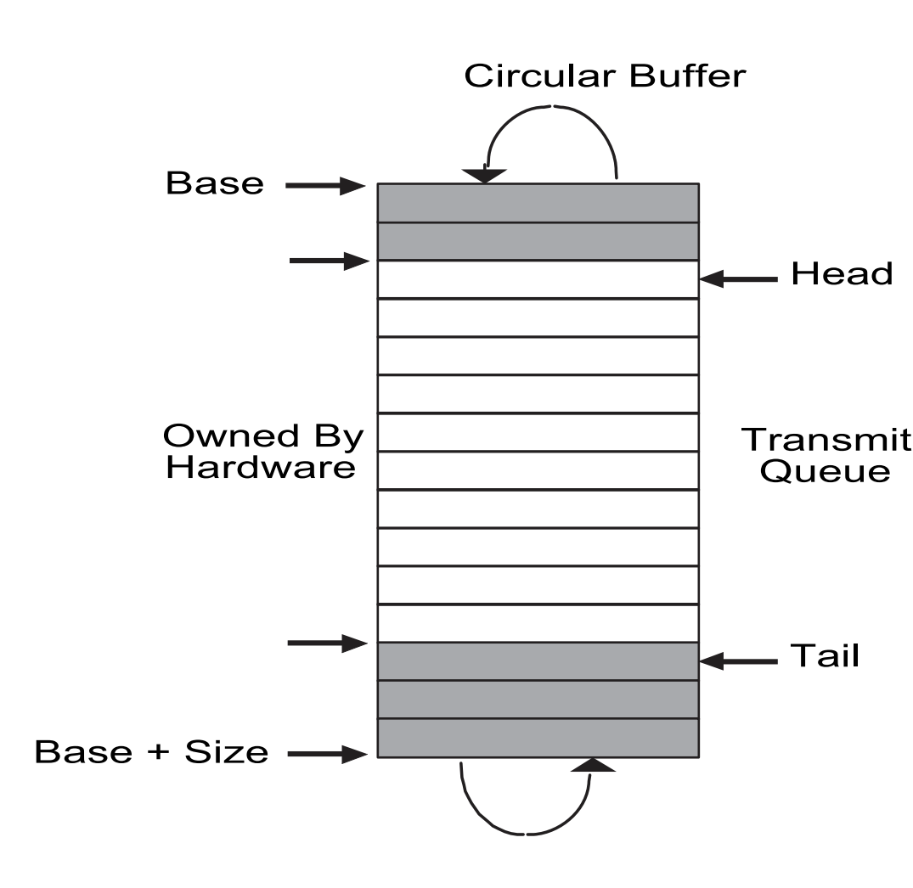
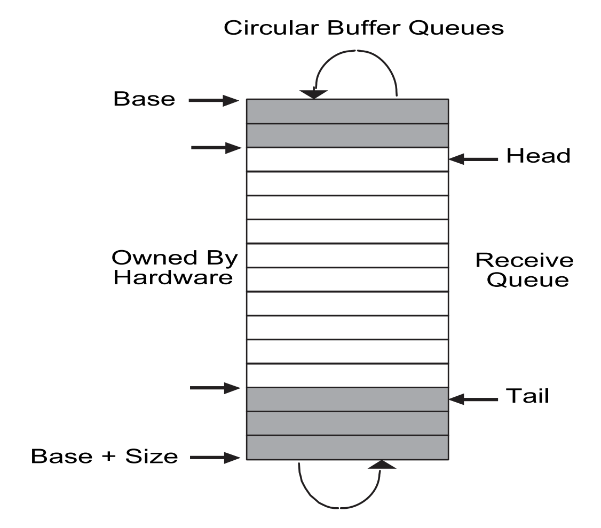

# Networking_lab

这个练习我们需要写一个`xv6`的设备驱动，用于NIC(network interface card)。

## Background

### Read Book

阅读"Chapter 5: Interrupts and device drivers"

这个之前做COW的时候已经阅读过了

### Other

我们需要使用网络设备`E1000`来处理网络通信。对于xv6（以及您编写的驱动程序），E1000看起来像是连接到真实以太网局域网 (LAN) 的真实硬件。实际上，驱动程序将与之通信的`E1000`是由`qemu`提供的仿真，连接到同样由`qemu`仿真的`LAN`。着这个仿真的LAN上，xv6（"guest"）的IP地址为`10.0.2.15`。运行`qemu`的计算机在`LAN`上的`IP`地址被设置为`10.0.2.2`。当xv6使用`E1000`发送数据包到`10.0.2.2`上时，qemu发送这个包到运行qemu的真实计算机（"host"）的恰当应用程序。

我们将使用QEMU的"用户态网络栈"。[QEMU的文档](https://wiki.qemu.org/Documentation/Networking#User_Networking_.28SLIRP.29)有更多关于用户态网络栈的信息。我们已经更新了`Makefile`以启用`QEMU`的用户态网络栈和`E1000`网卡。

`Makefile`将`QEMU`配置为将所有传入和传出的数据包记录到您实验室目录中的文件 packet.pcap 中。查看这些记录以确认 xv6 正在传输和接收您期望的数据包可能会有所帮助。要显示记录的数据包：

```
tcpdump -XXnr packets.pcap
```

我们为这个实验室添加了一些文件到`xv6`代码库。文件`kernel/e1000.c`包含`E1000`的初始化代码以及用于发送和用于接收数据包的空函数，我们需要完成这些函数。`kernel/e1000_dev.h`包含由`E1000`定义，并在`Intel E1000`[软件开发人员手册](https://pdos.csail.mit.edu/6.S081/2021/readings/8254x_GBe_SDM.pdf)中描述的，寄存器和标志位的定义。`kernel/net.c`和`kernel/net.h`包含一个实现[IP](https://en.wikipedia.org/wiki/Internet_Protocol)、[UDP](https://en.wikipedia.org/wiki/User_Datagram_Protocol)和[ARP](https://en.wikipedia.org/wiki/Address_Resolution_Protocol)协议的简单网络堆栈。这些文件还包含用于保存数据包的灵活数据结构，称为`mbuf`。最后，`kernel/pci.c`包含在`xv6`启动时在PCI总线上搜索E1000卡的代码。

## Do lab

> 您的工作是在`kernel/e1000.c`中完成`e1000_transmit()`和`e1000_recv()`，以便驱动程序可以传输和接收数据包。当`make grade`表示您的解决方案通过了所有测试时，您就完成了。

当在写代码的时候，如果参考`E1000`的[开发人员手册](https://pdos.csail.mit.edu/6.S081/2021/readings/8254x_GBe_SDM.pdf)，以下章节会比较有帮助：

* Section 2 is essential and gives an overview of the entire device.
* Section 3.2 gives an overview of packet receiving.
* Section 3.3 gives an overview of packet transmission, alongside section 3.4.
* Section 13 gives an overview of the registers used by the E1000.
* Section 14 may help you understand the init code that we've provided.

手册涵盖了几个密切相关的以太网控制器。QEMU模拟了`82540EM`。现在浏览第2章以了解该设备。要编写您的驱动程序，您需要熟悉第3章和第14章，以及4.1（尽管不是4.1的小节）。您还需要使用第13章作为参考。其他章节主要涵盖您的驱动程序不必与之交互的E1000组件。一开始不要担心细节；只需了解文档的结构，以便您稍后找到内容。E1000有许多高级功能，其中大部分您可以忽略。完成本实验只需要一小部分基本功能。

我们在`e1000.c`中为您提供的`e1000_init()`函数将 E1000 配置为读取要从`RAM`传输的数据包，并将接收到的数据包写入`RAM`。这种技术称为`DMA`，用于直接内存访问，指的是`E1000`硬件直接从`RAM`写入和读取数据包这一事实。

因为数据包的突增可能比驱动程序处理它们的速度更快，所以`e1000_init()`为`E1000`提供了多个缓冲区，`E1000`可以将数据包写入其中。`E1000`要求这些缓冲区由`RAM`中的""descriptor"数组描述；每个descriptor都包含`RAM`中的一个地址，`E1000`可以在其中写入接收到的数据包。`struct rx_desc`是descriptor的数据格式。descriptor数组称为接收环（receive ring）或接收队列（receive queue）。从某种意义上说，它是一个圆环，当NIC或驱动程序到达数组的末端时，它会回到起点。`e1000_init()`使用`mbufalloc()`分配`E1000`用于DMA的`mbuf`数据包缓冲区。
还有一个传输环（transmit ring），驱动程序将希望由`E1000`发送的数据包放入其中。`e1000_init()`将两个环配置为具有大小`RX_RING_SIZE`和`TX_RING_SIZE`。

当`net.c`中的网络堆栈需要发送数据包时，它会调用`e1000_transmit()`发送由`mbuf`保存的的数据包。传输代码必须在`TX`（传输）环的descriptor中放置一个指向数据包数据的指针。`struct tx_desc`是descriptor的数据结构。您需要确保每个`mbuf`最终被free，但不能在E1000完成数据包之前（`E1000`设置descriptor中的`E1000_TXD_STAT_DD`位以表明这一点）。

当`E1000`从以太网接收到每个数据包时，它首先将数据包`DMA`到下一个`RX`（接收）环descriptor指向的`mbuf`，然后产生中断。`e1000_recv()`代码必须扫描`RX`环并通过调用`net_rx()`将每个新数据包的`mbuf`传送到网络协议栈（在`net.c`中）。然后，您需要分配一个新的`mbuf`并将其放入descriptor中，以便当`E1000`再次到达`RX`环中的那个点时，它会找到一个新的缓冲区来`DMA`一个新的数据包。

除了在`RAM`中读取和写入描述符环之外，您的驱动程序还需要通过其内存映射的控制寄存器与`E1000`交互，以检测接收到的数据包何时可用，并在驱动程序已填入一些`TX`描述符与要发送的数据包时通知`E1000`。全局变量`regs`持有指向`E1000`的第一个控制寄存器的指针；您的驱动程序可以通过将`regs`按照数组索引，来获取其他寄存器。是需要索引到`E1000_RDT`和`E1000_TDT`。

要测试您的驱动程序，请在一个窗口中运行`make server`，在另一个窗口中运行`make qemu`，然后在`xv6`中运行`nettests`。`nettests`中的第一个测试会尝试向主机操作系统发送一个`UDP`数据包，目的地址为`make server`运行的程序。如果您还没有完成实验，`E1000`驱动程序实际上不会发送数据包，什么都不会发生。

完成实验后，`E1000`驱动程序会发送数据包，`qemu`会将数据包发送到您的主机，`make server`会看到它，然后发送响应数据包，然后`E1000`驱动程序和`nettests`会看到这个响应数据包。在主机发送相应之前，它会向`xv6`发送一个"ARP"请求包以找出它的48位以太网地址（MAC地址），并期望`xv6`以`ARP`回复进行响应。一旦你完成了`E1000`驱动程序的工作，`kernel/net.c`就会处理这个问题。如果一切顺利，`nettests`将打印`testing ping: OK`，而`make server`将打印`a message from xv6!`。

> 地址解析协议，即ARP（Address Resolution Protocol），是根据 IP地址 获取 物理地址 的一个 TCP/IP协议 。

`tcpdump -XXnr packets.pcap`应该产生如下开头的输出：

```
reading from file packets.pcap, link-type EN10MB (Ethernet)
15:27:40.861988 IP 10.0.2.15.2000 > 10.0.2.2.25603: UDP, length 19
        0x0000:  ffff ffff ffff 5254 0012 3456 0800 4500  ......RT..4V..E.
        0x0010:  002f 0000 0000 6411 3eae 0a00 020f 0a00  ./....d.>.......
        0x0020:  0202 07d0 6403 001b 0000 6120 6d65 7373  ....d.....a.mess
        0x0030:  6167 6520 6672 6f6d 2078 7636 21         age.from.xv6!
15:27:40.862370 ARP, Request who-has 10.0.2.15 tell 10.0.2.2, length 28
        0x0000:  ffff ffff ffff 5255 0a00 0202 0806 0001  ......RU........
        0x0010:  0800 0604 0001 5255 0a00 0202 0a00 0202  ......RU........
        0x0020:  0000 0000 0000 0a00 020f                 ..........
15:27:40.862844 ARP, Reply 10.0.2.15 is-at 52:54:00:12:34:56, length 28
        0x0000:  ffff ffff ffff 5254 0012 3456 0806 0001  ......RT..4V....
        0x0010:  0800 0604 0002 5254 0012 3456 0a00 020f  ......RT..4V....
        0x0020:  5255 0a00 0202 0a00 0202                 RU........
15:27:40.863036 IP 10.0.2.2.25603 > 10.0.2.15.2000: UDP, length 17
        0x0000:  5254 0012 3456 5255 0a00 0202 0800 4500  RT..4VRU......E.
        0x0010:  002d 0000 0000 4011 62b0 0a00 0202 0a00  .-....@.b.......
        0x0020:  020f 6403 07d0 0019 3406 7468 6973 2069  ..d.....4.this.i
        0x0030:  7320 7468 6520 686f 7374 21              s.the.host!
```

自己的输出看起来会有些不同，但它应该包含字符串"ARP，Request"，"ARP，Reply"，"UDP"，"a.message.from.xv6"和"this.is.the.host"。

`nettests`执行一些其他测试，最终通过（真实）Internet 将`DNS`请求发送到Google的name server之一。应该确保的代码通过所有这些测试，之后会看到以下输出：

```
$ nettests
nettests running on port 25603
testing ping: OK
testing single-process pings: OK
testing multi-process pings: OK
testing DNS
DNS arecord for pdos.csail.mit.edu. is 128.52.129.126
DNS OK
all tests passed.
```

### 一些提示

首先将打印语句添加到`e1000_transmit()`和`e1000_recv()`，然后运行` ​​make server`和`nettests`（在xv6中），然后会从打印语句中看到`nettests`生成了`e1000_transmit`的函数调用。

```
$ nettests
nettests running on port 26099
testing ping: call e1000_transmit, mbuf: 0x0000000087ee4000
```

实现`e1000_transmit`的一些提示：


* 首先通过读取`E1000_TDT`控制寄存器，向`E1000`查询它期待的下一个数据包的在`TX`环上的索引。
* 然后检查环是否溢出。如果`E1000_TDT`索引的descriptor中没有设置`E1000_TXD_STAT_DD`，则说明`E1000`还没有完成对应的上一个传输请求，因此返回错误。
* 否则，使用`mbuffree()`释放从该descriptor传输的最后一个`mbuf`（如果有的话）。
* 然后填写descriptor。`m->head`指向在内存中的数据包的内容地址，`m->len`是包的长度。设置必要的`cmd`标志（查看`E1000`手册中的第3.3节）并隐藏指向`mbuf`的指针以供以后释放。
* 最后，通过将ring的位置更新为`(E1000_TDT+1)%TX_RING_SIZE`
* 如果`e1000_transmit()`成功地将`mbuf`添加到环中，则返回0。失败时（例如，没有可用于传输`mbuf`的descriptor），返回-1以便调用者知道释放`mbuf`。

实现`e1000_recv`的一些提示：


* 首先请求E1000的ring中等待下一个接收包的索引位置，通过获取`E1000_RDT`的控制寄存器并+1然后模`RX_RING_SIZE`
* 然后通过检查descriptor状态部分中的`E1000_RXD_STAT_DD`位来检查新数据包是否可用。如果没有，停止。
* 否则，将`mbuf`的`m->len`更新为descriptor中上报的长度。使用`net_rx()`将`mbuf`传送到内核网络栈。
* 然后使用`mbufalloc()`分配一个新的`mbuf`来替换刚刚给`net_rx()`的那个。将其数据指针（`m->head`）写到descriptor中。将descriptor的状态位清零。
* 最后，将`E1000_RDT`寄存器更新为最后处理的ring descriptor的索引。
* `e1000_init()`用`mbufs`初始化`RX ring`，你会想看看它是如何做到的，也许还需要借用代码。
* 在某些时候，已经到达的数据包总数将超过环大小（16）；确保您的代码可以处理。

您将需要锁来应对`xv6`可能从多个进程使用`E1000`的可能性，或者当中断到达时可能在内核线程中使用`E1000`。


### Read Manual

PCI/PCI-X 系列千兆以太网控制器提供以下性能：

* 提供包含 10/100/1000 Mb/s PHY 的以太网接口，该接口还支持 1000 Base-X 实现
* 提供高性能，基于以下方法：
  * 无需使用映射寄存器即可直接访问所有内存
  * 最小化管理以太网控制器所需的`PCI` target accesses
  * 最小化管理以太网控制器的中断
  * 卸载host的一些简单操作，比如TCP的checksum计算
  * 最大化PCI效率和性能
  * 使用混合信号处理来确保物理层特性超过`UTP`铜介质的规格

* 为基本操作提供简单的软件接口
* 提供高度可定制的针对不同环境高效使用的设计

PCI/PCI-X 系列千兆以太网控制器架构是`82542`和`82543`设计的衍生产品。它们继承了其前身的`MAC`功能和集成铜线`PHY`，并将基于`SMBus`的可管理性和集成`ASF`控制器功能添加到`MAC`。此外，82546GB/EB在集成双端口解决方案中采用此架构，由两个不同的`MAC/PHY`实例组成。

#### 2.1 External Architecture



我理解的网卡类似于在PCI总线和以太网线上的一个桥接器，将以太网信号，转化为PCI数据。

#### 2.3.3 DMA Engine and Data FIFO

DMA 引擎处理主机存储器和片上存储器之间的接收和发送数据以及描述符传输。

在接收路径中，DMA 引擎将存储在接收数据`FIFO`缓冲区中的数据传输到主机存储器中的接收缓冲区，由描述符中的地址指定。它还取回更新的接收描述符并将其写回主机内存。

在传输路径中，DMA 引擎将存储在主机内存缓冲区中的数据传输到传输数据 FIFO 缓冲区。它还获取和写回更新的传输描述符。

以太网控制器数据`FIFO`模块由一个64KB（82547GI/EI 为40KB）片上缓冲器组成，用于接收和发送操作。接收和发送`FIFO`大小可根据系统要求分配。当以太网控制器接收或发送帧时，FIFO为帧提供了一个临时缓冲存储区。

DMA引擎和大数据`FIFO`经过优化，可通过以下方式最大限度地提高 PCI 总线效率并降低处理器占用率：

* 通过在传输之前缓冲整个传出数据包，来减轻瞬时接收带宽需求并消除传输欠载
* 在发送`FIFO`中排队发送帧，允许以最小帧间距进行背靠背传输
* 使以太网控制器能够承受较长的`PCI`总线延迟，而不会丢失输入数据或破坏输出数据
* 允许通过`FIFO`的发送阈值调整发送开始阈值。这种对系统性能的调整基于可用的`PCI`带宽、线速和延迟考虑
* 卸载接收和发送`IP`和`TCP/UDP`校验和计算
* 直接从发送`FIFO`重新发送任何导致错误（冲突检测、数据欠载）的传输，从而无需从主机存储器重新访问该数据

### 2.4 DMA Addressing

该设备支持64位寻址。并且PCI寻址是小端的。然而，并不是所有的系统使用PCI都将内存看作小端。网络数据本质上是一个byte序列。因此，处理器和以太网控制器对内存数据的表现形式应该一致。默认的是小端模式。

描述符访问不是字节交换的。

以下示例说明了小端序的数据字节排序。接收数据包的字节按从左到右的顺序到达。

```
01 02 03 04 05 06 07 08 09 0a 0b 0c 0d 0e 0f 10 11 12 13 14 15 16 17 18 19 1a 1b 1c 1d 1e
```

内存中的字节序列如下：



以太网地址：

几个寄存器在以太网控制器中存储以太网地址。两个32位寄存器组成地址：一个称为"高"，另一个称为"低"。例如，接收地址寄存器由接收地址高（RAH）和接收地址低（RAL）组成。存储在寄存器中的地址的最低有效字节的最低有效位（例如，RAL 的第 0 位）是多播位。LS字节是出现在线路上的第一个字节。该符号适用于所有地址寄存器，包括流控制寄存器。

中断：

以太网控制器提供了一套完整的中断，可实现高效的软件管理。中断结构旨在完成以下任务：

* 通过`set`和`clear-on-read`，而不是`read-modify-write`，保证访问线程安全
* 将完成工作所需的中断次数降至最低
* 最小化每次中断处理的时间

英特尔通过由四个中断寄存器组成的中断逻辑实现了第一个目标。关于这些寄存器的更多细节在`13.4.17`到`13.4.21`节中给出。

* 中断原因的`Set`和`Read`寄存器
  Read寄存器记录产生中断的原因。读取时设置的所有位都会自动清除。cause寄存器中写入为`1b`的每个位都会设置cause bit。如果硬件设置cause和软件清除中断之间存在竞争，则该位保持设置。写入设置寄存器时不存在竞争条件。"设置"提供中断的软件发布。自动清除"read"避免昂贵的写入操作。大多数系统都有写缓冲，这可以最大限度地减少开销，但通常需要一个读操作来保证写操作已经从发布的缓冲区中下刷。如果没有自动清除，清除中断的成本可能高达两次读取和一次写入。

* 中断屏蔽的 `Set` (Read) 和 `Clear` 寄存器

  中断仅在interrupt cause位为1，且中断屏蔽mask为1的时候出现在PCI上。软件能通过清空mask 寄存器来屏蔽中断。无论mask为什么，interrupt cause的位都会被设置。这里的`Clear`和`Set`操作使得该寄存器更加"线程安全"，因为不是使用`read-modify-write`操作。对`Set`寄存器中的每一位写入掩码位设置为1b，并在`Clear`寄存器中写入每一位时将其清零。读取`Set`寄存器返回当前值。

Intel 通过以下方法实现第二个目标（最小化中断）：

* 降低所有中断的频率（参见第 13.4.17 节）。不适用于82544GC/EI
* 在发出中断信号之前接受多个接收数据包（参见第 3.2.3 节）
* 消除（或至少减少）传输中断的需要（见第 3.2.7 节）

第三个目标是通过让一个中断寄存器整合所有中断信息来实现的。这消除了多次访问的需要。

### 2.7 Hardware Acceleration Capability

以太网控制器提供卸载`IP`，`TCP`和`UDP`的checksum操作。这些特性提供的功能可以通过将功能的负担从驱动程序转移到硬件来显着降低处理器利用率。

以下部分简要概述了校验和卸载功能。3.2.9节提供了有关所有硬件加速功能的更多详细信息。

* Checksum Offloading

  以太网控制器提供了从软件设备驱动程序卸载IP、TCP和UDP校验和要求的能力。对于常见的帧类型，硬件会自动计算、插入和检查通常由软件处理的适当校验和值。

  对于传输，每个以太网数据包可能有两个由以太网控制器计算和插入的校验和。通常，这些是`IP`校验和，以及`TCP`或`UDP`校验和。软件设备驱动程序指定数据包的哪些部分包含在校验和计算中，以及通过描述符插入计算值的位置（有关详细信息，请参阅第 3.3.5 节）。

  对于接收，硬件识别数据包类型并自动执行校验和计算和错误检查。校验和和错误信息通过接收描述符提供给软件（有关详细信息，请参阅第3.2.9节）。

* TCP Segmentation

  以太网控制器实现了用于传输的TCP分段功能，允许软件设备驱动程序将数据包分段和封装卸载到硬件。软件设备驱动程序可以将网络操作系统（NOS）向下发送的整个IP、TCP或UDP消息发送给以太网控制器进行传输。以太网控制器将数据包分割成合法的以太网帧并在线传输它们。通过处理分割任务，硬件减轻了软件处理某些框架职责的负担。这减少了CPU用于传输过程的开销，从而降低了整体 CPU 利用率。有关详细信息，请参阅第3.5节。

* Buffer and Descriptor Structure

  软件分配发送和接收缓冲区，并形成包含指向这些缓冲区的指针和状态的描述符。驱动程序软件与缓冲区和描述符的硬件之间存在概念上的所有权边界。该软件赋予硬件接收缓冲区队列的所有权。这些接收缓冲区存储数据，一旦有效数据包到达，软件就会拥有这些数据。

  对于传输，软件维护一个缓冲区队列。驱动程序软件拥有一个缓冲区，直到它准备好传输。然后软件将缓冲区提交给硬件；然后硬件拥有缓冲区，直到数据在发送 FIFO 中加载或发送。

  描述符存储有关缓冲区的以下信息：

  * 物理地址
  * 长度
  * 指向的缓冲区的状态和控制信息

  描述符包含一个包尾字段，指示包的最后一个缓冲区。描述符还包含指示数据包类型的数据包特定信息，以及在传输数据包的上下文中执行的特定操作，例如用于`VLAN`或校验和卸载的操作。

  第3节提供了有关数据包传输和接收上下文中描述符结构和操作的详细信息。


## Do lab

首先观察数据结构：

```c
// [E1000 3.3.3]
struct tx_desc
{
  uint64 addr;
  uint16 length;
  uint8 cso;
  uint8 cmd;
  uint8 status;
  uint8 css;
  uint16 special;
};

struct mbuf {
  struct mbuf  *next; // the next mbuf in the chain
  char         *head; // the current start position of the buffer
  unsigned int len;   // the length of the buffer
  char         buf[MBUF_SIZE]; // the backing store
};
```

这个是tx的描述符，可以到数据结构中甚至标注了在文档的哪一节，好评！这一描述符的layout如下：



这里的addr指向的是`mbuf->head`的位置。

从提示中可以看出，我们要实现的TX和RX依赖了两个ring。

其中，tx ring中的数据包由应用提供，由软件添加到队列的`tail`，由硬件在`head`读取。队列的head和tail之间的区域由硬件持有，硬件从`head`开始读取描述符，这些描述符都已经就位等待NIC操作（比如进入NIC的FIFO）。因此，如果一个数据已经发送，则需要软件来释放`mbuf`，因为硬件不会执行这一操作。而从`tail`到`head`的软件持有区间，是没有有效`mbuf`的（等待软件写入）。



对于RX ring，由硬件在`head`写入，软件从`tail`读取。注意指针的移动方向是一定的。如果大量数据包传入，则`head++`，使得从`tail`到`head`之间的软件持有区域变多。生产的来自`head`，消费来自`tail`，而用户可读取的数据包在`tail`到`head`之间。`head`和`tail`之间是由硬件持有的区域，这一区域的描述符都有对应的`mbuf`，当接收到数据后，会将数据写入其中。因此软件看到这些数据后，需要分配新的`mbuf`，并把`tail`向后移动，以供`NIC`消费。


### code

我们实现初步的`e1000_transmit()`函数如下：

```c
int
e1000_transmit(struct mbuf *m)
{
  //
  // Your code here.
  //
  // the mbuf contains an ethernet frame; program it into
  // the TX descriptor ring so that the e1000 sends it. Stash
  // a pointer so that it can be freed after sending.
  //

  acquire(&e1000_lock);
  
  uint32 idx = regs[E1000_TDT];
  struct tx_desc * desc_p = tx_ring + idx;
  if(!(desc_p->status & E1000_TXD_STAT_DD))
  {
     release(&e1000_lock);
     return -1;
  }
  // free transmitted mbuf 
  if(desc_p->addr && tx_mbufs[idx])
    mbuffree(tx_mbufs[idx]);
  desc_p->cmd = E1000_TXD_CMD_RS | E1000_TXD_CMD_EOP;

  desc_p->addr = (uint64)m->head;
  desc_p->length = m->len;
  tx_mbufs[idx] = m;

  __sync_synchronize();
  regs[E1000_TDT] = (idx + 1)%TX_RING_SIZE;

  release(&e1000_lock);
  return 0;
}
```

这里的`desc_p->cmd = E1000_TXD_CMD_EOP | E1000_TXD_CMD_RS;`是因为：

* 第3位是Report Status位，使得数据包在进入网卡FIFO后，会设置`E1000_TXD_STAT_DD`位
* 第0位是End Of Packet，说明构造了一个完整的包
* 参考网上的资料添加了`__sync_synchronize()`，用于指导编译器不要进行指令重排。


我们实现的`e1000_recv`函数如下，参考了网上的实现（需要使用while）:

```c
static void
e1000_recv(void)
{

  //
  // Your code here.
  //
  // Check for packets that have arrived from the e1000
  // Create and deliver an mbuf for each packet (using net_rx()).
  //
  
  uint32 idx = (regs[E1000_RDT]+1)%RX_RING_SIZE;
  while(rx_ring[idx].status & E1000_RXD_STAT_DD)
  {
    struct rx_desc * desc_p = rx_ring + idx;
    if(!rx_mbufs[idx])
        panic("e1000");
    rx_mbufs[idx]->len = desc_p->length;
    net_rx(rx_mbufs[idx]);
    struct mbuf * m = mbufalloc(0);
    if(!m)
      panic("e1000");

    desc_p->addr = (uint64) m->head;
    desc_p->status = 0;
    rx_mbufs[idx] = m;
    regs[E1000_RDT] = idx;

    idx = (idx+1)%(RX_RING_SIZE);
  }

  return ;
}
```


* 这里使用循环用于连续收包。因为网卡对多个网络包可能就产生一个中断，这导致如果不收包后续的进程都被阻塞的情况下，没有中断能唤醒进程，导致程序无法继续运行。
* 而关于锁的问题, 与发送数据不同, 接收时该函数只会被中断处理函数`e1000_intr()`调用, 因此不会出现并发的情况;此外, 网卡的接收和发送的数据结构是独立的, 没有共享, 因此无需加锁。且需要注意的是, 此处也不能使用`e1000_lock`进行加锁, 因为当接收到`ARP`报文时, 会在解封装的同时调用`net_tx_arp()`发送回复报文, 便会导致死锁。

### 测试

```shell
$ nettests
nettests running on port 26099
testing ping: OK
testing single-process pings: OK
testing multi-process pings: OK
testing DNS
DNS arecord for pdos.csail.mit.edu. is 128.52.129.126
DNS OK
all tests passed.
```