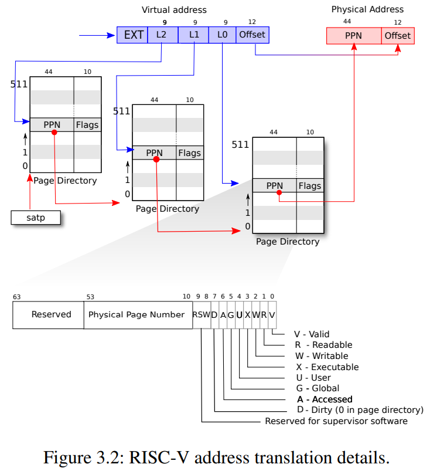
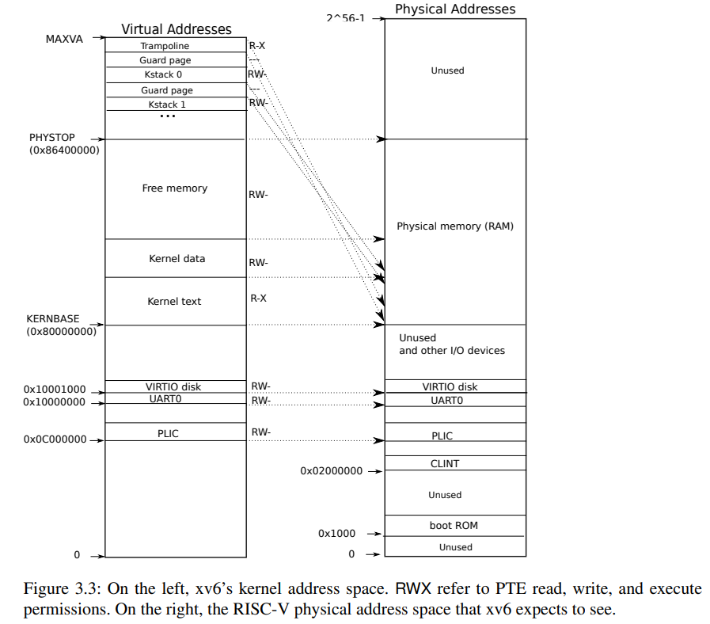
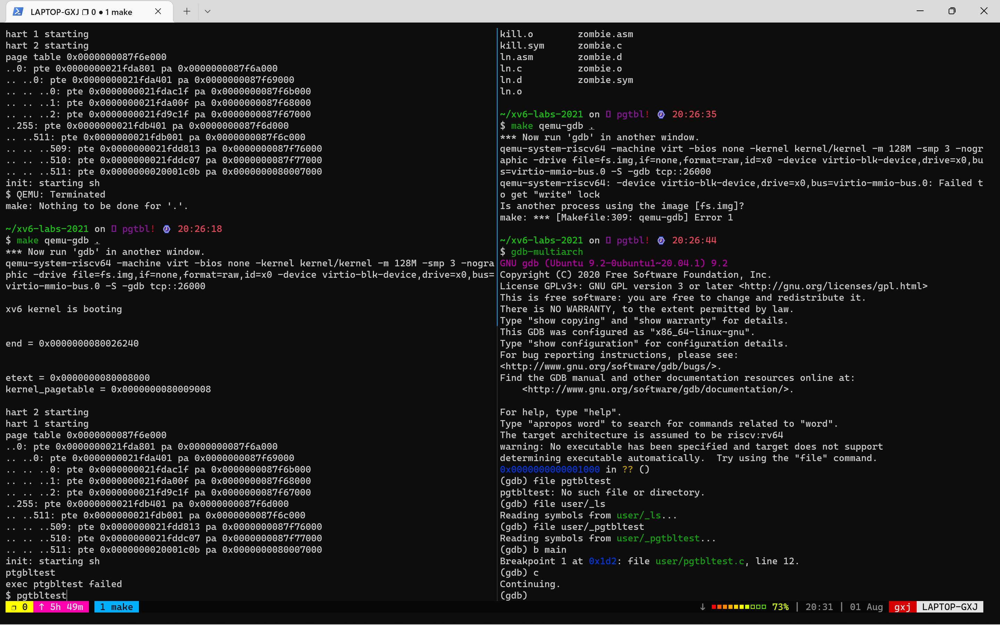
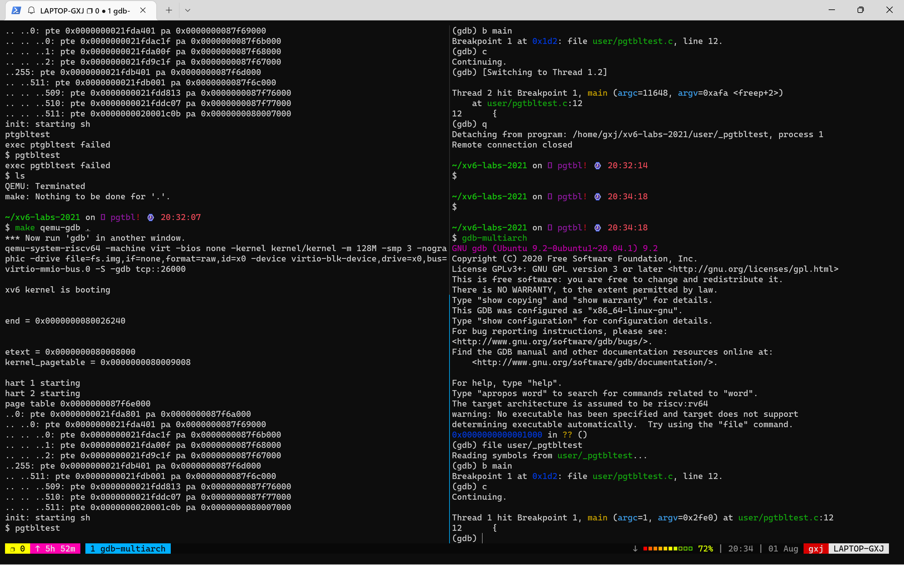
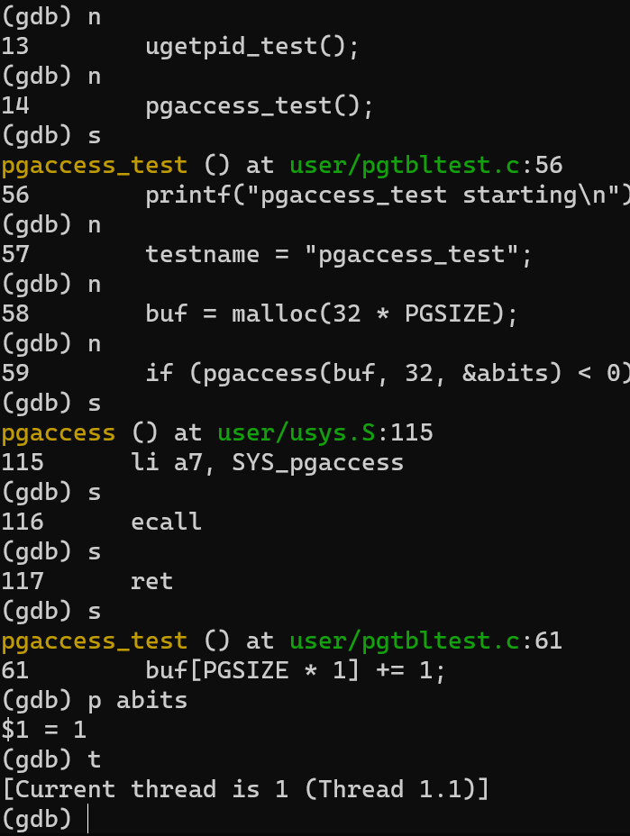

# PageTable_lab

虚拟内存使得操作系统为每个进程提供隔离的内存视角，使得每个进程能互不打扰在硬件上同时执行。同时叶提供了系统级的地址保护以及共享内存、使用空的页面保护内核等操作。个人觉得内核要是不提供虚拟内存，会非常不方便程序的开发，因为每个程序都要由系统提供真实内存操作权限。

## before coding

1. XV6 book Chapter 3
   1. Paging hardware
      
      xv6运行在 sv39 RISC-V上，即仅使用64位的低39位的虚拟地址。在这种配置下，RISC-V的页表由$2^27=134,217,728$个page table entries（PTEs）组成，每个PTE由一个44-bit的物理页号（physical page number,PPN）和一些flag组成。通过虚拟地址的中间27位定位一个44位的PPN，之后和虚拟地址的12位拼接成56位物理地址。

      如此系统的虚拟空间仅仅使用39位，即512GB的内存，物理空间也有10位的可拓展性。目前，已经有Sv48，使用48位的虚拟地址，比Sv-39多512倍内存空间。

      实际的系统并不会创建$2^27$个PTE，而是创建一个三层的树状索引结构的页表：
      
      

      为了告诉系统使用一个页表，内核需要将页表的根地址的物理地址写入到`satp`寄存器。每个CPU都有自己的`stap`，因此CPU之间使用不同的物理内存，因而不同的CPU可以跑不同的进程。
      系统使用虚拟地址中间的27个bit的高位9bit查询第一个由`stap`指向的页表，一个页目录（page directory）结构大小为4096Byte，包含512个PTE，每个PTE指向下一个4096Byte的页表，并且包含一些flag信息。

      树状的结构避免了为每个页创建PTE，减少了内存开销。

      使用软件做空间转换是低效的，因此CPU中使用TLB(translation look-aside buffer)硬件缓存一些页表，用于加速转换。

      每个PTE都有一些flag，用于告诉TLB是否是合法的虚拟地址访问。

      * PTE_V：PTE是否存在，如果没有设置，则会引发exception
      * PTE_R：是否能读
      * PTE_W：是否能写
      * PTE_X：是否能执行
      * PTE_U：是否是用户状态能访问的，如果没有设置，则仅能在supervisor状态访问

      典型的，内核会将所有的物理内存映射到page table中，因此内核可以使用load/store指令来读写任何物理内存。由于页表目录项也在物理内存，因此内核可以通过标准的load/store指令来以虚拟地址的形式修改物理地址的PTE。

   2. Kernel address space

      Xv6 为每个进程维护一个page table，描述每个进程的用户地址空间；一个单独的内核page table，描述内核空间。

      内核会配置其地址空间来使得内核能在预计的虚拟地址上访问物理内存，以及各种硬件资源。文件`kernel/memlayout.h`详细描述了xv6的内核内存分布。

      

      QEMU会模拟一个计算机设备，包括RAM(物理内存，从0x80000000)开始，并且连续至少到0x86400000，这里被xv6称为PHYSTOP。QEMU的模拟还包括I/O设备，比如disk的接口。QEMU将这些设备的接口，以映射到内存中的控制寄存器的形式，暴露给软件，他们的物理地址低于0x80000000。内核可通过读写这些物理地址的形式来与硬件进行交互，比如通过读写与硬件进行通信，而不是通过物理内存。第四章会解释xv6如何与设备进行交互。

      内核获得的RAM（物理内存）和设备寄存器都是使用直接映射，即物理内存和虚拟内存是相等的。比如内核位于虚拟地址和物理内存的`KERNBASE=0x80000000`同一个位置。直接映射简化了内核代码操作物理内存的工作。例如，当`fork`为子进程分配用户的内存，其分配器直接返回物理内存地址，`fork`能直接将以虚拟地址的形式将父进程的内存拷贝到子进程。

      这里有一些内核的虚拟地址并不是直接映射的：

      * trampoline page（）: 其被映射到虚拟地址的高地址空间，与用户的页表有着一样的映射。第四章将介绍trampoline page的作用，但是这里揭示了一个页表有趣的应用：同样的物理页（保存trampoline code）被映射了两次到内核的虚拟地址空间中，一次在虚拟地址空间的最顶层，一次是直接映射。
      * kernel stack page：每个进程持有一个其自己的内核栈，其被映射到高地址空间中，因此xv6能使用未被映射的虚拟页作为guard page。这些guard page的PTE被设置为无效的（如，PTE_V设为0），因此内核栈溢出将造成异常并导致内核panic。不使用guard page的话，如果一个内核栈溢出，将导致修改其他进程的内核栈，导致其他错误的操作。因此**A panic crash is preferable**。

      尽管内核通过高地址空间访问进程的内核栈，但是内核仍然可以通过直接映射访问进程的内核栈。一种可能的设计是仅使用直接映射的内核栈，但是如果在这种设计上添加guard page，将导致物理内存被浪费，会不易用。

      内核将映射的trampoline以及kernel text段的权限设置为`PTE_R`以及`PTE_X`。内核可以读取并执行这里的代码。内核对其他段的权限设置为`PTE_R`以及`PTE_W`，于是内核能读写这些内存。对于guard的页面的page是无效的。这些权限在图中都标注出，注意kstack在 kernel data段。

   3. Code: creating an address space
      大部分用于操作地址空间和页表的 xv6 代码位于`kernel/vm.c`中。其关键的数据结构是`pagetable_t`，实质上是一个指向RISC-V根页表的页的指针；一个pagetable_t可能是一个内核页表，也有可能是一个进程页表。其中心函数是`walk`，用于为一个虚拟地址找到一个`PET`，另一个中心函数是`mappages`，为新的映射安装`PETs`。函数首先启动`kvm`操作内核页表，之后使用`uvm`操作用户页表。其他的函数为两者公用，如`copyout`和`copyin`，将数据从用户态虚拟空间拷贝出或拷贝到内核。这些函数都在`vm.c`中，因为他们需要明确地将虚拟地址翻译为物理地址。

      在`main.c`的启动函数中，main函数会运行`kvminit`来创建内核页表，通过`kvmmake,(kernel/vm.c)`。这个函数的执行在xv6在RISC-V启动页功能之前，因此此时的内存直接访问到物理内存。`kvmmake`首先分配一个物理页保存根page table 页。接下来其将运行`kvmmap`将内核需要的一些翻译映射。这些翻译映射包括内核的指令段和数据段，物理内存最高到`PHYSTOP`，并且为一些设备创建内存映射。`Proc_mapstacks`函数将为每个进程创建内核栈（所有的进程在启动时都已经创建，但是是未使用的状态`UNUSED`）。其运行`kvmmap`将每个栈映射到虚拟地址（虚拟地址通过`KSTAK`产生，将留下一些空间来创建stack-guard pages）。

      `kvmmap`将调用`mappages`函数，对应到一个范围的物理内存地址映射到page table的虚拟地址中。它以页面为间隔，将范围内的每个虚拟地址单独执行映射。对于每个映射的虚拟地址，`mappages`调用`walk`函数为这些页寻找`PTE`。接下来出书画这些`PTE`保存对应的物理内存页号，相应的权限页在这个时候给出(`PTE_W`，`PTE_X`，以及`PTE_R`)，以及`PTE_V`来使得这个PTE有效。

      `walk`函数模拟了RISC-V的页硬件，寻找一个对应虚拟地址上的PTE。根据3级，每个级9个bit寻找到对应的页表以及最终的PTE。如果这个PTE是无效的，则说明这个虚拟地址还没有被分配。如果alloc参数被设置为1，并且找到的页没有初始化，则`walk`会`alloc`一个新的page-table页并将这个页的物理地址存入这个PTE中。最终函数返回最底层的PTE的物理地址。

      其中的关键代码是：
      ```c
      pte_t *
      walk(pagetable_t pagetable, uint64 va, int alloc)
      {
      if(va >= MAXVA)
         panic("walk");
      
      for(int level = 2; level > 0; level--) {
         pte_t *pte = &pagetable[PX(level, va)];
         if(*pte & PTE_V) {
            pagetable = (pagetable_t)PTE2PA(*pte);
         } else {//如果页无效
            if(!alloc || (pagetable = (pde_t*)kalloc()) == 0)//通过短路运算，保证只有在需要分配时分配一个新的物理页
            return 0;
            memset(pagetable, 0, PGSIZE);
            *pte = PA2PTE(pagetable) | PTE_V;//将中间或最终的PTE指向物理页
         }
      }
      return &pagetable[PX(0, va)];
      }
      ```

      以上的代码都依赖物理地址和内核虚拟地址是直接映射的。例如，`walk`把物理地址放入下一层的页表的PTE中，但是接下来执行`walk`遇到相同的`PTE`时，会将这个地址当成虚拟的进行查询。

      `main`函数执行`kvinithard`来安装内核的page table。函数把根页表页的物理地址写入到`satp`寄存器中。在此之后，CPU将使用内核page table来翻译地址。由于内核使用恒等映射，下一条指令的现在虚拟地址将映射到直接的物理内存地址。

      每个RISC-V CPU使用Translation Look-aside Buffer(TLB)将页表的entry缓存，将xv6改变页表的时候，必须告诉CPU将对应缓存的TLB entry失效。如果不这么做，有可能会使用到旧的失效的页表，指向已经分配给其他进程的物理页，使得程序能访问其他进程的内存。RISC-V使用指令`sfence.vma`将CPU中当前的`TLB`刷新。xv6在`kvminithart`函数中重新读`satp`寄存器后执行`sfence.vma`指令，在`trampoline`代码切换到用户页表，在返回用户态之前，也会执行`sfence.vma`指令。

      为了避免将所有的TLB 刷新，RISC-V CPU可能支持address space identifiers(ASIDs)。让内核可以为特定的地址空间执行刷新。

      > 页表指针存的是页表的地址，那么：
      > 
      > 页表指针的内存地址是？
      >
      > 页表指针的地址应该是内核编译的时候决定的
      >
      > 页表数据结构的地址是？
      > 
      > 页表数据结构的地址由`kalloc()`函数返回，它分配的地址在`kmem`数据结构的`freelist`中。
      > 
      > `kmem`的`freelist`由`kinit`创造，函数会将内核中`end`(first address after kernel，defined by kernel.ld.)直到`PHYSTOP`的物理内存页全部添加到`freelist`中，用于分配。
      > 
      > 因此`kalloc()`的数据在`end`到`PHYSTOP`之间。再具体的分配就要看如何规划的编译数据结构分配的链接脚本文件`kernel.ld`了。

      > 经过实验，打印出来end的值是`end = 0x0000000080026240`。
      > 
      > 此外还有kernel的text段的结束地址：`etext = 0x0000000080008000`
      > 
      > kernel的中pagetable自己的地址：`kernel_pagetable = 0x0000000080009008`，说明这个数据不在text段中，但是在kernel的数据段中，且不在`end`之后，不能被分配。

   4. Physical meory allocation

      内核必须在运行时为页表分配和释放物理内存、用户内存、内核栈以及管道的buffer。

      xv6使用内核的结束到`PHYSTOP`的内存用作run-time分配。每次分配和释放大小为4096-Byte，使用一个贯穿所有页的链表跟踪哪些页是空的。分配物理页是将freelist上的页移除；释放页是将其加入freelist

   5. Code: Physical memory allocator

      物理内存分配器保存在`kalloc.c`。其数据结构为一个freelist保存所有的页可以用于分配。每个free 页的链表元素是一个`struct run`。但是分配器也需要其他内存保存freelist的数据，它将每个空闲页面的运行结构存储在空闲页面本身中，因为那里没有存储任何其他内容。

      freelist通过一个spin lock保护。列表和锁被包装在一个结构中，以明确锁保护结构中的字段。关于锁的`acquire`和`release`将在第6章说明。

      `main`函数首先调用`kinit`来初始化分配器。`kinit`初始化从`end`到`PHYSTOP`的内存页到链表中。理论上，应该通过硬件的配置信息来决定多少物理内存可用。但是xv6假设由128MB的RAM。`kinit`通过`freerange`函数为每个页使用`kfree`来将从`end`到`PHYSTOP`的所有内存页添加到链表中。一个PTE只能指向一个4096-byte对齐的物理页。一开始的分配器没有内存可以分配，经过`freerange`之后获得了内存用于分配。

      通过C语言的类型转换，能够将地址当作指针操作的同时，也可以当作整数进行运算。

      `kfree`函数接受一个待释放的物理地址，首先将内存中的所有byte初始化为1，这会使得使用选空指针的程序读取到垃圾值，帮助这些程序尽快崩溃。之后`kfree`将这些页添加到freelist：将`pa`指向的空页当作一个`struct run`，记录旧的`freelist`的起始地址到`r->next`，之后将freelist指向新的run。

   6. Process address space

      每个进程都有独立的页表，当xv6切换进程时，同样切换了页表。如图所示，进程的用户态内存从虚拟地址0开始，并且能够增长到`MAXVA`，原则上允许用户进程最多试用256GB内存。

      当进程向需xv6申请更多用户内存，xv6首先使用`kalloc`分配物理内存。接下来向进程的页表中添加`PTE`，指向新的物理页。在该PTE中，xv6会设置`PTE_W`，`PTE_X`，`PTE_R`，`PTE_U`，`PTE_V`的标志。大多数进程不会使用全部的用户地址空间。对未使用的PTE，`PTE_V`为空。

      1. 不同的进程的页表将用户地址映射到不同的物理内存，因此每个用户有私有的地址空间。
      2. 每个进程都看到有连续的从0开始的虚拟地址，虽然用户的物理内存可能不连续。
      3. 内核将一个有trampoline代码的页映射到用户内存的最顶层，于是该单独的物理页在每个用户地址空间都有。

      

      图中展示了用户进程在执行时内存空间的分布。栈是一个单独页，图中的内容是`exec`调用后的初始值。字符串保存命令行参数，以及擦才能书的指针数组。这些都存在栈的最顶层。在参数后面是让机器认为是一个`main(argc, argv)`函数刚刚被调用时的状态。

      > 为什么这里有一个`return PC for main`
      > 
      > 因为需要C语言像调用一个函数一样，需要在栈中保存返回时跳转到的PC

      为了探测用户栈的溢出，xv6放置了无法访问的guard page在stack的下方（通过清除`PTE_U`）。如果用户栈溢出，进程会使用下方的栈地址。这样会产生一个page-fault异常。因为这些页无法在用户态访问。一个真实的操作系统可能会自动增长用户栈地址。

   7. Code: sbrk

      `Sbrk`是为进程收缩或增长用户内存的系统调用。系统调用由函数`growproc`实现。`growproc`调用`uvmalloc`或`uvmdealloc`，取决于参数是正数还是负数。

      `uvmalloc`会使用`kalloc`分配物理内存，并使用`mappages`将分配的物理内存映射到用户页表。`uvdalloc`会调用`uvmunmap`，会寻找到对应的PTE，用`kfree`指向的物理页。

      xv6不仅使用进程的页表告诉硬件用户的虚拟地址如何映射，还会记录哪些物理内存页被映射到该进程。这就是为什么释放用户内存（uvmunmap）需要检查用户页表。

      **一些思考：**

      `sbrk`调用的说明是：
      ```c
      char *sbrk(int n) Grow process’s memory by n bytes. Returns start of new memory.
      ```

      也就是说，返回的值是新内存的地址。

      但是`sbrk`调用的函数是：

      ```c
      uint64$
      sys_sbrk(void)$
      {$
      int addr;$
      int n;$
      $
      if(argint(0, &n) < 0)$
         return -1;$
      $
      addr = myproc()->sz;$
      if(growproc(n) < 0)$
         return -1;$
      return addr;$
      }
      ```

      但是这里的意思是`myproc()->sz`是新内存的地址，新增的内存直接append到这个地址后方。

   8. Code: exec

      `exec`是创建用户部分的地址空间的系统调用。它从文件系统中一个文件初始化用户部分的地址空间。`exec, kernel/exec.c`使用`manei`来打开一个命名的二进制`path`，将在第八章介绍。接下来，它将读取ELF的文件头。xv6的程序使用广泛应用的ELF-format，在kernel/elf.h中定义。一个ELF的二进制文件包含ELF header(`struct elfhdr`)，接下来是一系列的段头，`struct proghdr`。每个`proghdr`描述了程序必须加载到内存中的一段。xv6的程序仅有一个程序段头，但是其他系统可能有分离的代码和数据段。

      加载该文件的第一步是检查是否是合法的ELF二进制。一个ELF二进制首先由四个字节的"magic number"`0x7F, ELF`，也成为`ELF_MAGIC`。如果ELF头有正确的magic number，`exec`会假设该二进制结构正确的。

      `exec`通过`proc_pagetable`分配一个新的页表，此时没有用户的映射，通过`uvmalloc`为每个ELF段分配内存，并且使用`loadseg`将每个段加载到内存。`loadseg`使用`walkaddr`寻找到分配的内存的物理地址，并在上面写入ELF段，通过`readi`读取文件。

      程序被读取到内存后，解析各个段的大小，其中文件大小为`filesz`，可能小于需要的内存大小`memsz`字段，这之间的差距有0补充，用于C语言的全局变量。比如内核启动的第一个程序`/init`，filesz为2112byte，memsz为2136byte。`uvmalloc`会分配足够的内存存储2136字节，但是仅从文件中读取2112字节。

      之后`exec`会分配并初始化用户栈。分配一个页的用户栈后，将main函数的参数拷贝到栈顶部，并在`ustack`(用户栈)中记录指向参数的指针。在`argv`的结束部分保存一个`null`指针。`ustack`最开始的三项为虚假的返回PC（program counter），`argc`，以及`argv`。

      > 这里的PC用于给出一种main函数是被其他函数调用的假象。

      `exec`在用户栈页下方添加一个不可访问的虚拟页（将`PTE_V`置为0）。这样访问到这一页面将会导致异常，同时也帮助`exec`处理了过大的参数的问题。因为参数过长，将导致`copyout`函数拷贝到栈中时发现目的页无法访问，并返回-1。

      `exec`系统调用也是被其他程序启动的，调用`exec`会替换掉当前的进程，因此当前进程的内存映像也会被替换掉。在准备程序启动的新的内存映像（memory image）时，如果`exec`发现一个不合法的程序段，将会跳转到`bad`符号，释放这个新的image，并返回-1。
      
      `Exec`必须等待直到确定系统调用将成功，才能释放旧映像：因为如果旧的映像直接消失，就不能在`exec`失败时进行处理了。只有可能在创建`image`时可能让`exec`错误。一旦内存映像创建成功，`exec`会提交新的页表，并释放掉旧的页表，以此完成旧的`image`被替换为新`image`的过程。

      `exec`将ELF文件加载到内存的地址是被文件本身预先定义的。用户或进程能按照各种需要的形式在ELF中设置映射的地址。这导致`exec`的风险较高，因为可能目标地址会有意无意地指向内核。粗心的内核设计可能导致从崩溃，到恶意破坏内核隔离机制的后果。xv6执行了一系列的检查措施避免这样的风险。例如检查是否有内存整数64bit 溢出：`if(ph.vaddr + ph.memsz < ph.vaddr)`。因为用户可以使得溢出地址超过`0x1000`使得其看起来是合法的地址。在过去版本的xv6中，用户地址空间中还有内核，但是无法访问。但是用户可以精心设计地址溢出将用户二进制数据拷贝到内核中。在`RISC-V`版本这不会发生了，因为内核有独立的页表。`loadseg`仅加载用户页表，不会加载内核页表。

      对于一个内核开发者来说，很容易忽略关键检查，而现实世界的内核长期以来一直缺少检查，用户程序可以利用这些缺失来获取内核权限。xv6 可能无法完整地验证提供给内核的用户级数据，恶意用户程序可能会利用这些数据绕过 xv6 的隔离。

   9. Real world

      xv6需要假设内存的大小能满足直接映射，但是更通用的内核设计应该跟随硬件进行映射的调整。

      RISC-V支持物理内存保护，但是xv6没有使用这一特性。

      一些大内存的机器可能支持`super page`。小的页面允许进行细粒度的内存分配，以及细粒度下刷到disk。大页内存对于有很多内存的机器来说，减少了页表大小。

      xv6内核缺乏像`malloc`类似的能给小对象分配内存的分配器，这使内核无法使用需要动态分配的复杂数据结构。

      内存分配是一个多年的热点话题，其基本问题是高效的使用有限的内存，且为未来未知的请求准备。当前更加关注速度而不是效率。此外，更精细的内核可能会分配许多不同大小的小块，而不是（如在 xv6 中）仅 4096 字节的块；一个真正的内核分配器需要处理小分配和大分配。


## do lab

### Speed up system calls

一些系统（如linux）会通过内核和用户态通过只读区域内存共享加速系统调用。这样的操作避免了在进行系统调用时进入内核。我们这里要优化的时`getpid()`调用。

> 当进程创建时，映射一个只读页，保存一个`struct usyscall`，并初始化保存进程的PID。对于这个lab，`ugetpid()`已经提供到用户态，并能自动使用`USYSCALL`查找结构所在的页。
> ```c
> #define USYSCALL (TRAPFRAME - PGSIZE)
> ```

1. You can perform the mapping in proc_pagetable() in kernel/proc.c.
2. Choose permission bits that allow userspace to only read the page.
3. You may find that mappages() is a useful utility.
4. Don't forget to allocate and initialize the page in allocproc().
5. Make sure to free the page in freeproc().

实现还是相对容易的。由于在`memlayout.h`中定义的是在宏`LAB_PGTBL`有的时候才有结构`struct usyscall`，所以我的新增代码都以宏包裹。

首先，在`proc`结构中定义`struct usyscall*`指针。

```c
struct proc {
#ifdef LAB_PGTBL
   struct usyscall * usys_p;
#endif
}
```

其次，在`allocproc`中添加指针的页分配，并且在这里以指针形式初始化结构中的内容，即写入`pid`。

```c
#ifdef LAB_PGTBL$
  // Allocate a usyscall page$
  if((p->usys_p = (struct usyscall *)kalloc()) == 0){$
    freeproc(p);$
    release(&p->lock);$
    return 0;$
  }$
  p->usys_p->pid = p->pid;$
#endif
```

在接下来的`proc_pagetable()`，即进程的页表初始化函数中添加页的映射和内容。

```c
#ifdef LAB_PGTBL$
  // map usyscall speed up struct$
  if(mappages(pagetable, USYSCALL, PGSIZE, (uint64)p->usys_p, PTE_R | PTE_U) < 0){$
    uvmunmap(pagetable, TRAMPOLINE, 1, 0);$
    uvmunmap(pagetable, TRAPFRAME, 1, 0);$
    uvmfree(pagetable, 0);$
    return 0;$
  }$
#endif
```

> 这里有一个疑问：PTE的状态有`PTE_V`，`PTE_RWXU`。前者直接表示该PTE是否合法，后者表示是否能读写执行，以及是否是用户态可用。
> 
> 为什么没有设置过`PTE_V`？
> 
> 因为这个一直被`mappages`进行控制，是更底层的api
>  
> 那么用户栈帧的溢出保护通过什么实现呢？
> 
> 答：通过把用户栈的下方的一个页分配给用户，但是设置`PTE_U`为0，使得用户直接访问时出现异常

在页表释放时，需要释放物理页，并且解除虚拟页的映射。

```c
/* in freeproc */
#ifdef LAB_PGTBL
if(p->usys_p)
   kfree((void*)p->usys_p);
   p->usys_p = 0;
#endif

/*in proc_freepagetable */
#ifdef LAB_PGTBL
  uvmunmap(pagetable, USYSCALL, 1, 0);
#endif
```

即可。

这里提了一个问题，其他的syscall能否通过这个share的页进行加速。个人觉得和数据交换相关的，如`sys_write`，`sys_read`都可以加速，通过在内核态可以读写，在用户态只能读进行数据传输。避免了内核态拷贝到用户态时页表转换的开销。

### Print a page table

为了帮助可视化xv6的页表，同时帮助未来debug的过程，需要实现`vmprint`函数。这个函数在内核中，以一个页表的指针作为输入，打印页表。

测试时在`exec`函数`return argc`前，添加`if(p->pid==1) vmprint(p->pagetable)`，用于打印系统第一个进程的页表。

1. You can put vmprint() in kernel/vm.c.
2. Use the macros at the end of the file kernel/riscv.h.
3. The function freewalk may be inspirational.
4. Define the prototype for vmprint in kernel/defs.h so that you can call it from exec.c.
5. Use %p in your printf calls to print out full 64-bit hex PTEs and addresses as shown in the example.

需要在`vm.c`中实现该函数，并在`def.h`中添加函数声明。

实现函数需要查找页表指向的各个PTE，因此需要模拟`freewalk`函数的动作。

代码如下：

```c

// my implementation of vmprint, to print a pagetable recursively$
void vmprint(pagetable_t pagetable)
{
  printf("page table %p\n", pagetable);
  // there are 2^9 = 512 PTEs in a page table.
  for(int i = 0; i < 512; i++){
    pte_t pte1 = pagetable[i];
    if((pte1 & PTE_V) && (pte1 & (PTE_R|PTE_W|PTE_X)) == 0){
      // this PTE points to a lower-level page table.
      uint64 child1 = PTE2PA(pte1);
      printf("..%d: pte %p pa %p\n", i, pte1, child1);
      for(int j = 0; j < 512; j++){
        pte_t pte2 = ((pagetable_t)child1)[j];
        if((pte2 & PTE_V) && (pte2 & (PTE_R|PTE_W|PTE_X)) == 0){
          uint64 child2 = PTE2PA(pte2);
          printf(".. ..%d: pte %p pa %p\n", j, pte2, child2);
          for(int k = 0; k < 512; k++){
            pte_t pte3 = ((pagetable_t)child2)[k];
            if(pte3 & PTE_V)  printf(".. .. ..%d: pte %p pa %p\n", k, pte3, PTE2PA(pte3));
          }
        }
      }
    }
  }
}

```

使用了三重循环实现页表的dfs，注意lab中要求输出的是点，而不是空格。

这里也有一个lab的问题，解释初始化时，这些页都映射了什么。
理论上这些映射都映射了`kvmmake()`中初始化的映射。页表的最后映射的是用户栈，以及trampoline代码。


### Detecting which pages have been accessed

一些垃圾回收机制能够从哪些页面被访问（读或写）过这一信息收益。这个任务的目的是，添加一个新的系统调用，通过查询页表中的访问位，来返回页面是否被访问的信息，并传输回用户态。RISC-V硬件页面遍历器，会在TLBmiss的时候，将这些位置为1。

我们的任务是实现`pgaccess`系统调用。首先，它获取检查第一个用户页面的起始虚拟地址。
其次，它获取需要检查的页面数量。
最后，它将检查结果保存到一个提供的用户地址中，地址中存的是一个buffer，也是一个bitmask数据结构。

> 个人理解就是这样一函数需要的参数和执行结果
> 
> 在`user/user.h`中，对应的函数定义为：
> 
> `int pgaccess(void *base, int len, void *mask);`

some hits:

* Start by implementing sys_pgaccess() in kernel/sysproc.c.
* You'll need to parse arguments using argaddr() and argint().
* For the output bitmask, it's easier to store a temporary buffer in the kernel and copy it to the user (via copyout()) after filling it with the right bits.
* It's okay to set an upper limit on the number of pages that can be scanned.
* walk() in kernel/vm.c is very useful for finding the right PTEs.
* You'll need to define PTE_A, the access bit, in kernel/riscv.h. Consult the RISC-V manual to determine its value.
* Be sure to clear PTE_A after checking if it is set. Otherwise, it won't be possible to determine if the page was accessed since the last time pgaccess() was called (i.e., the bit will be set forever).
* vmprint() may come in handy to debug page tables.

这里的hits非常有帮助。

首先，打开`sys_pgaccess()`函数，起始已经在lab中定义了，和大多数系统调用没有区别。

由于实在系统调用中，所以需要使用内核态的获取参数的函数，也就是这里的第二条hints，使用`argint`和`argaddr`来获得参数。结合题目的说明，我们需要实现三个参数，分别是：`startaddr`, `ncheck`, `bitmask`，分别代表第一个需要检查的页地址，检查的页的个数，以及写回的结果的地址。

第三条提示是说，可以在内核中写完bitmask后，在整体使用`copyout`函数来写出去，这就需要保证我们写出的bitmask的大小我们是已知的，或者保证大小有限。这引出了第四条hint：可以定义检查的页的数量上限。

第五条提示说可以使用walk寻找正确的PTE，第六条是说，我们需要定义`PTE_A`宏，定义在PTE的某一个未使用的位上。也说了可以通过查询risc-v的manuel决定它的值。

> 这一点搜索到网上有同学说明RISC-V的PTE设置：
> 
> https://dingfen.github.io/risc-v/2020/08/05/riscv-privileged.html
> 
> 具体来说
> 
> 
> PTE_A在第6位

注意在检查了页面是否访问后，要将`PTE_A`置为空，否则页面就一直被设置为访问过。

最后一个提示是，可以使用`vmprint`来debug。

1. 在`kernel/riscv.h`中定义`PTE_A`：
   ```c
   #define PTE_A (1L << 6) // 1 -> accessed after last pgaccess()$
   ```

2. 这里我们设置一次最多检查的页面数量为512个（刚好一个页表页为4kB，每个pte为4byte，最多一整个页表页），换算到bitmask，就是64*8个bit。因此我们在内核的`sys_pgaccess`函数中，需要定义一个长度为64的uint8数组。

我们使用宏来方便管理：

```c
#define MAX_CHECK_N 512

#define MAX_UINT8_BITMAXK_L (MAX_CHECK_N+7)>>3

//并在函数中定义这样一个数组：

uint8 k_bitmask[MAX_UINT8_BITMAXK_L];

// 从内核态复制回结果
proc * p = myproc();
if(copyout(p->pagetable, u_bitmask,  k_bitmask, (ncheck+7)>>3) < 0)
   return -1;
return 0;
```

接下来要实现遍历页表的操作，需要借助`walk`函数获取第一个查询的页的PTE地址。

之后我发现，如果仅仅从第一个PTE地址出发，推理剩余的PTE地址是困难的(如果剩下的有效pte不在一个页表页中)，因此决定可以像打印页表时一样，用遍历的形式，只是遍历的第一次就直接定位到第一个检查页。

> 但是因为这里使用的数据结构时bitmask，是稠密的
> 
> 说明测试时使用的地址也是稠密的
> 
> 或者我们使用这个系统调用时的也是稠密的地址

> 另外使用中发现，walk函数是没有声明的，所以要我是在`defs.h`中加入了函数的声明

```c
/* in defs.h */
pte_t *         walk(pagetable_t, uint64, int);

/* in sysproc.c */

#ifdef LAB_PGTBL

#define MAX_CHECK_N 512

#define MAX_UINT8_BITMAXK_L (MAX_CHECK_N+7)>>3

int
sys_pgaccess(void)
{
  // lab pgtbl: your code here.

  uint64 startaddr;
  int ncheck;
  uint64 u_bitmask;
  if(argaddr(0, &startaddr) < 0)
      return -1;
  if(argint(1, &ncheck) < 0)
      return -1;
  if(argaddr(2, &u_bitmask) < 0)
      return -1;

  if(ncheck > MAX_CHECK_N)
      return -1;


  char k_bitmask[MAX_UINT8_BITMAXK_L];
  memset(k_bitmask, 0, sizeof(k_bitmask));
  struct proc * p = myproc();
  pte_t * pte = 0;
  //pte = walk(p->pagetable, startaddr, 0);
  for(int i = 0; i < ncheck; i++)
  {
    pte = walk(p->pagetable, startaddr + i * 4096, 0);
    if(pte == 0)
        continue;
    if((*(pte) & PTE_V) && (*(pte) & PTE_A))
    {
        *(pte) ^= PTE_A;
        k_bitmask[i >> 3] |= 1<<(i&0x7);
    }
  }
  
  if(copyout(p->pagetable, u_bitmask,  k_bitmask, (ncheck+7)>>3) < 0)
      return -1;
  return 0;
}
#endif
```
之后做测试可通过。

> 直接`make grade`不能拿满分
> 需要提供俩txt文件

```shell
$ make qemu-gdb
(3.8s)
== Test   pgtbltest: ugetpid ==
  pgtbltest: ugetpid: OK
== Test   pgtbltest: pgaccess ==
  pgtbltest: pgaccess: OK
== Test pte printout ==
$ make qemu-gdb
pte printout: OK (0.9s)
== Test answers-pgtbl.txt == answers-pgtbl.txt: FAIL
    Cannot read answers-pgtbl.txt
== Test usertests ==
$ make qemu-gdb


(241.0s)
== Test   usertests: all tests ==
  usertests: all tests: OK
== Test time ==
time: FAIL
    Cannot read time.txt
Score: 40/46
make: *** [Makefile:336: grade] Error 1
```

将我个人的一些回答写到文本文件中，这个lab周期有点长，因为期间参加了一些其他比赛。
```
======= in answers-pgtbl.txt =======
my answer:
1. yes, for some IO syscalls, shared page can accelerate them, e.g. sys_read;
2. These PTEs are mapped IO devices, and user process stack, and trampoline code.

======= in time.txt =======
96
```

即可通过所有测试

## 使用qemu+gdb

直接写出来的代码果然有bug，因此需要求助gdb。

https://zhuanlan.zhihu.com/p/342402097

1. 首先用 tmux 开两个终端窗口。
2. 第一个窗口键入make qemu-gdb.
3. 在第二个窗口中
   1. 修改home目录下的`.gdbinit`文件，允许 gdb 在xv6-labs这个目录启动的时候，加载该文件夹下的 `.gdbinit` 文件
      ```shell
      echo "add-auto-load-safe-path /home/gxj/xv6-labs-2021/.gdbinit " >> ~/.gdbinit
      ```
   2. 启动 gdb-multiarch


   3. 给代码打断点 
      
      简单来说，就是以下几步：
      
      ```
      file user/_ls
      b main
      c
      ```
      之后就是正常的GDB 使用流程了

4. 开始调试
   1. 在第二个窗口中输入以下指令：
      ```gdb
      file user/_pgtbltest 
      b pgaccess_test
      
      c
      ```
      因为外面的编译文件都有下划线

   2. 在第一个窗口中，运行`pgtbltest`
   
      


   3. 开始正常调试
      
      

      这里发现，其实不能切换到内核中
         
      


