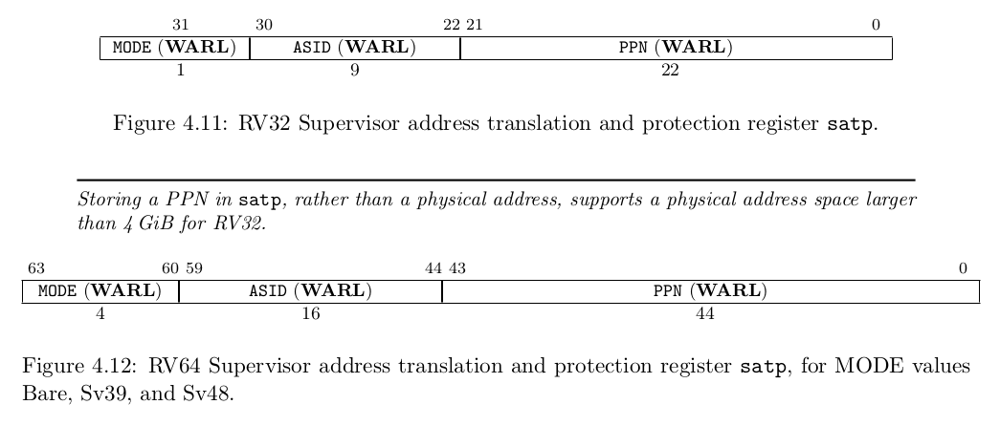
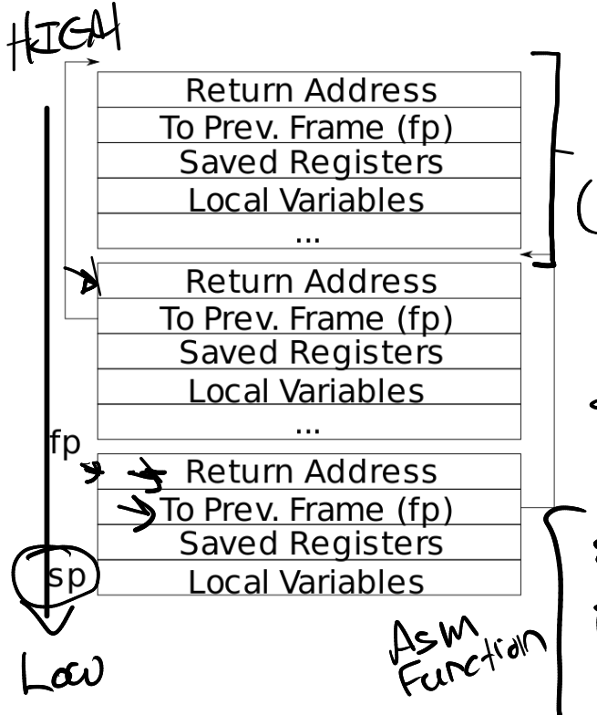
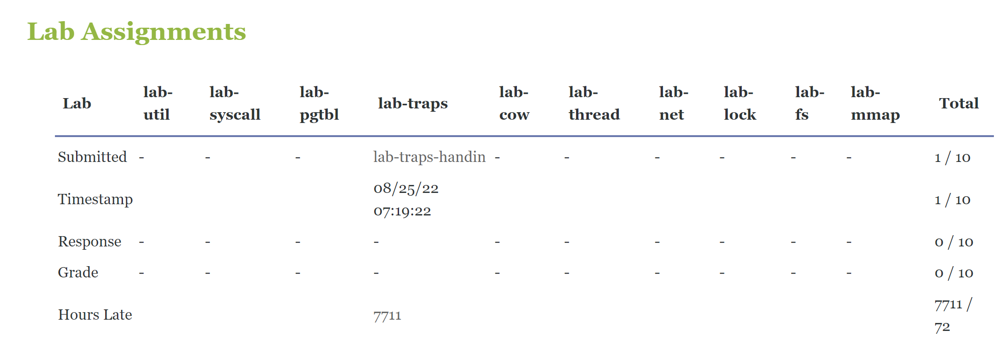

# Traps_lab

这一章介绍系统调用是如何通过traps(接下来统一翻译成 陷入)实现的。首先需要做一个通过栈的热身练习，然后实现一个用户态的陷入处理。

## Before Coding

### Reading: Chapter4
目前，有三种能让CPU放弃当前正在执行的代码，并放弃控制权到一些特殊代码的行为，本文统称为trap：
1. 系统调用：用户程序执行`ecall`操作时，要求内核执行一些操作
2. exception：用户或者内核执行了一些非法的行为，比如除以0、使用了非法的虚拟地址
3. interrupt：用于一些设备需要注意时，比如执行完读写操作的磁盘设备（需要返回信息到内核）

我们通常要求trap是透明的，也就是说正在执行的代码，不知道发生了trap。这对设备的interrupt尤为重要。通常trap会将控制权从用户态转移到内核，内核会保存寄存器等信息，用于恢复现场。内核中会执行应对这一trap的代码，比如系统调用，或者设备驱动。之后内核恢复现场，从trap返回，并继续让用户态从trap的地方开始运行。

xv6将所有的trap都在内核中处理。并且将系统调用、异常、以及中断都是内核的责任，以及更加方便的事情。

Xv6处理trap有四个阶段：
1. 首先通过RISC-V的CPU处理一些硬件动作
2. 一些汇编指令帮助能够执行内核中的C代码
3. C函数，用于决定对trap操作什么
4. 系统调用或者设备驱动真正处理

虽然这三种陷阱类型的共性表明内核可以使用单个代码路径处理所有trap，但是将以下三种情况分开会更加方便：用户态的trap、内核态的trap、以及timer interrupt。

内核代码中，处理trap的通常称为`handler`。最开始的handler指令通常由汇编构成，而不是c，并且有时被称为一个`vector`

#### RISC-V trap machinery

每个RISC-V的CPU都有一个控制寄存器集合，内核负责写入这些寄存器，以告诉CPU如何处理trap，并且内核能读取这些寄存器以知道这些trap是如何发生的。RISC-V的文件中有详细的定义，xv6使用的定义在`riscv.h`中。下面介绍一些重要的寄存器：

* `stvec` 内核将trap handler的地址写入到这里。RISC-V cpu会跳到这里的地址，进行trap的处理。
* `sepc` 当trap发生时（我理解是执行ecall时），RISC-V的cpu会将当前的PC保存在这个寄存器中。接下来PC会被`stvec`中的值覆盖。内核可以通过写入`spec`来控制`sret`指令接下来去到哪里。（也就是说，修改`sepc`能够使得内核返回时，去到用户进程的其他代码中。）
* `scause` RISC-V 将一个数字写入这里，用于说明trap的原因
* `sscratch` 内核在此处放置了一个值，该值在陷阱处理程序的一开始就派上用场。
* `sstatus` 该寄存器中的`SIE` 位控制是否允许设备中断。如果内核清除了`SIE`，则CPU互联设备中断。`SPP`位说明trap是内核还是用户态发生的，并控制`sret`返回到什么模式。

上述与traps相关的寄存器都在supervisor模式下处理，无法在用户态读写。

CPU中还有相似的一些控制寄存器，用于在machine mode（权限高于supervisor）处理trap。xv6仅仅在特殊情况下的timer interrupt使用这种寄存器。

多核CPU的每个核心都有其独立的这一套寄存器，并且在任何给定时间，可能有多个核心在处理trap。

当需要执行一个trap，RISC-V硬件会为所有trap类型执行以下的指令（除了timer interrupts）

1. 如果 trap 是一个设备中断，并且`sstatus` SIE被清零，则不进行任何以下操作；
2. 关中断：将`sstatus`中的SIE置空
3. 复制`pc`寄存器到`sepc`
4. 将当前的模式（用户或supervisor）保存到`sstatus`中的SPP位
5. 设置`scause`用于反应trap的原因
6. 将模式设置为supervisor
7. 拷贝`stvec`到pc
8. 开始以新的pc执行代码

注意到CPU硬件并不将页表切换为内核页表，也不切换内核栈，不保存任何用户态除了pc寄存器以外的寄存器。因此，内核软件必须执行这些操作。这样做的一个原因是，trap时CPU执行最少的工作，能提供给软件最大的灵活性。例如，一些系统在一些情况下忽略了页表切换，以提升性能。

值得思考的是，上述的步骤能否被忽略，用于获得更快的trap。尽管有一些情况下，更简单的步骤也能工作，但是也有很多的步骤被忽略会导致危险。例如，CPU不切换pc，这样导致trap切换到supervisor模式，但是仍然允许用户态代码。这打破了用户/内核的独立性，并使得用户态可以通过修改`satp`来访问所有的物理内存。因此在trap时，必须将pc切换到内核指定（我理解是可预见的）的指令地址，即`stvec`。

#### 4.2 Traps from user space

xv6对来自内核和用户态的trap是分别处理的。接下来介绍用户态的trap。

用户态的trap可能来自三种操作：system call（由ecall指令触发）；执行非法操作；设备中断。

触发trap时，首先在用户态的`uservec`（kernel/trampoline.S）中处理，接下来由`usertrap`（kernel/trap.c）处理。

结束trap时，首先执行`usertrapret`（kernel/trap.c），然后执行`userret`（kernel/trampoline.S）。

设计xv6的trap处理程序的一个主要限制是，RISC-V硬件并不帮助切换页表。这意味着，trap 处理函数的地址（保存在`stvec`中）必须映射到用户态，因为硬件处理完成后，页表还是用户态的页表，因此地址也必须是用户态的地址。此外，xv6的trap处理代码必须要将页表切换为内核页表，但是要让切换了页表后，继续执行处理代码的后续代码（因为不能改pc了），所有内核页表也需要映射处理代码的地址（`stvec`）。总之，内核和用户态的trap处理地址，相同。

xv6通过trampoline页实现这一功能。trampoline页包含`uservec`的代码，即`stvec`指向的trap处理代码。在每个进程中，该页都被映射到页表中的`TRAMPOLINE`地址，也就是地址空间的最后。这样该页是远高于用户程序需要的地址空间的。在内核中，该页页同样被映射到`TRAMPOLINE`虚拟地址。

> 这里的映射是虚拟的映射，内核中有两处虚拟地址映射了trampoline页。一个和物理地址相同，另一个是`TRAMPOLINE`。由于trampoline页在用户态被映射，并且有`PTE_U`的标志，trap首先在supervisor模式执行。由于trampoline代码同样也在内核地址中映射，因此切换到内核页表后，能继续执行。

`uservec`这一trap处理代码实现在`trampoline.S`中。当从`uservec`开始时，所有32个用户态的寄存器都是用户代码的。因此，这32个数需要保存到内存的某个地方，用于退出trap时恢复。保存到内存需要记录保存的地址指针，但是此时没有可以使用的通用寄存器。
以下是`uservec`的代码：
```asm
trampoline:
.align 4
.globl uservec
uservec:    
#
        # trap.c sets stvec to point here, so
        # traps from user space start here,
        # in supervisor mode, but with a
        # user page table.
        #
        # sscratch points to where the process's p->trapframe is
        # mapped into user space, at TRAPFRAME.
        #
        
# swap a0 and sscratch
        # so that a0 is TRAPFRAME
        csrrw a0, sscratch, a0

        # save the user registers in TRAPFRAME
        sd ra, 40(a0)
        sd sp, 48(a0)
        sd gp, 56(a0)
        sd tp, 64(a0)
        sd t0, 72(a0)
        sd t1, 80(a0)
        sd t2, 88(a0)
        sd s0, 96(a0)
        sd s1, 104(a0)
        sd a1, 120(a0)
        sd a2, 128(a0)
```

幸运的是，RISC-V提供了`sscratch`寄存器。`csrrw`指令在这一代码的最开始，用于交换`sscratch`和`a0`的内容。这样一来，cpu就可以使用`a0`来执行其他操作了，而`a0`之前的内容，由`sscratch`保存。

> 那么，交换之前的`sscratch`指向哪里呢？
> 
> sscratch points to where the process's p->trapframe is mapped into user space, at TRAPFRAME
> 
> 也就是说，`sscratch`指向进程的`p->trapfram`映射到的地方，也就是`TRAPFRAME`

之后我们使用间接寻址写入剩余的寄存器（注意到书上说的是32个，其实只用保存31个寄存器，因为有一个通用寄存器是只读的，值为0，用于帮助其他寄存器置为0）。在进入用户态前，内核将设置`sscratch`指向每个进程的`trapframe`（因为进程切换在内核，所以该寄存器一定指向当前发生trap的进程的trapframe），并且当前的进程的trampframe是一个页，一定有空间保存寄存器。另外注意到，trampframe是用户态地址空间中的，因此恢复需要用户的地址。由于`satp`仍然指向用户的页表，因此xv6保证每个进程都分配一个页，并且被映射到虚拟地址的`TRAPFRAME`，刚好在`TRAMPOLINE`下方。而内核中的`p->trapframe`也指向这个页（地址不同，内核中是物理地址，因此内核也可以使用）。

> trapframe在内核中和在用户态的形态是不同的。
> 
> 用户态，trapframe是在trampoline之下的一个虚拟页
> 
> 在内核态，trapframe指向一个真实的物理页，并且是一个结构体
> 
> 因此在内核态，用的是c语言有语义进行管理，而在用户态用的是汇编以偏移量进行管理。

```c

// per-process data for the trap handling code in trampoline.S.
// sits in a page by itself just under the trampoline page in the
// user page table. not specially mapped in the kernel page table.
// the sscratch register points here.
// uservec in trampoline.S saves user registers in the trapframe,
// then initializes registers from the trapframe's
// kernel_sp, kernel_hartid, kernel_satp, and jumps to kernel_trap.
// usertrapret() and userret in trampoline.S set up
// the trapframe's kernel_*, restore user registers from the
// trapframe, switch to the user page table, and enter user space.
// the trapframe includes callee-saved user registers like s0-s11 because the
// return-to-user path via usertrapret() doesn't return through
// the entire kernel call stack.
struct trapframe {
  /*   0 */ uint64 kernel_satp;   // kernel page table
  /*   8 */ uint64 kernel_sp;     // top of process's kernel stack
  /*  16 */ uint64 kernel_trap;   // usertrap()
  /*  24 */ uint64 epc;           // saved user program counter
  /*  32 */ uint64 kernel_hartid; // saved kernel tp
  /*  40 */ uint64 ra;
  /*  48 */ uint64 sp;
  /*  56 */ uint64 gp;
  /*  64 */ uint64 tp;
  /*  72 */ uint64 t0;
  /*  80 */ uint64 t1;
  /*  88 */ uint64 t2;
  /*  96 */ uint64 s0;
  /* 104 */ uint64 s1;
  /* 112 */ uint64 a0;
  /* 120 */ uint64 a1;
  /* 128 */ uint64 a2;
  /* 136 */ uint64 a3;
  /* 144 */ uint64 a4;
  /* 152 */ uint64 a5;
  /* 160 */ uint64 a6;
  /* 168 */ uint64 a7;
  /* 176 */ uint64 s2;
  /* 184 */ uint64 s3;
  /* 192 */ uint64 s4;
  /* 200 */ uint64 s5;
  /* 208 */ uint64 s6;
  /* 216 */ uint64 s7;
  /* 224 */ uint64 s8;
  /* 232 */ uint64 s9;
  /* 240 */ uint64 s10;
  /* 248 */ uint64 s11;
  /* 256 */ uint64 t3;
  /* 264 */ uint64 t4;
  /* 272 */ uint64 t5;
  /* 280 */ uint64 t6;
};

```

当交换了`sscratch`和`a0`后，`a0`保存当前进程的`trapframe`地址，之后把包括`a0`的所有寄存器保存到`trapframe`中。

`trapframe`保存当前进程的内核栈地址，当前cpu的id，用户态的`usertrap`函数地址，以及内核的页表的地址。`uservec`检索这些值，并将`satp`切换为内核页表地址，并调用`usertrap`

> 这里有一个疑问：内核页表的地址，在用户态是虚拟的地址，如何切换？
> 
> 也就是说，切换了页表后，`satp`的值应该变成了一个虚拟地址值？
> 
> `satp`寄存器的内部实现避免了这一点：
> 
> 
> 
> 注意到`satp`寄存器中存的不是地址，而是PPN，就是物理页号。因此修改`satp`后，不会有上述问题。

`usertrap`（kernel/trap.c）的任务是确定trap的原因，并返回。该函数首先修改`stvec`，因此内核中如果出现trap，将交由内核的`kernelvec`而不是`uservec`处理。该函数也会保存`sepc`寄存器，该寄存器是发生trap的进程的pc值，因为`usertrap`可能会调用`yield`切换到另一个进程的内核线程，然后该进程可能返回到用户态，可能会修改当前的`spec`寄存器。如果该trap是一个系统调用，`usertrap`调用`syscall`来处理；如果是一个设备中断，调用`devintr`；除此之外就是exception，则内核杀死该错误的进程。

系统调用路径会将保存的用户pc增加4，因为RISC-V的系统调用的pc指向`ecall`指令，但是用户的代码需要在ecall下一个指令开始。在函数结束路径上，`usertrap`检查进程是否已经被杀死，或者需要释放CPU（如果是一个timer 中断）。

`usertrap`函数的末尾是`usertrapret`，用于返回用户态。该函数设置RISC-V的控制寄存器，用于未来来自用户态的trap。返回时，需要修改`stvec`指向`suervec`，设置正确的`trapframe`区域，设置`sepc`为之前保存的用户`pc`。在`usertrapret`的末尾，会以函数指针的形式调用`userret`。`userret`保存在trampoline页，并且在用户态和内核态都有映射。`userret`是汇编代码，并且会切换页表。

> `userret`的c调用是通过函数指针进行的：
> ```c
> // jump to trampoline.S at the top of memory, which 
> // switches to the user page table, restores user registers,
> // and switches to user mode with sret.
> uint64 fn = TRAMPOLINE + (userret - trampoline);
> ((void (*)(uint64,uint64))fn)(TRAPFRAME, satp);
> ```

`usertrapret`调用`userret`传入了两个参数，分别是`TRAPFRAME`和`satp`。在c语言的调用中，这两个参数是通过`a0`和`a1`传入的。`userret`切换`satp`的值为`a1`，使其指向用户进程页表。注意到，内核和用户态仅有TRAMPOLINE是相同映射的。使得切换了页表后，在trampoline的`userret`代码能继续执行。之后，由于`a0`指向的是`TRAPFRAME`这个在用户态中的虚拟地址。因此可以通过间接寻址，恢复各种寄存器。

在恢复各种寄存器之前，首先将用户态的`a0`保存到`sscratch`中，用于方便继续使用`a0`简介寻址。在恢复完所有寄存器后，恢复`a0`，并通过`sret`返回。

> 注意到在syscall中，修改了`trapframe->a0`，恢复时也会把修改后的值传递到用户态。

#### 4.3 Code: Calling system calls

见syscall lab

#### 4.4 Code: System call arguments

见syscall lab

#### 4.5 Traps from kernel space

xv6 对于用户态和内核态的trap是分开处理的。在内核态，`stvec`指向`kernelvec`（kernel/kernelvec.S）的汇编代码。由于已经在内核态，因此可以继续使用`satp`指向的页表，以及继续使用内核栈。`kernelvec`将所有的32个寄存器都存在栈中，用于之后的恢复继续无感知的执行内核代码。

内核保存中断掉的内核进程的寄存器在进程的内核栈中，这是合理的，因为这些寄存器都属于这个线程。这一点对于造成线程切换的trap尤为重要，因为这会导致trap从另一个进程的栈中返回，这样能使得刚开始的进程能安全的保存寄存器数据。

> 为什么是内核进程，因为内核不同的线程都有一个独立的内核栈，允许不同的进程运行不同的内核代码，或者从内核退出后，进入内核时，恢复运行内核未完成的任务。

`kernelvec`在保存寄存器后跳转到`kerneltrap`(kernel/trap.c)。`kerneltrap`函数用于处理两种trap：设备中断、exception。对于前者，使用`devintr`(kernel/trap.c)来检查并处理。如果不是设备中断，则必然是exception，如果发生在xv6内核，则总是一个致命错误，内核调用`panic`并停止执行。

如果`kerneltrap`被时钟中断调用，并且此时是一个进程的内核线程在运行（而不是scheduler线程），则`kerneltrap`调用`yield`来使另一个线程获得机会运行。在某些时候，一个被时钟中断的线程会yield，并使得我们的线程及其暂停的`kerneltrap`继续执行。第七章将解释`yield`的原理。

> 也即是说，`kerneltrap`函数中，发生了线程切换，使得当前的进程暂停运行。而也有可能其他进程切换，使得暂停的进程继续运行。

当kerneltrap的工作结束，需要恢复之前中断的代码运行。由于函数中可能执行yield，扰乱当前进程的spec寄存器和模式`sstatus`，因此`kerneltrap`函数开始时会保存这些值（通过内核栈，创建C函数中的局部变量）。函数结束时，会恢复这些值，并返回`kernelvec`。`kernelvec`恢复保存的寄存器，并执行`sret`指令，该指令会拷贝`sepc`到`pc`，之后恢复中断的欸和代码。

当xv6从用户态进入内核态时，会设置`stvec`指向`kernelvec`，这一实现在`usertrap`（kernel/trap.c）中。这导致有一个时间窗口，虽然时在内核态执行，但是`stvec`仍然是用户态的`uservec`，这使得需要保证这一窗口内没有硬件中断产生。幸运的是，RISC-V在处理trap时，永远会关闭中断，并且在xv6设置成功stvec之前不会打开中断。

> RISC-V cpu在发生trap时，会将中断关闭。

#### 4.6 Page-fault exceptions

xv6对于exception的实现非常简单，不论是内核还是用户态的exception，都直接停止运行线程或内核。在真实操作系统中有更有趣的处理方式。

一个例子是很多内核使用page fault来实现`copy-on-write(COW) fork`。在`xv6`的fork实现时，使用了`uvmcopy`，真实复制物理内存。但是COW允许子进程和父进程共享相同的物理页面。

父进程和子进程能通过页表的权限设置和页中断来安全共享物理内存。在3种情况下cpu会发生page-fault exception：
1. 虚拟地址没有映射到物理地址
2. PTE_V为空
3. 违反`PTE_R, PTE_W, PTE_X, PTE_U`等权限位

RISC-V的cpu能分辨三种page fault：
1. load 指令导致的（load 时无法翻译对应的虚拟地址）
2. store 指令导致的
3. instruction（pc指向的代码无法翻译）

之后`scause`寄存器会指示发生了何种page fault，并由`stval`寄存器包含无法翻译的地址。

最基本的COW fork实现是为父子进程共享所有的物理页，但是都设置为read-only形式。当某个进程发生写入，则cpu发生page-fault exception。则trap处理程序需要分配新的物理页，使得失效的地址指向该页。在新的页的PTE是修改使得能写入的，并且复制了数据。之后恢复发生fault的进程，到发生falut之前的代码，并恢复执行。

COW需要记录来帮助决策哪些物理页能被释放，因为物理页可能被多个页表指向（由于fork，page fault，execs，以及exit）。这里的记录允许实现一个重要的优化：如果一个进程发生了一个store page fault，但是该页仅有该进程持有，则不需要复制操作。

COW 使得fork更加快速，因为这避免了复制内存。一些内存之后在写入时被复制，而一些内存可能用于不会本复制。一个例子是exec之后的fork：少量页在fork后被写入，但随后子进程的 exec 释放了从父进程继承的大部分内存。COW fork消除了需要拷贝这些会被释放的内存。更进一步，**COW fork**是透明的：应用不需要任何修改也可以获得这一好处。

除了COW以外，另一个非常有用的特性是 `lazy allocation`，具有两个部分：（1）当进程需要更多内存，并调用`sbrk`时，内核会记录增加的大小，但是不会真正分配物理内存，也不会创建对应虚拟地址的PTE。（2）当在这些新地址发生page fault时，内核分配一个页的内存，并将其映射在页表上。和COW fork类似，内核实现**lazy allocation**是透明的。

由于进程总是申请多于实际使用量的内存，lazy allocation是有益的：不需要对不使用的内存进行分配。其次，如果进程需要大量内存，则实际分配的`sbrk`的开销会非常高。比如分配GB级的内存，系统需要分配`262,144`个4096Byte的页，并清零。Lazy allocation将这一开销在时间上分摊。但是另一维度上，lazy allocation也导致page fault的开销增多。系统可以通过在发生page fault时，分配连续的页，来降低进入和退出内核的代价。

另一个广泛使用的特性是`demand page`。在`exec`中，xv6将所有的代码段和数据段都加载到内存。由于程序可能很大，并且需要从磁盘读取时很费时的，则程序的启动时间将变得用户可感知：当用户启动一个很大的程序，则会很长时间之后，shell才给出反馈。为了提升反馈性能，现代的内核会为用户空间创建页表，但是将PTE设置为无效的。当page fault发生时，内核读取该页对应在磁盘上的数据，并将其映射到用户地址空间。和COW fork和lazy allocation类似，该特性也是透明的。

用户需要的内存可能时物理内存无法提供的。为了能优雅地应付这一现状，操作系统可能会实现**paging on disk**。这一思想是，进保持部分用户页在内存，而将其他页保存在磁盘上。内核会记录这些页被保存到了`paging area(and thus not in RAM)`，并且设置为invalid。如果程序尝试访问这些在disk上的页，则会产生于给page fault。接下来，该paged out的页会被paged in：内核trap处理程序会分配一个物理页，并从磁盘读取到内存，并修改PTE指向这一内存。

当没有内存空间时，paged in操作还需要evicting来腾出空间。将一个物理页写到磁盘上，并标记其对应的PTE为invalid。Eviction操作是昂贵的，所以分页在不频繁的情况下表现最好：如果应用程序仅使用其内存页面的一个子集，并且子集的并集适合RAM（能装入物理内存）。这一特性通常称为有很好的访问局部性。由于有很多虚拟地址技术，内核通常也是透明地为程序实现pageing to disk地服务。

通常计算机在没有或者很少可用物理内存地情况下运行，无论有多少物理内存。例如，云提供商会复用很多用户在同一个物理机上来高效地使用硬件。另一个例子是，用户使用很多程序在智能手机上，尽管智能手机地物理内存很少。在这样地情况下，分配内存首先需要提出已有的物理页。因此，当空闲物理内存稀缺时，分配成本很高。

Lazy allocation 和 demand page在空闲内存有限时是特别有利的。在 sbrk 或 exec 中急切地分配内存会产生额外的eviction以使内存可用的成本。此外，由于在申请之前，急切的分配可能会被浪费，因为用户真正用到这样的页之前，操作系统可能会evict这些页。

结合分页和页面错误异常的其他功能包括**自动扩展堆栈**和**内存映射文件(mmap)**。

#### 4.7 Real world

trampoline 和trapframe机制可能看起来非常复杂。一个驱动力是 RISC-V CPU 在trap时有意尽可能少地执行，以允许非常快速的trap处理的可能性，事实证明这很重要。

结果，内核trap处理程序的前几条指令实际上必须在用户环境中执行：使用用户页表和用户寄存器内容。并且trap处理程序最初不知道很多有用的信息，例如正在运行的（发生trap的）进程的身份或其内核页表的地址。
一个可能的解决方案是，RISC-V提供了受保护的地方，在进入用户空间之前，内核可以在这些地方隐藏信息：sscratch寄存器和指向内核内存但受PTE_U置为空保护的用户页表条目（使得在用户态无法运行这一对应的用户页表）。Xv6的trampoline和trapframe利用了这些RISC-V特性（PTE_U以及sscratch）。

如果内核内存被映射到每个进程的用户页表（带有适当的 PTE 权限标志），则可以消除对特殊trampoline页的需求。这也消除了需要在trap时，内核和用户态切换页表的操作。因为这样让内核能直接调用利用当前用户的内存映射形式，允许直接对用户指针进行解引用。很多操作系统这样做来提升效率。Xv6 避免使用这一技术，为了减少由于无意使用用户指针而导致内核中出现安全错误，并降低了确保用户和内核虚拟地址不重叠所需的一些复杂性。

生产操作系统实现了COW fork、lazy allocation、demand paging、paging on disk、memory-mapped files等。此外，生产操作系统将尝试使用所有物理内存，无论是用于应用程序还是缓存(比如，文件系统的缓冲区缓存，我们将在后面的 8.2 节中介绍)。Xv6 在这方面是幼稚的：我们希望操作系统使用所有支付的物理内存，但 xv6 没有。此外，如果xv6内存不足，它会向正在运行的应用程序返回错误或将其终止，而不是例如evict另一个应用程序的页面。


### source files

#### `kernel/trampoline.S`

这里主要有两个模块`uservec`和`userret`。前者负责用户态到内核态的入口，后者是内核态出到用户态的出口。

1. `uservec`

该模块需要将用户的寄存器保存到用户态和内核都能看到的`trampframe`结构中，每个进程都有一个页在内核和用户态中对应。每个进程的用户态trampframe地址是相同的，但是在内核态不相同。这一点是通过用户态页表实现的。

保存用户态寄存器，需要通过间接寻址，但是又不能用非用户的寄存器。因此使用了`csrrw a0, sscratch, a0` 来交换`sscratch`和`a0`寄存器。在此之前`sscratch=TRAMPFRAME`，因此现在的`a0`能用于间接寻址获得内核态的`trampframe`结构体，用于写入其他寄存器。

之后通过内核的`trampframe`恢复在内核中的栈帧，内核中的hartid，并获取内核中接下来处理的函数`usertrap`的地址，注意到，这个地址是内核页表才能用的。

之后切换内核页表，并跳转到`usertrap`。

2. `userret`

#### `kernel/trap.c`

内核中，分类处理trap的函数。

## do lab


### RISC-V assembly
掌握一些RISC-V的汇编知识是重要的，做这个lab的人被默认上过6.004。

在代码库中有一个文件`user/call.c`，使用`make fs.img`会编译该文件，并生成可读的汇编文件`user/call.asm`。

阅读`call.asm`中的`g`，`f`，和`main`函数的代码。RISC-V的指令手册在[reference page](https://pdos.csail.mit.edu/6.S081/2021/reference.html)。下面有一些需要回答的问题，回答后保存在`answers-traps.txt`。

我们首先将这一汇编文件的三个函数写道笔记中来：
```asm

user/_call:     file format elf64-littleriscv


Disassembly of section .text:

0000000000000000 <g>:
#include "kernel/param.h"
#include "kernel/types.h"
#include "kernel/stat.h"
#include "user/user.h"

int g(int x) {
   0:1141                addi sp,sp,-16
   2:e422                sd s0,8(sp)
   4:0800                addi s0,sp,16
  return x+3;
}
   6:250d                addi wa0,a0,3
   8:6422                ld s0,8(sp)
   a:0141                addi sp,sp,16
   c:8082                ret

000000000000000e <f>:

int f(int x) {
   e:1141                addi sp,sp,-16
  10:e422                sd s0,8(sp)
  12:0800                addi s0,sp,16
  return g(x);
}
  14:250d                addi wa0,a0,3
  16:6422                ld s0,8(sp)
  18:0141                addi sp,sp,16                              1a:8082                ret


000000000000001c <main>:
void main(void) {
   1c:1141                addi sp,sp,-16
   1e:e406                sd ra,8(sp)
   20:e022                sd s0,0(sp)
   22:0800                addi s0,sp,16
   printf("%d %d\n", f(8)+1, 13);
   24:4635                li a2,13
   26:45b1                li a1,12
   28:00000517          auipc a0,0x0
   2c:7b050513          addi a0,a0,1968 # 7d8 <malloc+0xea>
   30:00000097          auipc ra,0x0
   34:600080e7          jalr 1536(ra) # 630 <printf>
   exit(0);
   38:4501                li a0,0
   3a:00000097          auipc ra,0x0
   3e:27e080e7          jalr 638(ra) # 2b8 <exit>
```

我们观察到一些现象：
首先，汇编的代码中，函数`f(x)`和`g(x)`是没有区别的，因为f(x)返回的是直接调用`g(x)`的结果，因此编译器在这里做了优化。


Q1: Which registers contain arguments to functions? For example, which register holds 13 in main's call to printf?

A1: 函数的参数是由寄存器a0保存的，比如在f和g函数中，都是直接用a0=a0+3，进行计算的。在main函数中，调用printf时，两个参数的值分别是12 和13，由a1 和 a2分别保存。注意到编译器直接计算出了结果。

Q2: Where is the call to function f in the assembly code for main? Where is the call to g? (Hint: the compiler may inline functions.)

A2: 没有调用两个函数的过程。函数的计算结果都被直接由编译器计算了。比如main中的f(8)+1，值就是12

Q3: At what address is the function printf located?

A3: 函数的地址在`0x0630`
```asm
0000000000000630 <printf>:

void
printf(const char *fmt, ...)
{

$在main中该函数调用由以下命令实现，调用的是printf
34:600080e7          jalr1536(ra) # 630 <printf>$
```

注意到1536 = 0x600，而不是0x630，由当前的ra的值为`0x30 + 0x600`取址到printf


Q4: What value is in the register ra just after the jalr to printf in main?

A4: 我们需要理解`auipc`和`jalr`两条指令的作用以确认ra的值。

```
30:00000097          auipc ra,0x0
34:600080e7          jalr 1536(ra) # 630 <printf>
```

简单来说：
`auipc ra, 0x0` 的效果是`ra = pc + 0x0 << 12 = pc`

JALR指令格式为：`JALR rd，offset(rs1)`
`t = pc + 4;  pc = (x[rs1]+sext(offset)) & ~1;  x[rd]=t`

`jalr 1536(ra)` 扩展为 `jalr ra, ra, 0x600`，如此操作后，寄存器值ra = pc+4 = 38。

Q5: Run the following code.

	unsigned int i = 0x00646c72;
	printf("H%x Wo%s", 57616, &i);
      
What is the output? Here's an ASCII table that maps bytes to characters.
The output depends on that fact that the RISC-V is little-endian. If the RISC-V were instead big-endian what would you set i to in order to yield the same output? Would you need to change 57616 to a different value?

Here's a description of little- and big-endian and a more whimsical description.

A5: 我们修改call.c添加以上两行代码，得到的输出为：`HE110 World`

Q6: In the following code, what is going to be printed after 'y='? (note: the answer is not a specific value.) Why does this happen?

	printf("x=%d y=%d", 3);

A6: 这里的值应该会是默认上一次在寄存器`a2`中的值。我们进行如下实验。
```
int d = 2568;
printf("x=%d y=%d", 3, d);
printf("x=%d y=%d", 3);
printf("x=%d y=%d", 3, 2*d);
printf("x=%d y=%d", 3);
```

输出是：

```
x=3 y=2568
x=3 y=1
x=3 y=5136
x=3 y=1
```

应该是printf函数内部对寄存器有操作，我们调整策略为使用内嵌汇编：

```
asm volatile(
                "li a2, 4396;"
    );
printf("x=%d y=%d", 3);
```

获得输出:
```
x=3 y=4396
```

### Backtrace

对于debug操作，拥有一个backtrace功能通常非常有帮助：用于列出出现bug点之上的各种函数调用栈。

这个实验就是要我们实现这一功能。要求如下：
```
实现backtrace()函数在`kernel/printf.c`中。在系统调用`sys_sleep`中添加对`backtrace`的调用。

成功后，在shell中调用`bttest`，它将调用`sys_sleep`。应该得到的输出如下，输出在`bttest`退出qemu之后：

backtrace:
0x0000000080002cda
0x0000000080002bb6
0x0000000080002898

地址可能会有些许不同，但是如果运行`addr2line -e kernel/kernel`，或者`riscv64 -unknown-elf-addr2line -e kernel.kernel`，然后复制粘贴之上的地址输出，就像下方的样子：

    $ addr2line -e kernel/kernel
    0x0000000080002de2
    0x0000000080002f4a
    0x0000000080002bfc
    Ctrl-D

我们会看到类似如下的输出：

    kernel/sysproc.c:74
    kernel/syscall.c:224
    kernel/trap.c:85

```

编译器会将每个栈帧中放入一个帧指针，保存函数调用者的栈帧地址。实现的`backtrace`应该使用这一个帧指针，用于唤醒调用栈，并将每个栈帧中保存的返回地址打印出来。

#### 一些提示

1. 将`backtrace`函数的原型添加到`kernel/defs.h`中，用于能在`sys_sleep`中调用。
2. GCC 编译器将当前正在执行的函数的帧指针保存在寄存器`s0`中。将如下的函数添加到`kernel/riscv.h`中：
   
  ```
  static inline uint64
  r_fp()
  {
    uint64 x;
    asm volatile("mv %0, s0" : "=r" (x) );
    return x;
  }
  ```
   
  并调用这个函数以获得当前的帧指针。这个函数使用了内联汇编用于读取`s0`。

3. 这份[课程讲义](https://pdos.csail.mit.edu/6.828/2021/lec/l-riscv-slides.pdf) 中有一张栈帧的排列方式的图。注意到返回地址存储在西藏对栈帧指针固定的偏移量（-8）的位置，而保存的栈帧指针保存在相对当前帧指针（-16）的地方。
4. Xv6为每个栈在内核中分配一个`PAGE-aligned address`的页。我们能通过`PGROUNDDOWN(fp)`和`PGROUNDUP(fp)`来计算栈页的顶部和底部地址（详细信息在`kernel/riscv.h`中，这些结果对`backtrace`结束其循环很有帮助）。

如果实现的`backtrace`能够工作，从`panic`（`kernel/printf.c`）中调用它，用于观察在panic发生时的调用栈。

#### 实现

1. 首先在`printf.c`中添加函数实现，并`defs.h`中添加函数声明

  ```
  // in printf.c
  // my implementation of backtrace to show stack frames
  void backtrace(){
      printf("printf in backtrace\n");
  }


  // in defs.h

  void            backtrace(void);
  ```

2. 在`sys_sleep`中调用该函数

  我的做法是直接在函数开始调用，不过应该不影响。

  ```
  uint64
  sys_sleep(void)
  {
    int n;
    uint ticks0;  
    backtrace();
  ```

3. 测试函数是否能够调用

  
  ```
  $ make qemu
  $ bttest
  printf in backtrace
  ```

  说明能够运行调用

4. 真正实现栈帧的链式索引
  
  
  
  栈帧的链式结构如图所示：

  由`sp`指向栈的底端，在xv6中和4k对齐，并且只有一页。

  由`fp`指向当前的返回地址，在GCC编译器中，将保存到`s0`寄存器。

  > 注意到，返回地址（return address）和（prev frame）是不一样的，一个表示程序的只读代码段地址，一个是栈帧数据段地址。

  由于我们的栈是由高到低进行生长的，因此当最后一个栈帧获得到栈的最顶端时，获取栈帧就结束了。

  注意到我们这里需要打出的是内核的栈，所以不需要页表地址翻译。


  首先添加获取`fp`的函数到`riscv.h`中。

  ```
  // in kernel/riscv.h

  static inline uint64
  r_fp()
  {
    uint64 x;
    asm volatile("mv %0, s0" : "=r" (x) );
    return x;
  }
  ```

  在`blockframe`中获取当前的栈帧，判断是否是栈顶，获取上一个的栈帧，循环。

  ```
  // my implementation of backtrace to show stack frames
  void backtrace(){
      uint64 curr_fp;
      uint64 prev_fp;
      uint64 rt_addr;
      uint64 real_pgup;
      curr_fp = r_fp();
      real_pgup = PGROUNDUP(curr_fp);

      while(1)
      {
        rt_addr = *((uint64 *)(curr_fp - 8));
        prev_fp = *((uint64 *)(curr_fp - 16));
          
        if(curr_fp != real_pgup)
          printf("%p\n", rt_addr);
        else
          break;
        curr_fp = prev_fp;
      }
  }
  ```

  这里当`curr_fp == real_pgup`时，退出。这是因为在最顶部的栈帧是汇编代码，不是c语言的函数，因此栈帧结构和c的不同，没有确定的函数，无法打印返回值。

  另外间接取址时，要让`curr_fp`的基础上进行数值操作，而不是以指针的形式操作。

  之后我们将这一个函数添加到`panic()`函数中。

#### 测试

```
# in qemu

$ bttest
0x00000000800020cc
0x0000000080001fa6
0x0000000080001c90

# in shell

$ addr2line -e kernel/kernel
0x00000000800020cc
0x0000000080001fa6
0x00000000/home/gxj/xv6-labs-2021/kernel/sysproc.c:62
/home/gxj/xv6-labs-2021/kernel/syscall.c:140
80001c90
/home/gxj/xv6-labs-2021/kernel/trap.c:76

```
  
### Alarm

#### 要求

在本练习中，您将向 xv6 添加一个功能，该功能会在进程使用 CPU 时间时定期提醒它。这对于想要限制它们占用多少 CPU 时间的计算受限的进程，或者对于想要计算但又想要采取一些定期操作的进程可能很有用。更通用的说，你需要实现一个用户级中断/故障处理程序的原始形式；例如，您可以使用类似的东西来处理应用程序中的页面错误。如果解决方案顺利执行，则能够通过`alarmtest`和`usertest`。

#### 实现思路

你们需要添加新的系统调用`sigalarm(interval, handler)`。如果一个应用调用`sigalarm(n, fn)`，则之后每`n`个CPU时间的`ticks`后，内核应该调用应用程序`fn`。当函数`fn`返回后，应用应该恢复到它离开的地方。在xv6中，`tick`是一个相当任意的时间单位，由硬件定时器产生中断的频率决定。

实现时能够发现一个文件`user/alarmtest.c`在仓库中。将这个应用添加到Makefile中。只有在实现了`sigalarm`和`sigreturn`后，才会编译成功。

`alarmtest`会调用`sigalarm(2, periodic)`在`test0`中要求内核每2个tick后调用`periodic()`，接下来自旋一段时间。汇编代码说保存在`user/alarmtest.asm`中，这对于调试可能很方便。当 alarmtest 产生这样的输出并且 usertests 也正确运行时，您的解决方案是正确的：

```
$ alarmtest
test0 start
........alarm!
test0 passed
test1 start
...alarm!
..alarm!
...alarm!
..alarm!
...alarm!
..alarm!
...alarm!
..alarm!
...alarm!
..alarm!
test1 passed
test2 start
................alarm!
test2 passed
$ usertests
...
ALL TESTS PASSED
$

```

完成后，您的解决方案将只有几行代码，但要正确处理可能会很棘手。我们将使用原始仓库中的版本测试您的代码。您可以修改`alarmtest.c`来帮助您调试，但要确保原始的`alarmtest`表明所有测试都通过了。

#### 实现

1. 添加Makefile中的程序

  ```
  UPROGS=\
  U/_cat\
  U/_echo\
  U/_forktest\
  U/_grep\
  U/_init\
  U/_kill\
  U/_ln\
  U/_ls\
  U/_mkdir\
  U/_rm\
  U/_sh\
  U/_stressfs\
  U/_usertests\
  U/_grind\
  U/_wc\
  U/_zombie\
  U/_alarmtest\
  ```

2. 添加系统调用

     1. 向`kernel/syscall.h`中添加系统调用符号
        
        ```
       #define SYS_close  21
       #define SYS_sigalarm  22
       #define SYS_sigreturn  23
        ```

     2. 向`kernel/syscall.c`中添加函数指针数组

       ```
       extern uint64 sys_sigalarm(void);
       extern uint64 sys_sigreturn(void);

       [SYS_sigalarm]   sys_sigalarm,
       [SYS_sigreturn]   sys_sigreturn,
       ```

     3. 向`kernel/sysproc.c`中添加函数实现原型

       ```
       uint64
       sys_sigalarm(void)
       {
           return 0;
       }

       uint64
       sys_sigreturn(void)
       {
           return 0;
       }
       ```

     4. 向`user/user.h`中添加系统调用在用户态的原型

       ```
       int sigalarm(int, void (*)());
       int sigreturn(void);
       ```

     5. 向`user/usys.pl`中添加系统调用在用户态的入口

       ```
       entry("sigalarm");
       entry("sigreturn");
       ```


3. 尝试编译执行

  能够编译执行：

  ```
  $ alarmtest
  test0 start
  ....................................................................................................................................................................................................................................................................................................................................................................................................................................................................................................................
  test0 failed: the kernel never called the alarm handler
  test1 start
  ........................................................................................................................................................................................................
  test1 failed: too few calls to the handler
  test2 start
  ....................................................................................................................................................................................................................................................................................................................................................................................................................................................................................................................
  test2 failed: alarm not called
  ```

#### test0: invoke handler

首先修改内核以从用户态跳转到alarm handler，这样test0能够打印"alarm!"。不用在意在输出之后的事情，即使崩溃也是可以的。

> 以下提示我做的时候跳过了，建议先看


一些提示：

* 修改Makefile以能够编译`alarmtest.c`
* 正确的在的函数声明在`user/user.h`中为：

  ```
  int sigalarm(int ticks, void (*handler)());
  int sigreturn(void);
  ```

* 修改`user/usys.pl`，`kernel/syscall.h`，`kernel/syscall.c`，以成功调用`sys_sigalarm`和`sys_sigreturn`调用。

* 当前`sys_sigreturn`应该返回0

* `sys_sigalarm()`应该能保存alarm间隔，和到handler的指针，保存的位置应该是内核中对应进程的`struct proc`

* 我们需要跟踪当前从上次调用后，经过了多少`ticks`（或者离下次还剩多少ticks）。在`struct proc`中也需要这一个数据区域。这些区域的初始化可以在`allocproc(), proc.c`中进行。

* 对于每个`tick`，硬件时钟会强加一个中断，在`usertrap(), kernel/trap.c`中处理。

* 当时钟中断时，如果仅需要处理进程的`alarm ticks`，可以用如下的代码：

  ```
  if(which_dev == 2) ...
  ```

* 仅当进程有未完成的计时器时才调用警报函数。注意到可能会有用户态的alarm function的地址为0。（例如在`user/alarmtest.asm`中，`periodic`的地址在0。
  
  > 这个是告诉实现者，不能用函数地址确定是否需要alarm

  ```
  void
  periodic()
  {
    0: 1141                 addi sp,sp,-16
    2: e406                 sd ra,8(sp)
    4: e022                 sd s0,0(sp)
    6: 0800                 addi s0,sp,16
  ```

  意思是说，`periodic`的函数指针为0。

* 需要修改`usertrap()`函数，使得当进程的alarm 间隔过期，此个用户进程需要执行`handler`函数。当RISC-V的trap返回到用户态，是什么能决定当返回用户态继续执行后的指令地址？

* 当使用gdb观察trap时，如果仅仅使用一个CPU会更加简单，通过如下指令实现：
  
  ```
  make CPUS=1 qemu-gdb
  ```

* 如果`alarmtest`能打印"alarm!"，则通过test0。

#### 实现test0

* 修改`struct proc`，在`allocproc`中添加初始化代码
  
  ```
  // in struct proc
    int alarminterval;
    uint64 alarmhandler;
    int leftinterval;
  };

  // in allocproc()

    memset(&p->context, 0, sizeof(p->context));
    p->context.ra = (uint64)forkret;
    p->context.sp = p->kstack + PGSIZE;

    // initialize alarm handler field, new code
    p->alarminterval = 0;
    p->alarmhandler = 0;
    p->leftinterval = 0;
    
    return p;
  }
  ```

* 在`sys_sigalarm`中，记录进程的handler和interval

  ```
  uint64
  sys_sigalarm(void)
  {
    int interval;
    uint64 fp;

    if(argint(0, &interval) < 0) return -1;
    if(argaddr(1, &fp) < 0) return -1;

    myproc()->alarminterval = interval;
    myproc()->alarmhandler = fp;
    myproc()->leftinterval = interval;

    return 0;
  }
  ```

* 修改`usertrap()`获得tick，并执行

  ```
  // give up the CPU if this is a timer interrupt.
  if(which_dev == 2)
  {
    yield();
    if(p->alarminterval !=0)
    {
        if(--(p->leftinterval) == 0)
        {
            p->leftinterval = p->alarminterval;
            // make process return to execute p->alarmhandler!
        }
    }
  }
  ```

* 如何使得进程返回用户态时，执行`handler`？

  由前面的阅读可以知道，进入中断时，CPU将当前的`pc`拷贝到`sepc`中，因此恢复进程也会继续在之前的`sepc`执行。

  所以我们假设这样一种场景：

  ```
  a = b + c;
  // alarm handler occur!
  c *= 2;
  ```

  那么上面的代码会被翻译为

  ```
  a = b + c;
  handler();
  c *= 2;
  ```

  但是我们不能修改我们的只读代码段，在代码中插入一个函数调用。

  因此，我们需要让程序，像是在已经进入了`handler()`，之后执行仅仅是运行完后返回。

  所以我认为，我们可以在用户栈中添加一个栈帧，使得栈帧的返回地址为原来的`sepc`，栈帧中指向的上一个栈帧为进程的`s0`寄存器。之后修改`sepc`为`handler()`。因此修改的代码如下：

  ```
  // give up the CPU if this is a timer interrupt.
  if(which_dev == 2)
  {
    yield();
    if(p->alarminterval !=0)
    {
        if(--(p->leftinterval) == 0)
        {
            p->leftinterval = p->alarminterval;
            // make process return to execute p->alarmhandler!

            p->trapframe->epc = p->alarmhandler;

        }
    }
  }
  ```

  这里直接修改了`p->trapframe->epc = p->alarmhandler;`，是因为在`usertrapret`中有用w_sepc恢复`p->trapframe-epc`的执行


  这里有一个问题，栈的底部在`sp`。

  但是test0可以崩溃，因此我们直接将`sepc`修改为`handler`就完事。

#### 测试test0

  ```
  $ alarmtest
  test0 start
  interval 2, func 0x0000000000000000
  ...............................................alarm!
  test0 passed
  test1 start
  .....alarm!
  .....alarm!
  ....alarm!
  .....alarm!
  ....alarm!
  .....alarm!
  ....alarm!
  ....alarm!
  .......alarm!
  ....alarm!

  test1 failed: foo() executed fewer times than it was called
  test2 start
  ............................................................alarm!
  test2 passed
  ```

  > 做到这里的时候发现实现有错误，因为打出来的handler是0x02，但是真实的地址是0x00，应该是interval和handler记录错了，原因是`argaddr()`的第一个参数是参数的顺序，需要增加1。本文档之前出现的代码我已经修改了，能正确执行。

#### test1/test2(): resume interrupted code


有可能 alarmtest 在打印“alarm!”后在 test0 或 test1 中崩溃，或者 alarmtest（最终）打印“test1 failed”，或者 alarmtest 退出而不打印“test1 pass”。为了修改这一个问题，需要保证当`alarm handler`结束时，控制能够回到用户进程结束执行的代码的位置。必须保证寄存器内容在执行中断时被恢复到执行中断前的值，使用户程序可以在报警后不受干扰地继续运行。

最终，还需要重新在关闭后，重新恢复alarm 计数器，用于继续定期调用`alarm handler`。

> 由上面的可以看出，其实在设置`sepc`时，是不需要恢复`leftinterval`的，相当于关闭我们的handler处理。为什么要这样，我认为可能是有的handler处理时间很长，可能引起再次中断，因此需要关闭。修改上面的`usertrap()`中的代码如下：

```
  if(which_dev == 2)
  {
    yield();
    if(p->leftinterval != 0)
    {
        if(--(p->leftinterval) == 0)
        {
            // make process return to execute p->alarmhandler!

            //p->trapframe->epc = p->alarmhandler;
            p->trapframe->epc = 0;
        }
    }
  }

// output

$ alarmtest
test0 start
interval 2, func 0x0000000000000000
...........................................alarm!
test0 passed
test1 start
.....alarm!
...................................................................................................................................................................................................
test1 failed: too few calls to the handler
test2 start
.........................................................alarm!
test2 passed
```

在设计之初，我们已经为您做出了设计决策：用户警报处理程序需要在完成后调用 sigreturn 系统调用。以alarmtest.c 中的周期性为例。这意味着您可以将代码添加到 usertrap 和 sys_sigreturn 中，它们会协同工作以使用户进程在处理完警报后正确恢复。

一些提示：

* 解决方案需要保存和恢复寄存器（大量寄存器）
* 让`usertrap`保存足够的状态到`struct proc`中，使得当timer启动后，`sigreturn`能正确返回中断的用户代码
* 避免重复进入handler——如果handler没有返回，内核不应该再次调用它。test2对这个进行了测试。

当通过`test0`，`test1`，`test2`后，调用`usertests`确保修改的东西没有对内核其他部分造成破坏。

#### 实现

既然要保存这么多寄存器，不如直接把`trapframe`保存两份。我这里实现，选择在内核的`struct proc`中，添加一个`alarmtrapframe`结构，用于保存和恢复。

下面给出一个恢复执行用户态代码的比较容易理解的思路：

```
a = b + c;
              alarm_trap();
                store registers;
                return_to_user();
alarm_handler();
              sig_return_trap();
                restore registers;
                return_to_user();
c *= 2;
```

我们的执行代码需要对`alarm_handler()`无感，因此运行时，我们让代码如下执行：

```
a = b + c;
              alarm_trap();
                return_to_user();
c *= 2;
```

此时中间发生的所有对寄存器的修改都无感，第一个trap的入口，和第二个syscall的出口直接连接，看起来就像是一个传送门将中间的代码折叠起来一样。


```
// in struct proc
  int alarminterval;
  uint64 alarmhandler;
  int leftinterval;
  struct trapframe alarmtrapframe;
};


// in usertrap

  // give up the CPU if this is a timer interrupt.
  if(which_dev == 2)
  {
    yield();
    if(p->leftinterval != 0)
    {
        if(--(p->leftinterval) == 0)
        {
            //printf("try call handler %p\n", p->alarmhandler);
            
            p->alarmtrapframe = *(p->trapframe);

            // make process return to execute p->alarmhandler!

            p->trapframe->epc = p->alarmhandler;
        }
    }
  }

// in sys_sigreturn()

uint64
sys_sigreturn(void)
{
    struct proc * p = myproc();
    *(p->trapframe) = p->alarmtrapframe;
    //restore sepc
    w_sepc(p->trapframe->epc);
    p->leftinterval = p->alarminterval;
    return 0;
}
```

#### 测试test1/test2

```
$ alarmtest
test0 start
interval 2, func 0x0000000000000000
.........................................alarm!
test0 passed
test1 start
.....alarm!
.....alarm!
.....alarm!
.....alarm!
.....alarm!
....alarm!
......alarm!
......alarm!
....alarm!
.....alarm!
test1 passed
test2 start
.............................................................alarm!
test2 passed
```

之后执行`usertests`也通过：

```
ALL TESTS PASSED
```

### submit lab

首先使用`make grade`进行得分测试：

```
make[1]: Leaving directory '/home/gxj/xv6-labs-2021'
== Test answers-traps.txt == answers-traps.txt: OK
== Test backtrace test ==
$ make qemu-gdb
backtrace test: OK (2.1s)
== Test running alarmtest ==
$ make qemu-gdb
(3.7s)
== Test   alarmtest: test0 ==
  alarmtest: test0: OK
== Test   alarmtest: test1 ==
  alarmtest: test1: OK
== Test   alarmtest: test2 ==
  alarmtest: test2: OK
== Test usertests ==
$ make qemu-gdb
usertests: OK (94.2s)
== Test time ==
time: OK
Score: 85/85
```

之后可以通过网站(submit)[https://6828.scripts.mit.edu/2021/handin.py/register]进行注册，并通过`make handin`进行提交。



> 迟到了7711小时